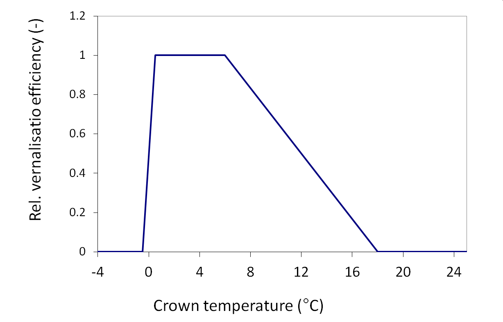

```{r}
#| label: SetupLibraries
#| include: FALSE

knitr::opts_chunk$set(echo = TRUE, warning = FALSE, message = FALSE, fig.align = "center", fig.width = 12, fig.height = 6, fig.pos = "h", fig.cap = TRUE)
rm(list = ls(all.names = TRUE))

library(rmarkdown)
library(bookdown)
library(soilwater)
library(tidyverse)
library(reticulate)
library(tinytex)
library(bibtex)
library(ggsci)
library(knitcitations)
library(kableExtra)
library(xml2)
library(ggpmisc)
options("citation_format" = "pandoc")

```

```{r}
#| include: false
fn_source <- "Q:/HUME/HUME/Components/Ceres Wheat/Development.pas"
fn_xml_docu <- "Q:/HUME/HUME/XML_Delphi_Docu/Development.xml"
doc <- read_xml(fn_xml_docu)

```

# Summary

```{r}
#| echo: false
#| message: false
#| warning: false


# Extract the text inside <devnotes><summary>
summary_text <- xml_text(xml_find_first(doc, ".//devnotes/summary"))

#cat(summary_text, sep = "\n\n")
classes <- xml_find_all(doc, ".//class")


result <- data.frame(
  class_name = xml_attr(classes, "name"),
  devnotes   = sapply(classes, function(class_node) {
    devnotes_node <- xml_find_first(class_node, "./devnotes")
    if (!is.na(devnotes_node)) trimws(xml_text(devnotes_node)) else NA_character_
  }),
  stringsAsFactors = FALSE
)
```


```{r}
#| echo: false
#| message: false
#| warning: false
#| results: asis

#cat(summary_text, sep="\n\n")
cat(result$devnotes, sep="\n\n")


```


# Lists of model objects

## State variables

```{r}
#| message: false
#| warning: false
#| include: false
#fn <- "Q:/SimProject/project/PenMonteith1.csv"
fn <- "csv_Hume_Docu/Development1.csv"
df <- read.delim(fn, header = TRUE, sep = ";")
df.state <- df %>% filter(SubModel == "Development1", EntityType == "State") %>% dplyr::select(EntityName, Units, Value, Comment)
names(df.state) <- c("State variable", "Units", "InitialValue", "Description")
```

The class TDevelopment has `r trunc(nrow(df.state))` following state variable(s).

```{r}
#| echo: false
#| message: false
#| warning: false
kable(df.state)
```

## Parameters

```{r}
#| message: false
#| warning: false
#| include: false

df.par <- df %>% filter(SubModel == "Development1", EntityType == "Parameter") %>% dplyr::select(EntityName, Units, Value, Comment)
names(df.par) <- c("Parameter", "Units", "Value", "Description")

```

The class TDevelopment has `r trunc(nrow(df.par))` following parameter(s).

```{r}
#| echo: false
#| message: false
#| warning: false
kable(df.par,  escape = FALSE)
```

## Variables

```{r}
#| message: false
#| warning: false
#| include: false

df.var <- df %>% filter(SubModel == "Development1", EntityType == "Variable") %>% dplyr::select(EntityName, Units, Comment)
names(df.var) <- c("Variable", "Units", "Description")

```

The class TDevelopment has `r trunc(nrow(df.var))` following variable(s).

```{r}
kable(df.var,  escape = FALSE)
```

## External variables

```{r}
#| message: false
#| warning: false
#| include: false

df.ext <- df %>% filter(SubModel == "Development1", EntityType == "ExtVar") %>% dplyr::select(EntityName, Units, Comment, Option)
names(df.ext) <- c("External variable", "Units", "Description", "Source")

```

The class TDevelopment has `r trunc(nrow(df.ext))` following external variable(s).

```{r}
#| echo: false
#| message: false
#| warning: false
kable(df.ext,  escape = FALSE)
```

## Options

```{r}
#| message: false
#| warning: false
#| include: false

df.opt <- df %>% filter(SubModel == "Development1",EntityType == "Option" ) %>% dplyr::select(EntityName, Units, Comment)
names(df.opt) <- c("Option", "Units", "Description")

```

The class TDevelopment has `r trunc(nrow(df.opt))` following option(s).

```{r}
#| echo: false
#| message: false
#| warning: false
kable(df.opt,  escape = FALSE)
```

## Scientific Background

The phenological model module of HumeWheat is based on phenological Ceres Wheat (CW) model for winter wheat. It has been published originally in [@johnen2012]. The phenological process in CW is divided into nine developmental or growth stages (GS) according to [@ritchie2015] (@tbl-CWDevStages), the common approach in Europe, however is the BBCH stage [@lancashire1991a]. Zadoks stages or equivalent BBCH values, however, are not calculated in the original phenology model of CERES-Wheat up to Version 3.0.

| GS | BBCH | Phase |
|------------------------|------------------------|------------------------|
| 7 | 00 | Fallow |
| 8 | 00 | Sowing to germination |
| 9 | 05 | Germination to emergence |
| 1 | 10 | Emergence to terminal Spikelet initiation |
| 2 | 30 | Terminal spikelet to end of leaf growth and beginning of ear growth |
| 3 | 40 | End of leaf growth and beginning of ear growth to end of pre-anthesis ear growth |
| 4 | 57 | End of pre-anthesis ear growth to beginning of grain filling |
| 5 | 71 | Grain filling |
| 6 | 90 | End of grain filling to harvest |

: Development stages of the CW model (GS) and corresponding BBCH stages {#tbl-CWDevStages}

The CW model mainly describes phenological development through the change of GS over time. In CWm we added an explicit simulation of three additional state variables, the leaf number on the main stem (nLMS), the number of initiated leaves on the main stem (inLMS) and the BBCH stage. At emergence nLMS is set to one and inLMS is set to 4 [@brooking2002a]. This is because the embryo at the time of sowing has already three leaf primordia [@kirby1985] and that an additional primordium is assumed to be produced until emergence. The rate of change of number of initiated leaves is calculated according to @eq-dinLMS from emergence until the last leaf primordium is formed:

$$
\frac{d\,in{{L}_{MS}}}{dt}=\frac{\max
(0,T-{{T}_{b}})}{Plast}
$$ {#eq-dinLMS}

Where Plast is the plastochron (°Cd) T is the air temperature and T~b~ is the base temperature. The formation of leaf primordia which produce leaves is finished some time before the double ridge stage (Bonnet, 1935; Bonnet, 1936; Muschik, 1957). The time of the cessation of leaf primordia initiation, however, is not exactly coupled to a certain GS in the CW model and is also not linked to a certain BBCH stage. From available data of BBCH 37, i.e. the time when the last leaf appears, it was possible to estimate an approximate GS corresponding to the formation of the final leaf primordium ($GS_{flp}$) *ex post*. The number of visible leaves on the main stem nLMS is calculated accordingly (@eq-dnLMS):

$$\frac{d\,n{{L}_{MS}}}{dt}=\frac{\max (0,T-{{T}_{b}})}{Phyll}$$ {#eq-dnLMS}

where Phyll denotes the phyllochron (°Cd).

### Calculation of changes of GS and BBCH

The main state variables of the phenological model are the GS-stage according to Ritchie and the BBCH-stage more commonly used in the description of wheat phenology. Their rate of change is calculated stage specific.

#### Sowing to emergence (GS 8 and 9)

We simplified the model by pooling together the GS stages eight and nine, which represent the germination and emergence processes, because no data were available to distinguish between both events. The redefined parameter P9, which now governs the rate of development during the time from sowing to emergence, was calculated from observed thermal times from sowing to emergence .

$$\frac{dGS}{dt}=\frac{\max (0,T-{{T}_{b}})}{P9}$$ {#eq-dGS_dt_GS9}

The rate of change for BBCH is ten time higher as for GS as the event of crop emergence is equivalent to 10.

$$\frac{dBBCH}{dt}=10\frac{\max (0,T-{{T}_{b}})}{P9}$$ {#eq-dBBCH_dt_GS9}

#### Emergence to terminal Spikelet initiation (GS 1)

Temperature, vernalization, photoperiod, and phyllochron interval determine the development rate during GS 1. According to CW the lowest value of two functions, depending on the vernalization stage and the actual photoperiod in interaction with the actual effective temperature limits the development rate (@eq-dGS_dt_GS1).

$$\frac{dGS}{dt}=\frac{\max (0,T-{{T}_{b}})\cdot \min (f(V),f(P))}{(400\cdot Phyll\ /\ 95)}$$ {#eq-dGS_dt_GS1}

The functions f(V) and f(P) as well as the Phyllocron (Phyll) are genotype specific.

##### Vernalisation

The effect of vernalisation on the development rate is calculated from the accumulated sum of "vernalisation days". The rate of change of the vernalisation days is calculated from the daily mean temperature and a vernalisation response function which is characterized by 4 cardinal temperatures (@fig-RelVernalisation).

{#fig-RelVernalisation}

The vernalisation rate is acccumulated in the state variable VernalisationDays.

$$\frac{dV}{dt}=\max (0, fV)$$ {#eq-dV_dt}

The value of the f(V) in @eq-dGS_dt_GS1 is calculated from the actual value of accumulated number of vernalisation dates according to:

$$f(V) = 1-k\cdot \left(50-V \right)$$ {#eq-fV_k}

The values of k thereby is genotype specific and according to Ritchie et al. (1998) is coded in the parameter value P1V. The value of 50 in @eq-fV_k is the maximum number of vernalisation days. The vernalisation days are reset to zero after the maximum number of vernalisation days is reached.\
The value k is the slope of the linear relation between the vernalisation days and the development rate. It can be calculated from the parameter P1V according to

$$k = \frac {P1V+0.55}{183}$$ {#eq-kfromP1V} For a larger number of wheat cultivars in Germany [@johnen2012b] found a value of P1V of 2.84. Higher values of P1V indicate a higher vernalisation requirement of the cultivar, i.e. a lower development rate at low vernalisation days which is typical for cultivars of continental origin. A low value of P1V indicates a low vernalisation requirement, typical for summer crops of wheat or for wheat cultivars grown in Mediterranean regions.

```{r}
#| label: fig-VernRate
#| fig-cap: Relative vernalisation rate of winter wheat as a function of accumulated vernalisation days
#| fig-align: center
#| echo: false


fV <- function(V, k){
  fV <- 1 - k * (50 - V)
  fV <- pmax(fV, 0)
  return(fV)
}

P1V <- c(0.5, 2.84, 5)
k <- (P1V+0.55) / 183 

VernDays <- seq(0, 50, 1)

df_VernRate <- expand.grid( k = k, V = VernDays)
df_VernRate$fV <- fV(df_VernRate$V, k)
df_VernRate <- df_VernRate %>% mutate(P1V = round(k * 183-0.55,3))

df_VernRate <- df_VernRate %>% mutate(P1V = as.factor(P1V))
df_VernRate <- df_VernRate %>% filter(fV >= 0)
df_VernRate <- df_VernRate %>% arrange(V, P1V)

ggplot(data = df_VernRate, aes(x = V, y = fV, color=P1V), size=2) +
  geom_line(size=2) +
  labs(x = "Vernalisation days", y = "fV [0..1]") +
  theme_bw(base_size = 20) +
  scale_color_aaas()  


```

##### Photoperiod

The effect of photoperiod on the development rate (f(P)) is calculated from the actual photoperiod and a photoperiod response function

$$f(P)=1-C \cdot\left(20-P\right)^2$$ {#eq-fPhoto}

The parameter C is coded in the parameter P1D. The value of 20 in @eq-fPhoto is the maximum photoperiod. The value of C is the slope of the quadratic relation between the photoperiod and the development rate. It can be calculated from the parameter P1D according to

$$C=P1D/500$$ {#eq-CfromP1D}

Typical values of P1D are in the range of 1 to 3. Higher values of P1D indicate a higher photoperiod requirement of the cultivar, i.e. a lower development rate at low photoperiods which is typical for cultivars of northern origin. A low value of P1D indicates a low photoperiod requirement, typical for summer crops of wheat or for wheat cultivars grown in mediterranean regions. In the study of [@johnen2012a] a value of P1D of 2.76 was found as a mean for a larger number of wheat cultivars in Germany.

```{r}
#| label: fig-PhotRate
#| fig-cap: Relative development rate of winter wheat at GS1 as a function of photoperiod
#| fig-align: center
#| echo: false

fP <- function(P, C){
  fP <- 1 - C * (20 - P)^2
  fP <- pmax(fP, 0)
  return(fP)
}

P1D <- c(1, 2, 3)
C <- P1D / 500

Photoperiod <- seq(8, 20, 0.2)

df_PhotRate <- expand.grid( C = C, P = Photoperiod)
df_PhotRate$fP <- fP(df_PhotRate$P, df_PhotRate$C)
df_PhotRate <- df_PhotRate %>% mutate(P1D = round(C * 500,3))

df_PhotRate <- df_PhotRate %>% mutate(P1D = as.factor(P1D))
df_PhotRate <- df_PhotRate %>% filter(fP >= 0)
df_PhotRate <- df_PhotRate %>% arrange(P, P1D)

ggplot(data = df_PhotRate, aes(x = P, y = fP, color=P1D), size=2) +
  geom_line(size=2) +
  labs(x = "Photoperiod [h]", y = "fP [0..1]") +
  theme_bw(base_size = 20) +
  scale_color_aaas()  


```

##### Leaf number and leaf initiation

At early development stages (BBCH\<30) BBCH stages are determined by the number of leaves and tillers present. Their rate of change is determined by the Phyllochron (Phyll), i.e. the inverse of the phyllochron is the emergence rate of leaves and tillers per effective day temperature (\@eq-dBBCH_dt_GS1).

$$\frac{dBBCH}{dt}=\frac{\max (0,T-{{T}_{b}})}{Phyll}$$ {#eq-dBBCH_dt_GS1}

At BBCH 13.5 there is a switch to BBCH 21, because simultaneously to the appearance of the fourth leaf the first tiller is emerging and mainstem leaf appearance is then associated with tiller appearance until BBCH 30.

The plastochron is the inverse of the rate of leaf initiation. It is assumed to be constant during the time from sowing to the end of leaf initation. It defines the rate of leaf initiation and together with the initial number of leaf primordia of the embryo at sowing the number of initiated leaves and with the GS stage when leaf initation ceases the number of leaves on the main stem.

$$If \ \ BBCH >= 13.5 \ and \ BBCH<20; \    BBCH = BBCH+7.5$$ {#eq-BBCH_jumpto21}

#### Terminal spikelet to end of leaf growth and beginning of ear growth (GS 2)

Within the model the implicit and simplifying assumption is made that GS 2 stage is more or less closely associated with BBCH 30 [@baker1983], but that the initiation of the terminal leaf primordium may be reached a bit earlier at a stage we named $GS_{flp}$.

The GS change rate between GS 2 and 3 is calculated as the ratio of the daily temperature minus the base temperature (T~b~, assumed to be 0°C) to the thermal time interval GS 2 to GS 3. This thermal time interval is calculated by the number of leaves not yet expressed at GS 2 minus two (fL), multiplied by the phyllochron plus the temperature sum between BBCH 37 and 39, i.e. ‘PH39’:.

$$\frac{dGS}{dt}=\frac{\max (0,T-{{T}_{b}})}{fL\cdot Phyll+Ph39}$$ {#eq-dGS_dt_GS2}

thereby the term fL denotes the leaves which have to appear after GS 2 is reached, calculated from the number of initiated leaves at GS 2 minus 2. The substraction of two leaf primordia was made in accordance to the assumption that at least the last two vegetative primordia may not produce visible leaves, they are therefore sometimes called labile primordia [@griffiths1985].

In the CWm model we therefore calculated a rate of node emission and introduced a parameter we called ‘TSumInternode’ analogous to the phyllochron. The numerical value of this parameter is the inverse of the slope of the relation of node numbers to the temperature sum from BBCH 30. The rate of change of BBCH stages is calculated until BBCH 37 (final leaf begins to emerge) from the ratio of the effective day temperature and TSumInternode (@eq-dBBCH_dt_GS1).

The BBCH stage 37 is reached when the number of the emerged leaves is equal to the number of leaf primordia minus two. The subtraction of two leaf primordia was made in accordance to the assumption that at least the last two vegetative primordia may not produce visible leaves, they are therefore sometimes called labile primordia [@griffiths1985].

The length of the thermal time from sowing to the initiation of the last leaf primordium together with the plastochron now determines the number of initiated leaves. This number is variable and the new algorithm of CWm therefore also predicts a variable length of GS 2 in terms of temperature sum. In CWm the rate of development between BBCH 37 and BBCH 39, however, is again described by a certain temperature sum expressed as the newly added parameter ‘PH39’ (@eq-dBBCH_dt_GS2b). It was introduced because according to our data analysis the thermal time between BBCH 37 and 39 ratings was significantly longer than one phyllochron.

$$\frac{dBBCH}{dt}=\frac{\max (0,T-{{T}_{b}})}{\text{TSumInternode}}$$ {#eq-dBBCH_dt_GS2a}

If nL_MS \> inL_MS-2 and If BBCH\< 37 then BBCH = 37 If BBCH\>=37:

$$
  \frac{dBBCH}{dt}= \min \left( \frac{2\max (0,T-{{T}_{b}})}{\text{Ph39}},(40-BBCH) \right)
$$ {#eq-dBBCH_dt_GS2b}

##### Day length effects

As an additional option in a later stage of the module development a daylength sensitivity of TSumInternode and Ph39 has been included. This is because data analysis revealed that the memory effect postulated from the assumption of a constant plastochron and phyllochron could not be verified in a larger data set. This is because presumably under increasing daylength the phyllochron shortens. The model parameters TSumInternode and Ph39 are closely linked to the phyllochron and thereby are change by the photoperiod:

$$
TSumInternode = phyll + fdl \cdot daylengthp^2 
$$ {#eq-dayphyll}

#### End of leaf growth and beginning of ear growth to end of pre-anthesis ear growth (GS3)

The period from the end of leaf growth to the beginning of ear growth is for the GS development rate defined by a length of 2 phytochrons

$$\frac{dGS}{dt}=\frac{\max (0,T-{{T}_{b}})}{2Phyll}$$ {#eq-dGS_dt_GS3}

The rate of change of BBCH stages is during that stage simply synchronized with the GS rate according to equation @eq-dBBCH_dt_GS3.

$$\frac{dBBCH}{dt}=(4+1.7(GS-3))\cdot 10-BBCH$$ {#eq-dBBCH_dt_GS3}

#### End of pre-anthesis ear growth to beginning of grain filling (GS4)

The period from the end of pre-anthesis ear growth to the beginning of grain filling is for the GS development rate defined by a length of 200 degree days:

$$\frac{dGS}{dt}=\frac{\max (0,T-{{T}_{b}})}{200}$$ {#eq-dGS_dt_GS4}

The rate of change of BBCH stages is during that stage simply synchronized with the GS rate according to equation @eq-dBBCH_dt_GS4.

$$\frac{dBBCH}{dt}=(5.7+1.4(GS-4))\cdot 10-BBCH$$ {#eq-dBBCH_dt_GS4}

#### Grain filling (GS5)

The period of grain filling is for the GS development rate defined by a genotype specific temperature sum and the effective temperature during grain filling. The latter is calculated as the mean temperature minus the base temperature. The effective temperature is divided by the temperature sum for grain filling (TSumGF) to get the rate of change of GS 5:

$$\frac{dGS}{dt}=\frac{\max (0,(T-{{T}_{b}})-1)}{TSumGF}$$ {#eq-dGS_dt_GS5}

$$TSum_{GF} = \frac{(P5+21.5)}{0.05}$$ {#eq-TSumGF}

The rate of change of BBCH stages is during that stage simply synchronized with the GS rate according to equation @eq-dBBCH_dt_GS5.

$$\frac{dBBCH}{dt}=(7.1+1.9(GS-5))\cdot 10-BBCH$$ {#eq-dBBCH_dt_GS5}

#### End of grain filling to harvest (GS6)

The period from the end of grain filling to harvest is for the GS development rate defined by a length of 250 degree days:

$$\frac{dGS}{dt}=\frac{\max (0,T-{{T}_{b}})}{250}$$ {#eq-dGS_dt_GS6}

The rate of change of BBCH stages is during that stage simply synchronized with the GS rate according to equation @eq-dBBCH_dt_GS6.

$$\frac{dBBCH}{dt}=(9+(GS-6))\cdot 10-BBCH$$ {#eq-dBBCH_dt_GS6}
