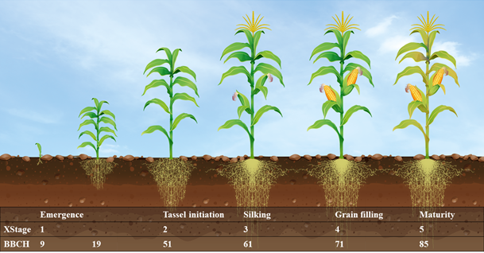

```{r}
#| label: SetupLibraries
#| include: FALSE

knitr::opts_chunk$set(echo = TRUE, warning = FALSE, message = FALSE, fig.align = "center", fig.width = 12, fig.height = 6, fig.pos = "h", fig.cap = TRUE)
rm(list = ls(all.names = TRUE))

library(rmarkdown)
library(bookdown)
library(soilwater)
library(pracma)
library(dplyr)
library(ggplot2)
library(extrafont)
library(gifski)
library(gganimate)
library(transformr)
library(reticulate)
library(tinytex)
library(magick)
library(bibtex)
library(ggsci)
library(knitcitations)
library(kableExtra)
library(Weatherfunctions)
library(xml2)
library(ggpmisc)
library(tidyr)
library(ggplot2)
options("citation_format" = "pandoc")

```

```{r}
#| include: false
#fn_source <- "Q:/HUME/HUME/Components/Evapotranspiration/UPenMonteith.pas"
#fn_xml <- "Q:/OSR/Project/OSRGrowth/xml_docu/UPenMonteith.xml"
#xml_docu <- read_xml(fn_xml)


```

# Introduction

Maize development is regulated by the effective temperature (\$T\_{eff}\$), which is calculated as the positive difference between the daily mean temperature and a defined base temperature (@par-T1) of 6 °C, following @Pages.1994 and @Bonhomme.1994.

The development process is divided into five stages, hereafter referred to as **XStages**, following the HYBRID-Maize framework and the approach of @Yang.2016. These XStages represent the key phenological stages of maize development: emergence, tassel initiation, silking, effective grain filling, and maturity (Figure @fig-DevScheme).

Development rates between the individual stages are calculated as the ratio between effective temperature (\$T\_{eff}\$) and the corresponding temperature sums (growing degree days, GDD). Specifically, development rates are defined for the phases between sowing and emergence (@eq-DevRateS0), emergence and tassel initiation (@eq-DevRateS1), tassel initiation and silking (@eq-DevRateS2), and silking and grain filling (@eq-DevRateS3). The corresponding temperature sums are defined by the parameters @par-GDDemer, @par-GDDtasini, @par-GDDS2, and @par-GDDS3 (Table @tbl-parameters).

Compared to the approach of @Yang.2016, an additional temperature sum from emergence to silking (@par-GDDsilk) is introduced. This parameter is used to calculate the development rate from grain filling until maturity (@eq-DevRateS4). The development rate is derived from the remaining temperature requirement between the total temperature sum to maturity (@par-GDDtotal) and the temperature sums of the preceding stages.

All temperature sums are defined as cultivar-specific parameters according to the assumptions of @Bignon.1990 for a mid-early maize cultivar grown on soils with medium warming dynamics. The crop is assumed to be harvested at the dough stage, corresponding to the typical harvest time of whole-crop silage maize with a dry matter content of approximately 35 %.

Leaf appearance is simulated following the approaches implemented in HYBRID-Maize and CERES-Maize (@Jones.1986; @Yang.2016). The rate of leaf appearance is calculated as the ratio between effective temperature (\$T\_{eff}\$) and the phyllochron parameter (@par-phy; @eq-phy).

During the early growth period, when the plant has fewer than five leaves (\< BBCH15), leaf appearance is assumed to occur at a higher rate. To account for this effect, a reduction factor (\$f\_{phy}\$) is applied to the phyllochron (@eq-fphy).

In the field trials used for model evaluation, phenological stages were recorded according to the BBCH scale of @Lancashire.1991. These observations were subsequently converted into the corresponding XStages for comparison with the model simulations (Figure @fig-DevScheme).

$$DevRate_{S0} = \frac{T_{eff}}{{GDD}_{emer}}$$ {#eq-DevRateS0}

DevRateS0: Development rate between sowing and emergence, Teff: effective temperature, GDDemer: corresponding growing degree days

$$\mathrm{DevRateS1=}\frac{\mathrm{T}_{\mathrm{eff}}}{{\mathrm{GDD}}_{\mathrm{tasini}}}$$ {#eq-DevRateS1}

DevRateS1: Development rate between emergence and tassel initiation, Teff: effective temperature, GDDtasini: growing degree days from emergence till tassel initiation

$$\mathrm{DevRateS2=\ }\frac{\mathrm{T}_{\mathrm{eff}}}{{\mathrm{GDD}}_{\mathrm{S2}}}$$ {#eq-DevRateS2}

DevRateS2: Development rate between tassel initiation and silking, Teff: effective temperature, GDDS2: growing degree days from tassel initiation till silking

$$\mathrm{DevRateS3=}\frac{\mathrm{T}_{\mathrm{eff}}}{{\mathrm{GDD}}_{\mathrm{S3}}}$$ {#eq-DevRateS3}

DevRateS4: Development rate between grain filling and maturity, Teff: effective temperature, GDDtotal: growing degree days from sowing till maturity, GDDemer: growing degree days from sowing till emergence, GDDsilk: growing degree days from emergence till silking, GDDS3: growing degree days from silking till grain filling

$$\mathrm{DevRateS4=}\frac{\mathrm{T}_{\mathrm{eff}}}{{\mathrm{GDD}}_{\mathrm{total}}\mathrm{-} {\mathrm{GDD}}_{\mathrm{emer}}\mathrm{-} {\mathrm{GDD}}_{\mathrm{silk}}\mathrm{-} {\mathrm{GDD}}_{\mathrm{S3}}}$$ {#eq-DevRateS4}

LeafNo: number of leaves, Teff: effective temperature, phy: phyllochron, fphy: reduction factor for early growth phase.

$$\frac{{\mathrm{dLeaf}}_{\mathrm{No}}}{\mathrm{dt}}\mathrm{\mathrm{=}}\frac{\mathrm{Teff}}{\mathrm{phy\ *\ }\mathrm{f}_{\mathrm{phy}}}$$ {#eq-LeafNo}

fphy: reduction factor for early growth phase, LeafNo: number of leaves, constants (0.66, and 0.068) are parameters according to @Yang.2016, @Jones.1986.

$$\mathrm{f}_{\mathrm{phy}}\mathrm{\mathrm{=}}0.66+0.068 * LeafNo \quad |\quad LeafNo < 5 \\1 \quad |\quad LeafNo ≥ 5$$ {#eq-phy}

{#fig-DevScheme}

```{r}
#| label: fig-DevScheme
#| fig.cap: "Development scheme of maize used in HUME-Maize"
#| include: true
#| message: false
#| warning: false


```

## Descendence

The class TPenMonteith is derived from TPlantRelatedSubMod, which is derived from TSubmodel which is derived from TObject or TGraphicControl.

TPenMonteith \|\_\_\_\_TPlantRelatedSubMod \|\_\_\_\_TSubmodel

## State variables

```{r}
#| message: false
#| warning: false
#| include: false
fn <- "Q:/HUME/HUME/Components/Maize/Documentation/subDevelopment_Maize1.csv"
df <- read.delim(fn, header = TRUE, sep = ";")

df.state <- df %>% filter( EntityType == "State") %>% dplyr::select(EntityName, Units, Value, Comment)
names(df.state) <- c("State variable", "Units", "InitialValue", "Description")

```

The class TSubDevelopent has `r trunc(nrow(df.state))` following state variable(s).

```{r}
#| label : tab-state
#| table.cap : "State variables of TSubDevelopmentMaize"
#| echo: false
#| message: false
#| warning: false
kable(df.state)
```

## Parameters

```{r}
#| label: tab-Parameter
#| echo: false
#| message: false
#| warning: false
#| table-cap: Model Parameter
kable(df %>% filter( EntityType == "Parameter") %>% dplyr::select(EntityName, Units, Value, Comment) %>% rename(Parameter = EntityName, Description = Comment))
```

| Parameter | Value | Unit | Description | Source |
|---------------|---------------|---------------|---------------|---------------|
| $T_{1}$ | 6 | °C | Base temperature for calculating $T_{eff}$ | @Pages.1994; @Bonhomme.1994 |
| $GDD_{emer}$ | 100 | °C d | Temperature sum from sowing until emergence | @Bignon.1990 |
| $GDD_{tasini}$ | 320 | °C d | Temperature sum from emergence until tassel initiation | @Bignon.1990 |
| $GDD_{S2}$ | 510 | °C d | Temperature sum from tassel initiation until silking | @Bignon.1990 |
| $GDD_{S3}$ | 200 | °C d | Temperature sum from silking until grain filling | @Bignon.1990 |
| $GDD_{silk}$ | 830 | °C d | Temperature sum from emergence until silking | @Bignon.1990 |
| $GDD_{total}$ | 1890 | °C d | Temperature sum from sowing until maturity | @Bignon.1990 |
| $phy$ | 50.8 | °C d leaf⁻¹ | Phyllochron | @Jones.1986; @Yang.2016 |

## Variables

```{r}
#| label: tab-Variable
#| echo: false
#| message: false
#| warning: false
#| table-cap: Model Variables
kable(df %>% filter( EntityType == "Variable") %>% dplyr::select(EntityName, Units, Value, Comment) %>% rename(Variable = EntityName, Description = Comment))
```
