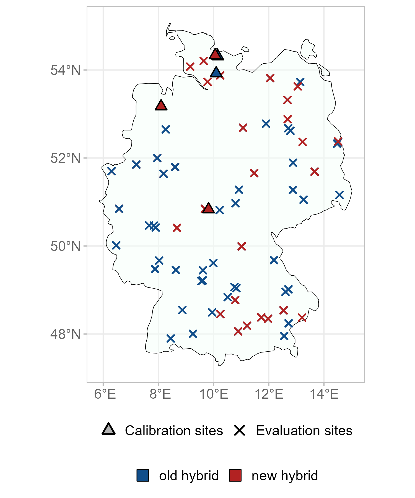

```{r}
#| label: SetupLibraries
#| include: FALSE

knitr::opts_chunk$set(echo = TRUE, warning = FALSE, message = FALSE, fig.align = "center", fig.width = 12, fig.height = 6, fig.pos = "h", fig.cap = TRUE)

rm(list = ls(all.names = TRUE))

library(knitr)
library(rmarkdown)
library(bookdown)
library(soilwater)
library(tidyverse)
library(reticulate)
library(tinytex)
#library(bibtex)
library(ggsci)
#library(knitcitations)
library(kableExtra)
library(xml2)
library(ggpmisc)
library(tools)
library(here)
source("ExtractInformationFromXML.R")
source("Rlib/DokuUtilFunctions.R")

ExtractInformationFromCSV <- function(fn) {

  df <- read.delim(fn, header = TRUE, sep = ";")|>filter(Submodel==!!Submodel) 
  df.state <- df |> filter( EntityType == "State")  |> dplyr::select(EntityName, Units, Value, Comment)|>distinct()|>
        mutate(Value=as.numeric(Value))
  names(df.state) <- c("State variable", "Units", "Initial Value", "Description")
  
  df.par <- df |> filter( EntityType == "Parameter") |> dplyr::select(EntityName, Units, Value, Comment)|>distinct()|>
    mutate(Value=as.numeric(Value))
  names(df.par) <- c("Parameter", "Units", "Value", "Description")

  df.var <- df |> filter( EntityType == "Variable") |> dplyr::select(EntityName, Units, Comment)|>distinct()
  names(df.var) <- c("Variable", "Units", "Description")

  df.ext <- df |> filter( EntityType == "ExternalValue") |> dplyr::select(EntityName, Units, Comment, Option)|>distinct()
  names(df.ext) <- c("External Variable", "Units", "Description", "Source")

  df.opt <- df |> filter(EntityType == "Option" ) |>  dplyr::select(EntityName, Option, Comment)|>distinct()
  names(df.opt) <- c("Option", "Selection", "Description")

  result <- list(
    df.state = df.state,
    df.par = df.par,
    df.var = df.var,
    df.ext = df.ext,
    df.opt = df.opt
  )

}

```

```{r}
#| include: false

fn_source <- here("Components/Maize/Usublightint_growth_Maize.pas")
fn_xml_docu <- here("XML_Delphi_Docu/Usublightint_growth_Maize.xml")
fn <- here("csv_Hume_Docu/Docu_Docu_MAIZE.csv")

Submodel <- c("sublightint_growth_Maize1")
NameSource <- file_path_sans_ext(basename(fn_source))

doc <- read_xml(fn_xml_docu)

output <- ExtractXMLDocuInformation(fn_xml_docu, ClassName = "Tsublightint_growth_Maize")

Entities <- ExtractInformationFromCSV(fn)

```

```{r}
#| echo: false
#| message: false
#| warning: false
#| results: asis
 
 GetFirstDevNotes(fn_xml_docu)
```

# Descendence

The class Tsublightint_growth_Maize has the following ancestor classes shown in @tbl-AncestorClasses.

```{r}
#| label: tbl-AncestorClasses
#| echo: false
#| tbl-cap: "Ancestor classes of Tsublightint_growth_Maize"

df <- GetAncestorClasses(fn_xml_docu,"Tsublightint_growth_Maize")

kable(df)|>
   kable_styling(full_width = FALSE, position = "center")

```

# Scientific Background

## Modelling DM production

Within season, daily dry matter production ($\frac{dDM_{tot}}{dt}$\$\\frac{dDM\_{tot}}{dt}\$ is driven by absorbed photosynthetic radiation (Q, MJ m^-2^ d^-1^) and potential light use efficiency (LUE, g MJ^-1^ PAR^-1^):

$$\frac{{\mathrm{dDM}}_{\mathrm{total}}}{\mathrm{dt}}\mathrm{=Q*}LUE * Temp_{fact} * SWDF$$ {#eq-DMproduction}

With $Temp_{\text{fact}}$, a temperature weight factor for photosynthetic activity \[-\], ranging between 0 to 1 and calculated with a trapezoidal function (@Marshall1996; @Porter1999) and the soil water deficit factor (SWDF).

$$Temp_{fact} = \begin{cases}
0 & \text{if  } TMPM < C_1 \\
\frac{TMPM - C_1}{C_2 - C_1} & \text{if  } C_1 \leq TMPM \leq C_2 \\
1 & \text{if  } C_2 < T_{mean} \leq C_3 \\
\frac{C_4 - TMPM}{C_4 - C_3} & \text{if } C_3 < TMPM \leq C_4 \\
0 & \text{if } TMPM > C_4
\end{cases}$$ {#eq-trapez}

The Q is calculated according to the Beer-Lambert law (@Monsi1953), using the photosynthetically active radiation (PAR, MJ m^-2^ d^-1^) and green area index (GAI, m^2^ m^-2^) as input variable. Thereby, utilised PAR is an approximation, as it is commonly referred to as half of global radiation (GR, MJ m^-2^ d^-1^, @Szeicz1974):

$$\mathrm{Q\ =\ PAR*}\left(\mathrm{1-}\mathrm{e}^{{\mathrm{-k}}_{\mathrm{PAR}}\mathrm{*GAI} }\right)$$ {#eq-Q}

with a constant extinction coefficient $k_{PAR}$ \[-\] (Par_ExtCoeffPAR, see Tsubpartitioning_Maize_Roots1), which is set to 0.654 (@Rose2023). The GAI \[m^2^ m^-2^\] is an external value provided by the dry matter partitioning component. The LUE decreases linearly with increasing Q , describing the effect of light saturation of the single leaf photosynthesis with higher irradiance at the canopy level (@Kage2001d; @Kage2001e). In contrast to many crop growth models, where radiation use efficiency is assumed to be constant or only indirectly affected by environmental stress factors, this approach explicitly accounts for the decline in efficiency at high radiation levels.

$${\mathrm{LUE}}\mathrm{=}LUE_{max} - LUE_{steig}*PAR$$ {#eq-LUE}

with $LUE_{\text{max}}$ \[-\] and $LUE_{\text{steig}}$ \[-\] as regression parameters, which were optimized by the model internal Levenberg-Marquard algorithm. In case of drought stress, LUE is reduced by the SWDF \[-\], originally proposed in a peanut growth model (@ferreyra2003), describing the effects of water stress as non-linear function. This formulation allows for a more gradual decline in LUE under moderate stress and a stronger limitation under severe drought conditions, which was not accounted in another maize model.

$$SWDF\mathrm{=\ 1\ -\ }{\frac{\mathrm{Act}_{\mathrm{trans}}}{\mathrm{Pot}_{\mathrm{trans}}}}^{SWDF_{fact}}$$ {#eq-SWDF}

with the ratio between actual transpiration ($Act_{\text{trans}}$, mm d^-1^) and potential transpiration ($Pot_{\text{trans}}$ mm d^-1^) and a power value $SWDF_{\text{fact}}$ \[-\] describing the non-linear relation of SWDF. The parameter $SWDF_{\text{fact}}$ was set to 1.6 after model internal optimisation.

## Results of calibration and evaluations

With the calibration dataset, a strong fit was achieved for whole-season $DM_{\text{shoot}}$ (R² = 0.97, @tbl-results) including measurement data of the whole season (n=83). The productivity on sandy loam sites was underestimated in 2008 and overestimated in 2007. However, predictions for the sandy site were accurate for both calibration years (@fig-DMShoot A). In the evaluation, prediction accuracy of $DM_{\text{shoot}}$ was still high with R² of 0.95 and a RMSE of 239.28 g m-2 (@tbl-results). In 2021, high yields harvested at both sandy loam and sandy sites were underestimated by the model. Due to severe drought stress at the sandy and sandy silt site in 2022, harvest was conducted one month earlier (2022/09/06 and 2022/09/02, respectively), explaining the low yields (@fig-DMShoot B).

::: {#tbl-results}
| Variable | Einheit | Steigung (Slope) | Achsenabschnitt (Intercept) | R² | n | RMSE |
|-----------|-----------|-----------|-----------|-----------|-----------|-----------|
| $\mathrm{DM}_{\mathrm{shoot}}$ | \[g m⁻²\] | 1.14 (1.08) | -102.91 (-73.91) | 0.95 (0.97) | 63 (83) | 239.28 (157.41) |

: Results of model evaluation and calibration (in brackets) for aboveground dry matter production ($DM_{\text{shoot}}$). Performance was assessed with slope and intercept of the regression between measured and simulated data, R² and root mean square error (RMSE). n is the number of measurements.
:::

{#fig-DMShoot}

### Large scale evaluation

The prediction of final yield with the baseline model and hybrid-specific parameters (see Tsubpartitioning_Maize_Roots_N) was evaluated using a large dataset (n: 287) comprising silage maize yield data of the two regarded hybrids. The dataset consists of 67 sites distributed all over Germany (@fig-Dtl), collected during a time span of 14-years (2006 to 2021). The data were sourced from national hybrid trials published by the agricultural chambers and institutions of the federal states of Germany on https://www.isip.de/versuchsberichte. Soil textures were derived from the German soil map (@buk200) from 0-200 cm, summarized in up to four different soil layers.

{#fig-Dtl}

The large-scale evaluation for the prediction of final silage maize yields of the baseline-model resulted in a prediction error rRMSE of 0.16 and 0.24, for the older and the newer hybrid, respectively (@fig-RRMSE A). Overall d-statistic was 0.61, with a 0.62 for the old and 0.60 for the new hybrid. By the hybrid-specific parameterisation, the rRMSE for the newer hybrid was reduced to 0.21 and the d-statistic to 0.69. The comprehensive dataset enabled a further residual analysis of parameters affecting yield prediction accuracy. Thereby, a significant influence of drought stress was detected, which is computed by fSWDF (@eq-SWDF), with yields being tendentially underestimated. Without drought stress, the residuals declined below 0 (@fig-RRMSE B).

{#fig-RRMSE}

# Submodel objects

Dynamic system model consists according to the Forrester approach of state variable, parameters, variables and external driving forces. This is implemented in Hume by dynamic lists, which contents is given in the following sections.

## State variables

The class Tsublightint_growth_Maize has `r trunc(nrow(Entities$df.state))` following state variable(s).

```{r}
#| label: tbl-States
#| echo: false
#| message: false
#| warning: false
#| tbl-cap: "Initial Values of State Variables"

kable(
  Entities$df.state,
  format = "html",
  booktabs = TRUE
 ) %>%
   kable_styling(full_width = FALSE, position = "center")

```

## Parameters

The class Tsublightint_growth_Maize has `r trunc(nrow(Entities$df.par))` following parameter(s).

```{r}
#| label: tbl-Parameters
#| echo: false
#| message: false
#| warning: false
#| tbl-cap: "Parameter values, units and descriptions"

Entities$df.par$Value <- format(
  round(Entities$df.par$Value,4),
 nsmall = 2,
 trim = T, 
 scientific = FALSE
)

kable(Entities$df.par, 
      escape = FALSE,
      format = "html",
      booktabs = TRUE
 )|>
   kable_styling(full_width = FALSE, position = "center",
                 htmltable_class = "table"
  ) |>
  kableExtra::row_spec(0, bold = TRUE)

```

## Variables

The class Tsublightint_growth_Maize has `r trunc(nrow(Entities$df.var))` following variable(s).

```{r}
#| label: tbl-Variables
#| echo: false
#| message: false
#| warning: false
#| tbl-cap: "Variables, Units and Descriptions"

kable(Entities$df.var, escape = FALSE,
      format = "html",
      booktabs = TRUE
 )|>
   kable_styling(full_width = FALSE, position = "center",
                 htmltable_class = "table"
  ) |>
  kableExtra::row_spec(0, bold = TRUE)
```

## External variables

The class Tsublightint_growth_Maize has `r trunc(nrow(Entities$df.ext))` following external variable(s).

```{r}
#| label: tbl-ext.Variables
#| echo: false
#| message: false
#| warning: false
#| tbl-cap: "External Variables"


kable(Entities$df.ext, escape = FALSE,
      format = "html",
      booktabs = TRUE
 )|>
   kable_styling(full_width = FALSE, position = "center",
                 htmltable_class = "table"
  ) #|>
#  kableExtra::row_spec(0, bold = TRUE)
```

## Options

The class Tsublightint_growth_Maize has `r trunc(nrow(Entities$df.opt))` following option(s).

```{r}
#| label: tbl-Options
#| echo: false
#| message: false
#| warning: false
#| tbl-cap: "Options and Descriptions"
kable(Entities$df.opt, escape = FALSE,
      format = "html",
      booktabs = TRUE
 )|>
   kable_styling(full_width = FALSE, position = "center",
                 htmltable_class = "table"
  ) |>
  kableExtra::row_spec(0, bold = TRUE)
```
