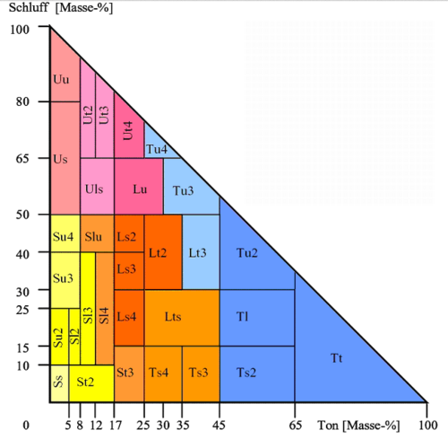

```{r}
#| label: SetupLibraries
#| include: FALSE

knitr::opts_chunk$set(echo = TRUE, warning = FALSE, message = FALSE, fig.align = "center", fig.width = 12, fig.height = 6, fig.pos = "h", fig.cap = TRUE)
rm(list = ls(all.names = TRUE))

library(rmarkdown)
library(bookdown)
library(soilwater)
library(pracma)
library(dplyr)
library(ggplot2)
library(extrafont)
library(gifski)
library(gganimate)
library(transformr)
library(reticulate)
library(tinytex)
library(magick)
library(bibtex)
library(ggsci)
library(knitcitations)
library(kableExtra)
library(Weatherfunctions)
library(xml2)
library(ggpmisc)
library(tidyr)
source("Q:/HUME/HUME/RLib/DokuUtilFunctions.R")

options("citation_format" = "pandoc")

```

```{r}
#| include: false
fn_source <- "Q:/HUME/HUME/Components/Soil/USoilTexture.pas"
fn_xml_docu <- "Q:/HUME/HUME/XML_Delphi_Docu/USoilTexture.xml"
```

# Introduction

```{r}
#| echo: false
#| results: "asis"
#| message: false
#| warning: false

# 1. Load the XML file
doc <- xml2::read_xml(fn_xml_docu)


```

```{r}
#| echo: false
#| results: "asis"
#| message: false
#| warning: false

GetFirstDevNotes(fn_xml_docu)
```

# Scientific Background

## Parameterisation of soil water retention and hydraulic conductivity

The module is based on the Van Genuchten-Mualem approach for parameterisation of soil water retention and hydraulic conductivity. The soil water retention curve is described by the following equation:

$$\theta = \theta_r + \frac{\theta_s - \theta_r}{(1 + (\alpha \cdot h)^n)^m}$$ {#eq-VanGenuchten}

Where $\theta$ is the soil water content, $\theta_r$ is the residual soil water content, $\theta_s$ is the saturated soil water content, $h$ is the soil water suction, and $\alpha$, $n$, and $m$ are empirical parameters that describe the shape of the soil water retention curve. The hydraulic conductivity is calculated based on the soil water retention curve and the Mualem model, which describes the relationship between hydraulic conductivity and soil water content.

### Pedo-transfer functions

The parameters of this equation can be determined based on soil texture and bulk density using pedotransfer functions, which are empirical relationships that relate soil texture properties to the parameters of the Van Genuchten-Mualem model. The module includes currently two sets of pedotransfer functions for different soil textures, which can be used to estimate the parameters based on the soil texture and bulk density. The first is based on the *Bodenkundliche Kartieranleitung* (KA5) and the second is based on the publication of Renger et al. (2012). Both appproaches are based on the texture classes of the German Soil Classification (KA5) (@fig-TextureTriangel).
The user can choose between these two sets of pedotransfer functions based on the soil texture and bulk density of the soil being simulated. It is, however also possible to use specific values of the parameters of the Van Genuchten-Mualem model.

{#fig-TextureTriangel}

The parameters of the Van Genuchten-Mualem model for different soil textures based on the two sets of pedotransfer functions are shown in @tbl-GenuchtenPars.

```{r}
#| include: false
#


fn_KA5 <- "./Components/Soil/Documentation/GenuchtenPars.csv"
Params_KA5 <- read.table(fn_KA5, header = TRUE, comment.char = "[", sep = ";", dec = ".")
Params_KA5$l <- 0.5
Params_KA5$Source <- "KA5"

fn_RR <- "./Components/Soil/Documentation/GenuchtenPars_roteReihe.csv"
Params_RR <- read.table(fn_RR, header = TRUE, comment.char = "[", sep = ";", dec = ".")
Params_RR$Source <- "RR"

#Params <- rbind(Params_KA5,Params_RR, Params_Vereecken)
Params <- rbind(Params_KA5,Params_RR)
Params$Source <- as.factor(Params$Source)

Params$m <- 1-1/Params$n
Params$FK <- swc (psi=-10^1.8, alpha=Params$alpha,
                  n=Params$n,m=Params$m,theta_sat=Params$theta_s,
                  theta_res=Params$theta_r, psi_s = -1/alpha, lambda = m * n, type_swc = "VanGenuchten")
Params$PWP <- swc (psi=-10^4.2, alpha=Params$alpha,
                  n=Params$n,m=Params$m,theta_sat=Params$theta_s,
                  theta_res=Params$theta_r, psi_s = -1/alpha, lambda = m * n, type_swc = "VanGenuchten")
Params$nFK <- Params$FK-Params$PWP


```

```{r}
#| echo: false
#| message: false
#| warning: false
#| include: true
#| label: tbl-GenuchtenPars
#| tbl-cap: Parameters of the Van Genuchten-Mualem model for different soil textures based on two sets of pedotransfer functions. The parameters are the residual soil water content (theta_r), the saturated soil water content (theta_s), the alpha parameter, the n parameter, the m parameter, the soil water content at field capacity (FK), the soil water content at permanent wilting point (PWP) and the difference between FK and PWP (nFK).


library(dplyr)
library(DT)
library(htmlwidgets)

Params2 <- Params %>%
  select(Source, Bodenart, everything()) %>%
  arrange(Bodenart, Source)

num_cols <- names(Params2)[sapply(Params2, is.numeric)]

datatable(
  Params2,
  rownames = FALSE,
  filter = "top",
  options = list(
    pageLength = 8,
    autoWidth = TRUE,
    scrollX = TRUE
  ),
  callback = JS(
    "table.on('init.dt', function() {",
    "  var headerRows = $(table.table().header()).find('tr');",
    "  if (headerRows.length > 1) {",
    "    $(headerRows[1]).find('th').each(function(i) {",
    "      if (i > 1) {",
    "        $(this).html('');",
    "      }",
    "    });",
    "  }",
    "});"
  )
) %>%
  formatRound(columns = num_cols, digits = 3, dec.mark = ".")
```

```{r}
#| include: false
library(dplyr)
library(plotly)
library(crosstalk)

Params_shared <- SharedData$new(Params, key = ~Bodenart)

```

In the interactive figure below you can explore the parameters of the Van Genuchten-Mualem model for different soil textures based on the two sets of pedotransfer functions. You can filter the data by soil texture and source of the pedotransfer function using the dropdown menu and checkboxes above the figure. The figure shows the soil water retention curves for different soil textures based on the parameters of the Van Genuchten-Mualem model.

```{r}
#| include: false


logpsi <- seq(from=1, to = 4.3, by=0.05)
psi <- 10^logpsi
#psi <- -psi


#psi <- seq(0.1, 15000, length.out = 200)

retention_curve <- function(theta_s, theta_r, alpha, n, psi){
  theta_r + (theta_s-theta_r)/(1+(alpha*psi)^n)^(1-1/n)
}

curves <- Params %>%
  rowwise() %>%
  do({
    tibble(
      Bodenart = .$Bodenart,
      Source = .$Source,
      psi = psi,
      theta = retention_curve(.$theta_s, .$theta_r, .$alpha, .$n, psi)
    )
  })
```

```{r}
#| echo: false
#| message: false
#| warning: false
#| include: true
#| label: fig-retention_curves
#| fig-cap: "Soil water retention curves for different soil textures based on the parameters of the Van Genuchten-Mualem model. The curves are based on two sets of pedotransfer functions for different soil textures, which can be used to estimate the parameters based on the soil texture and bulk density. The first is based on the *Bodenkundliche Kartieranleitung* (KA5) and the second is based on the publication of Renger et al. (2012). Both appproaches are based on the texture classes of the German Soil Classification (KA5)."

shared_curves <- SharedData$new(curves)

bscols(
  widths = c(3,9),
  list(
    filter_select("boden", "Texture", shared_curves, ~Bodenart, multiple = TRUE),
    filter_checkbox("Source", "PTF", shared_curves, ~Source, inline = TRUE)
  ),

  plot_ly(
    shared_curves,
    x = ~psi,
    y = ~theta,
    color = ~Source,
    linetype = ~Bodenart,
    type = "scatter",
    mode = "lines"
  ) %>%
  layout(
    xaxis = list(title = "Soil suction (hPa)", type = "log"),
    yaxis = list(title = "Water content"),

    shapes = list(
      list(
        type = "line",
        x0 = 10^1.8, x1 = 10^1.8,
        y0 = 0, y1 = 1,
        yref = "paper",
        line = list(color = "black", dash = "dash")
      ),
      list(
        type = "line",
        x0 = 10^4.2, x1 = 10^4.2,
        y0 = 0, y1 = 1,
        yref = "paper",
        line = list(color = "black", dash = "dash")
      )
    )
  )
)
```


