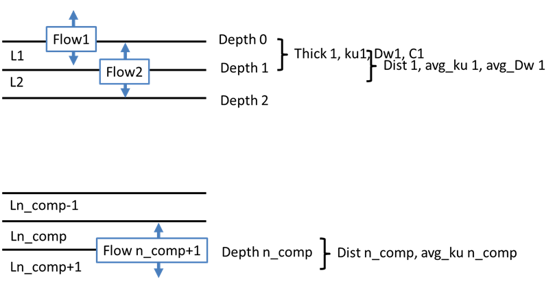
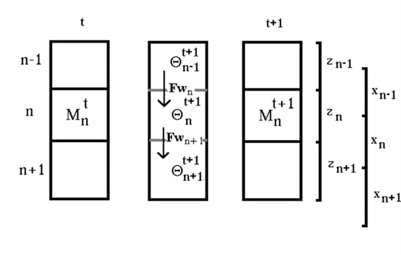

```{r}
#| label: SetupLibraries
#| include: FALSE

knitr::opts_chunk$set(echo = TRUE, warning = FALSE, message = FALSE, fig.align = "center", fig.width = 12, fig.height = 6, fig.pos = "h", fig.cap = TRUE)
rm(list = ls(all.names = TRUE))

library(rmarkdown)
library(bookdown)
library(soilwater)
library(pracma)
library(dplyr)
library(ggplot2)
library(extrafont)
library(gifski)
library(gganimate)
library(transformr)
library(reticulate)
library(tinytex)
library(magick)
library(bibtex)
library(ggsci)
library(knitcitations)
library(kableExtra)
library(Weatherfunctions)
library(xml2)
library(ggpmisc)
library(tidyr)
source("Q:/HUME/HUME/RLib/DokuUtilFunctions.R")

options("citation_format" = "pandoc")

```

```{r}
#| include: false
fn_source <- "Q:/HUME/HUME/Components/Soil/USoilwatermod.pas"
fn_xml_docu <- "Q:/HUME/HUME/XML_Delphi_Docu/USoilwatermod.xml"
```

# Introduction

```{r}
#| echo: false
#| results: "asis"
#| message: false
#| warning: false

# 1. Load the XML file
doc <- xml2::read_xml(fn_xml_docu)


```

```{r}
#| echo: false
#| results: "asis"
#| message: false
#| warning: false

GetClassDevNotes("TSoilWaterMod",fn_xml_docu)
```

## Ancestor classes

The class TSoilWaterModelR has the following ancestor classes shown in Table @tbl-AncestorClasses.

```{r}
#| label: tbl-AncestorClasses
#| echo: false
#| tbl-cap: "Ancestor classes of TSoilWaterMod."

df <- GetAncestorClasses(fn_xml_docu,"TSoilWaterMod")

kable(df)


```

# Scientific Background

The TSoilWaterModelR module simulates the vertical transport of water in the soil profile, which is a key process in agro-ecological systems. The upper boundary is defined by the soil surface, where water can enter the soil profile through precipitation or irrigation, and can leave the soil profile through evaporation. The lower boundary is at the last soil compartment, usually parameterized at a depth of 2m. There capillary rise or drainage can occur, depending on the soil water potential gradient between the last soil compartment and the lower subsoil and different options for its calculation.

## Soil water transport

The module TSoilWaterModelR simulates the vertical transport of water in the soil profile. The water balance at any point in the soil profile can be described by the continuity equation:

$$\frac{d\theta }{dt}=\frac{dFw}{dz}-{{S}_{(z,t)}}$$ {#eq-H2OContinuity}

The water flow F~w~ in the soil follows the potential gradients, whereby only the matrix potential ($\psi_m$) and the gravitational potential ($\psi_z$) have to be taken into account in agricultural soils in temperate climates:

$$Fw(z,t)=-Ku(\theta )\cdot \frac{d{{\psi }_{h}}}{dz}=-\left( Ku(\theta )\frac{d{{\psi }_{m}}}{dz}+Ku(\theta )\frac{d{{\psi }_{z}}}{dz} \right)=-Ku(\theta )\left( \frac{d{{\psi }_{m}}}{dz}+1 \right)$$ {#eq-potentialtransport}

The water transport can also be described using the diffusion equation:

$$Fw(z,t)=-\left( Dw(\theta )\frac{d\theta }{dz}+Ku(\theta ) \right)$$ {#eq-diffusiontransport}

The water diffusivity is defined as the water conductivity multiplied by the reciprocal of the specific water storage capacity, $C(\psi_m)$ or as the water flow per unit of water content gradient:

$$Dw(\theta )=Ku\left( \theta  \right)\frac{d{{\Psi }_{m}}}{d\theta }$$ {#eq-diffusivity}

$$C\left( {{\psi }_{m}} \right)=\frac{d\theta }{d{{\psi }_{m}}}$$ {#eq-specificwaterstorage}

$${{D}_{w}}\left( \theta  \right)\equiv \frac{{{k}_{u}}\left( \theta  \right)}{C\left( \theta  \right)}$$ {#eq-diffusivity2}

The continuity equation can now be represented in different ways. In a combination of water content change on the left and water potential gradients on the right ( mixed):

$$\frac{d\theta }{dt}=\frac{dFw}{dz}=\frac{d}{dz}\left( ku\left( \theta  \right)\cdot \left( \frac{d{{\psi }_{m}}}{dz}+1 \right) \right)$$ {#eq-mixedSoilWater}

The purely tension-based equation ist often used for a numerical solution:

$$C\left( {{\psi }_{m}} \right)\frac{d{{\psi }_{m}}}{dt}=\frac{d}{dz}\left( ku\left( \theta  \right)\cdot \left( \frac{d{{\psi }_{m}}}{dz}+1 \right) \right)$$ {#eq-psisoilwater}

Using a finite difference approach, this equation can be solved iteratively, and more important using a so called ***implicit*** approach. This is explained in more detail in a later chapter.

Using the water diffusivity leads to an equation in which only water contents are included as a variable on the left and driving force on the right side of the equation. This has advantages in terms of the mass balance during iterative solution of the equation and a higher numerical stability.

The water “mobility” in the flow calculation is thereby represented via the soil water diffusivity:

$$\frac{d\theta }{dt}=\frac{d}{dz}\left( ku\left( \theta  \right)\cdot \frac{d{{\psi }_{h}}}{d\theta }\cdot \frac{d\theta }{dz} \right)=\frac{d}{dz}\left( \frac{ku\left( \theta  \right)}{C\left( \theta  \right)}\cdot \frac{d\theta }{dz}+ku\left( \theta  \right) \right)=\frac{d}{dz}\left( Dw\left( \theta  \right)\cdot \frac{d\theta }{dz}+{{k}_{u}}\left( \theta  \right) \right)$$ {#eq-diffusionSoilWater}

Also a simpler tipping bucket approach is implemented, which is based on the assumption that water flows from one compartment to the next until the water content of the upper compartment reaches field capacity. This approach is numerically stable and fast, but does not consider upward flow of water such as cappilary rise and does not allow for over saturation of soil layers which may an important role in denitrification processes as well as an extra storage of water for later consumption of the crops.

### Spatial discretisation

For the numerical solutions of the water and mass transport equations, the soil profile is divided into a number of layers (See @fig-soil-discretisation). The standard is a resolution in 20 layers S with a layer thickness of 10 cm each. In principle, other resolutions are also possible, provided that the code of all components using this concept correctly. With variable depth resolution, it is important to differentiate between the distance between the center points of the compartments and the thickness. The former determines the transport distances and thus the gradients for the transport of water and nutrients, the latter is part of the buffering, ie the change in water contents / concentrations due to the spatial divergence of the flows.

{#fig-soil-discretisation}

#### Discretisation of transport equations

When converting to a finite difference approach, this results in:

$$\frac{{{\theta }^{t+1}}-{{\theta }^{t+1}}}{\Delta t}=\frac{F{{w}_{\,in}}-F{{w}_{\,out}}}{\Delta z}-{{S}_{(z,t}}_{)}$$ {#eq-H2OContinuityfinDiff}

or

$${{\theta }^{t+1}}\Delta z={{\theta }^{t+1}}\Delta z+\left( F{{w}_{\,in}}-F{{w}_{\,out}} \right)\cdot \Delta t-{{S}_{(z,t)}}$$ {#eq-H2OContinuityfinDiff2}

Where $\theta \cdot \Delta z$ corresponds to the amount of water M in a compartment.

{#fig-soilcompartimentisation}

The change in the amount of water $M_n^{t+1}$ - $M_{n}^t$ in a compartment in the time period $\Delta t$ is equal to the difference in the flow into and out of this compartment and the change in water content due to other sinks S (water uptake, evaporation):

$$M_{n}^{t+1}=M_{n}^{t}+\left( F{{w}_{n}}-F{{w}_{n+1}} \right)\cdot \Delta t-{{S}_{n}}\cdot \Delta t$$ {#eq-Massbalanceequation}

The flow towards the groundwater has a positive sign by definition. The amount of water at time step t+1 therefore can be written:

$$\theta {{_{n}^{t+1}}^{.}}z_{n}^{{}}=\theta {{_{n}^{t}}^{.}}z_{n}^{{}}+{{({{F}_{w}}_{n}^{t+1}-{{F}_{w}}_{n+1}^{t+1})}^{.}}\Delta t-{{S}_{n}}\cdot \Delta t$$ {#eq-Massbalanceequation2}

## Root water uptake

The root water uptake is considered in the water balance equation as a sink term. The potential transpiration (Tpot) is calculated based on the Penman-Monteith equation, which considers the atmospheric demand for water and the resistance to water flow from the soil to the atmosphere through the plant. The actual transpiration (Tact) is then calculated by considering the reduction of water uptake due to low soil water content and root competition.

The details are given in the documentation of the derived class [TSoilWaterModelR](https://agronomykiel.github.io/HUME/Components/Soil/Documentation/TSoilWaterModelR.html).

## Soil evaporation

Actual evaporation \[mm d^-1^\] (E~act~) is calculated by a reduction factor (f~evap~), which corrects E~pot~ by the influence of low soil water content in the top soil layer (@fig-evapredf).

$${{E}_{act}}={{E}_{pot}}\cdot {{red}_{evap}}$$ {#eq-Eact}

Within the module two different options for calculation of evaporation are included. The option called *modified Beese* is the default:

$${{red}_{evap}}=max\left(0, min \left(1,\frac{-1\cdot (\log 10(ps{{i}_{arr[1]}})-4.2)}{4.2-\log 10(ps{{i}_{critevap}})}\right)\right)$$ {#eq-fevap}

the original function according to Beese1978 however is available as well:

$$red_{evap} = max\left(0, min \left(1,-0.5767 * log_{10}(psi_{arr1}) + 1.78\right)\right)$$ {#eq-fevapBeese}

Thereby psi~arr~[1] is the soil water tension in the top soil compartment and psi~critevap~ is the soil water tension at which evaporation is reduced. The initiation of soil water potential (psi) is simply done by a parameter psi~ini~. The parameter value of psi~critevap~ has a default value of 500 [hPa].

```{r}
#| echo: false
#| message: false
#| warning: false
#| label: fig-evapredf
#| fig-cap: Reduction factor for soil evaporation (fevap) as a function of soil water tension in the top soil layer (psiarr[1]) for a given critical soil water tension for evaporation reduction (psicritevap).


psi_arr_1 <- seq(-16000, -1, by = 1) # Soil water tension in the top soil layer

psicritevap <- -100 # Critical soil water tension for evaporation reduction
fevap <- length(psi_arr_1)
fevap <- pmax(0, pmin(1,(-1 * (log10(-psi_arr_1) - 4.2)) / (4.2 - log10(-psicritevap))))
fevapBeese <- pmax(0, pmin(1, -0.5767 * log10(-psi_arr_1) + 1.78))


illu <- data.frame(psi_arr_1, fevap, fevapBeese)
illu <- pivot_longer(illu, cols = c("fevap", "fevapBeese"), names_to = "Method", values_to = "ReductionFactor")


p <- ggplot(data = illu) +
  geom_line( aes(x = abs(psi_arr_1), y = ReductionFactor, group=Method, color=Method), size = 1) +
  scale_x_log10() +
  scale_color_manual(values = c("blue", "red"), labels = c("Modified Beese", "Original Beese")) +
  labs(x = "Soil water tension in the top soil layer (psi_arr[1]) [kPa]",
       y = "Reduction factor for soil evaporation (fevap)") +
  theme_minimal(base_size = 14)
p

```

## Lower boundary conditions

The lower boundary condition can be defined in different ways. The default is a free drainage, which means that water can freely flow out of the last soil compartment if the soil water potential gradient between the last soil compartment and the groundwater is negative. If the soil water potential gradient is positive, capillary rise can occur, which means that water can flow from the groundwater into the last soil compartment. The capillary rise is calculated based on the soil water retention curve and the hydraulic conductivity of the last soil compartment.

### Free drainage boundary condition

For the free drainage boundary condition, the matrix potential and the soil water content of the compartment n+1 is set to the value of the compartmen n. Therefore the water flow is only driven by the gravitational potential:

$$Fw_{n+1}  = -Ku \left( \theta  \right)\cdot \left( \frac{0}{dz}+1 \right)=-Ku\left( \theta  \right)$$ {#eq-FreeDrainage}

### Fixed water table and no flow boundary condition

There is also an option for a fixed water table, which means that the soil water potential at the lower boundary i.e. in the compartment n+1 is fixed to a certain value. This can be used to simulate situations where the groundwater level is close to the soil surface and can influence the soil water dynamics.

Furthermore a no flow boundary condition is available, which means that water cannot flow out of the last soil compartment. This can be used to simulate situations where the groundwater level is very deep and does not influence the soil water dynamics.

# Details of numerical solutions

Starting with the mass balance i.e. the amount of water \[cm\] within a compartment n at the time t $M_{n}^{t}$, the change in the amount of water can be calculated as the difference between the influx $F_{w_{n}}$ and the efflux $F_{w_{n+1}}$ and the sink term $S_{n}$ (Eq. 15). The amount of water can also be expressed as the product of the water content $\theta$ and the thickness of the compartment D (Eq. 16).

$$M_{n}^{t+1}=M_{n}^{t}+{{({{F}_{w}}_{n}^{t+1}-{{F}_{w}}_{n+1}^{t+1}-{{S}_{n}})}^{.}}\Delta t$$ {#eq-Massbalanceequation3}

$$\theta {{_{n}^{t+1}}^{.}}D_{n}^{{}}=\theta {{_{n}^{t}}^{.}}D_{n}^{{}}+{{({{F}_{w}}_{n}^{t+1}-{{F}_{w}}_{n+1}^{t+1}-{{S}_{n}})}^{.}}\Delta t$$ {#eq-Massbalanceequation4}

The change of the amount of water is equal to the change in soil water suction times the specific water storage capacity C. This results in:

$$\frac{\partial \theta }{\partial t}=C\left( h \right)\frac{\partial h}{\partial t}\approx C\left( h \right)\frac{h_{n}^{t+1}-h_{n}^{t}}{\Delta t}$$ {#eq-StorageChange}

For a numerical solution of the water balance equation using the soil water suction h, the balance equation can be written in analogy to the above equations as follows:

$$\begin{align}
  & h_{n}^{t+1}\cdot C_{n}^{t+1}\cdot D_{n}^{{}}=h_{n}^{t}\cdot C_{n}^{t+1}\cdot D_{n}^{{}}+{{\left[ ku{{_{n-{}^{1}/{}_{2}}^{t+1}}^{.}}\left( \frac{h_{n}^{t+1}-h_{n-1}^{t+1}}{z_{n-1}^{{}}}+1 \right)-ku{{_{n+{}^{1}/{}_{2}}^{t+1}}^{.}}\left( \frac{h_{n+1}^{t+1}-h_{n}^{t+1}}{z_{n}^{{}}}+1 \right)-{{S}_{n}} \right]}^{.}}\Delta t \\ 
 &  \\ 
\end{align}$$

Removing the brackets for the flows:

$$h_{n}^{t+1}\cdot C_{n}^{t+1}\cdot D_{n}^{{}} = h_{n}^{t} \cdot C_{n}^{t+1} \cdot D_{n}+ku{{_{n-{}^{1}/{}_{2}}^{t+1}}^{.}} \frac{h_{n}^{t+1}-h_{n-1}^{t+1}}{z_{n-1}^{{}}}\cdot \Delta t+ku_{n-{}^{1}/{}_{2}}^{t+1}\cdot \Delta t-ku{{_{n+{}^{1}/{}_{2}}^{t+1}}^{.}} \frac{h_{n+1}^{t+1} -h_{n}^{t+1}}{z_{n}^{{}}}\cdot \Delta t-\\ku_{n+{}^{1}/{}_{2}}^{t+1}\cdot \Delta t-{{S}_{n}}\Delta t$$ {#eq-Massbalanceequation5}

Multiplying the flow terms out:

$$\begin{align}
  & h_{n}^{t+1}\cdot C_{n}^{t+1}\cdot D_{n}^{{}}=h_{n}^{t}\cdot C_{n}^{t+1}\cdot D_{n}^{{}}+ \\ 
 & h_{n}^{t+1}{{\cdot }^{.}}\frac{ku_{n-{}^{1}/{}_{2}}^{t+1}}{z_{n-1}^{{}}}\cdot \Delta t-h_{n-1}^{t+1}{{\cdot }^{.}}\frac{ku_{n-{}^{1}/{}_{2}}^{t+1}}{z_{n-1}^{{}}}\cdot \Delta t+ku_{n-{}^{1}/{}_{2}}^{t+1}\cdot \Delta t \\ 
 & -h_{n+1}^{t+1}\frac{ku{{_{n+{}^{1}/{}_{2}}^{t+1}}^{.}}}{z_{n}^{{}}}\cdot \Delta t-h_{n}^{t+1}\frac{ku{{_{n+{}^{1}/{}_{2}}^{t+1}}^{.}}}{z_{n}^{{}}}\cdot \Delta t-ku_{n+{}^{1}/{}_{2}}^{t+1}\cdot \Delta t \\ 
 & -{{S}_{n}}\cdot \Delta t \\ 
 &  \\ 
\end{align}$$

Division by Cn\*Dn:

$$\begin{align}
  & h_{n}^{t+1}=h_{n}^{t}+ \\ 
 & h_{n}^{t+1}{{\cdot }^{.}}\frac{ku_{n-{}^{1}/{}_{2}}^{t+1}}{z_{n-1}^{{}}\cdot C_{n}^{t+1}\cdot D_{n}^{{}}}\cdot \Delta t-h_{n-1}^{t+1}{{\cdot }^{.}}\frac{ku_{n-{}^{1}/{}_{2}}^{t+1}}{z_{n-1}^{{}}\cdot C_{n}^{t+1}\cdot D_{n}^{{}}}\cdot \Delta t+\frac{ku_{n-{}^{1}/{}_{2}}^{t+1}\cdot \Delta t}{C_{n}^{t+1}\cdot D_{n}^{{}}} \\ 
 & -h_{n+1}^{t+1}\frac{ku{{_{n+{}^{1}/{}_{2}}^{t+1}}^{.}}}{z_{n}^{{}}\cdot C_{n}^{t+1}\cdot D_{n}^{{}}}\cdot \Delta t-h_{n}^{t+1}\frac{ku{{_{n+{}^{1}/{}_{2}}^{t+1}}^{.}}}{z_{n}^{{}}\cdot C_{n}^{t+1}\cdot D_{n}^{{}}}\cdot \Delta t-\frac{ku_{n+{}^{1}/{}_{2}}^{t+1}\cdot \Delta t}{C_{n}^{t+1}\cdot D_{n}^{{}}} \\ 
 & -\frac{{{S}_{n}}\Delta t}{C_{n}^{t+1}\cdot D_{n}^{{}}} \\ 
\end{align}$$

Removing the brackets for the tensions:

$$\begin{align}
  & h_{n}^{t+1}=h_{n}^{t}+\frac{ku_{n-{}^{1}/{}_{2}}^{t+1}\cdot \Delta t}{C_{n}^{t+1}\cdot D_{n}^{{}}}-\frac{ku_{n+{}^{1}/{}_{2}}^{t+1}\cdot \Delta t}{C_{n}^{t+1}\cdot D_{n}^{{}}}-\frac{{{S}_{n}}\Delta t}{C_{n}^{t+1}\cdot D_{n}^{{}}} \\ 
 & -h_{n-1}^{t+1}{{\cdot }^{.}}\frac{ku_{n-{}^{1}/{}_{2}}^{t+1}}{z_{n-1}^{{}}\cdot C_{n}^{t+1}\cdot D_{n}^{{}}}\cdot \Delta t \\ 
 & h_{n}^{t+1}{{\cdot }^{.}}\left( \frac{ku_{n-{}^{1}/{}_{2}}^{t+1}}{z_{n-1}^{{}}\cdot C_{n}^{t+1}\cdot D_{n}^{{}}}\cdot \Delta t-\frac{ku{{_{n+{}^{1}/{}_{2}}^{t+1}}^{.}}}{z_{n}^{{}}\cdot C_{n}^{t+1}\cdot D_{n}^{{}}}\cdot \Delta t \right) \\ 
 & -h_{n+1}^{t+1}\frac{ku{{_{n+{}^{1}/{}_{2}}^{t+1}}^{.}}}{z_{n}^{{}}\cdot C_{n}^{t+1}\cdot D_{n}^{{}}}\cdot \Delta t \\ 
\end{align}$$

$$\begin{align}
  & mit \\ 
 & P_{n}^{t+1}=\frac{\Delta t}{C_{n}^{t+1}\cdot D_{n}^{{}}}\,\,und\,\,Kf_{n}^{t+1}=\frac{ku_{n-{}^{1}/{}_{2}}^{t+1}}{z_{n-1}^{{}}} \\ 
\end{align}$$

Following simplification:

$$\begin{align}
  &  \\ 
 & h_{n}^{t+1}=h_{n}^{t}+\left( ku_{n-{}^{1}/{}_{2}}^{t+1}-ku_{n+{}^{1}/{}_{2}}^{t+1} \right)\cdot P_{n}^{t+1}-{{S}_{n}}\cdot P_{n}^{t+1} \\ 
 & -h_{n-1}^{t+1}{{\cdot }^{.}}Kf_{n-{}^{1}/{}_{2}}^{t+1}\cdot P_{n}^{t+1} \\ 
 & h_{n}^{t+1}{{\cdot }^{.}}\left( Kf_{n-{}^{1}/{}_{2}}^{t+1}\cdot P_{n}^{t+1}-Kf_{n+{}^{1}/{}_{2}}^{t+1}\cdot P_{n}^{t+1} \right) \\ 
 & -h_{n+1}^{t+1}{{\cdot }^{.}}Kf_{n+{}^{1}/{}_{2}}^{t+1}\cdot P_{n}^{t+1} \\ 
 &  \\ 
\end{align}$$

$$\begin{array}{*{35}{l}}
   h_{n}^{t}+\left( ku_{n-{}^{1}/{}_{2}}^{t+1}-ku_{n+{}^{1}/{}_{2}}^{t+1} \right)\cdot P_{n}^{t+1}-{{S}_{n}}\cdot P_{n}^{t+1}= & B\_Vektor  \\
   h_{n-1}^{t+1}{{\cdot }^{.}}Kf_{n-{}^{1}/{}_{2}}^{t+1}\cdot P_{n}^{t+1} & Lower  \\
   h_{n}^{t+1}{{\cdot }^{.}}\left( -Kf_{n-{}^{1}/{}_{2}}^{t+1}\cdot P_{n}^{t+1}-Kf_{n+{}^{1}/{}_{2}}^{t+1}\cdot P_{n}^{t+1}+1 \right) & Diag  \\
   h_{n+1}^{t+1}{{\cdot }^{.}}Kf_{n+{}^{1}/{}_{2}}^{t+1}\cdot P_{n}^{t+1} & Upper  \\
\end{array}$$

##### Lower boundary condition

For the lower boundary condition, in principle, 4 options are implemented:

-   A constant water content / a constant water tension ("ConstContent"), i.e. the water content / water tension in compartment n_comp + 1 remains at the initialized value,
-   a free flow ("FreeFlow") at the lower compartment end, i.e. the water a free flow ("FreeFlow") at the lower compartment end, i.e. the water tension in n_comp+1 is set to a lower value corresponding to the distance from the compartment center, as it would be in hydraulic equilibrium,
-   No flow at the lower boundary ("NoFlow")
-   A variable groundwater level specified via the weather input file ("Groundwater")

For the variants ConstContent, FreeFlow and Groundwater, the water tension / water content for compartment n_comp+1 is known and therefore does not need to be determined by solving the system of equations.

$$\begin{align}
  & h_{n\_comp}^{t+1}\cdot C_{n\_comp}^{t+1}\cdot D_{n\_comp}^{{}}= \\ 
  h_{n\_comp}^{t}\cdot C_{n\_comp}^{t+1}\cdot D_{n\_comp}^{{}} \\ 
 & \,\,\,\,\,\,\,\,\,\,\,\,\,\\,\,\,\,\,\,\,\,\,\,\,\,\,+{{\left[ ku{{_{n\_comp-{}^{1}/{}_{2}}^{t+1}}^{.}}\left( \frac{h_{n\_comp}^{t+1}-h_{n\_comp-1}^{t+1}}{z_{n\_comp-1}^{{}}}+1 \right)-ku{{_{n+{}^{1}/{}_{2}}^{t+1}}^{.}}\left( \frac{h_{n\_comp+1}^{t}-h_{n\_comp}^{t+1}}{z_{n\_comp}^{{}}}+1 \right)-{{S}_{n\_comp}} \right]}^{.}}\Delta t \\ 
 &  \\ 
\end{align}$$

Das bedeutet, dass der Term mit hn_comp+1 in den Term mit den bekannten Werten wandert und es somit keinen Term für den „upper“-Vektor gibt:

$$\begin{array}{*{35}{l}}
   h_{n}^{t}+\left( ku_{n-{}^{1}/{}_{2}}^{t+1}-ku_{n+{}^{1}/{}_{2}}^{t+1} \right)\cdot P_{n}^{t+1}-{{S}_{n}}\cdot P_{n}^{t+1}-h_{n+1}^{t+1}{{\cdot }^{.}}Kf_{n+{}^{1}/{}_{2}}^{t+1}\cdot P_{n}^{t+1}= & B\_Vektor  \\
   h_{n-1}^{t+1}{{\cdot }^{.}}Kf_{n-{}^{1}/{}_{2}}^{t+1}\cdot P_{n}^{t+1} & Lower  \\
   h_{n}^{t+1}{{\cdot }^{.}}\left( -Kf_{n-{}^{1}/{}_{2}}^{t+1}\cdot P_{n}^{t+1}-Kf_{n+{}^{1}/{}_{2}}^{t+1}\cdot P_{n}^{t+1}+1 \right) & Diag  \\
   {} & {}  \\
\end{array}$$

Am oberen Rand kann die Situation von Wassersättigung bzw. sehr starker Austrocknung eintreten. In diesem Fall wechselt die Fluss- zu einer Gehaltsrandbedingung und das erste gerechnete Kompartiment ist das zweite, für das nun eine bekannte Wasserspannung im 1. Kompartiment als Randbedingung vorliegt:

$$\begin{align}
  & h_{2}^{t+1}=h_{2}^{t+1}+\frac{ku_{2-{}^{1}/{}_{2}}^{t}\cdot \Delta t}{C_{2}^{t+1}\cdot D_{2}^{{}}}-\frac{ku_{2+{}^{1}/{}_{2}}^{t+1}\cdot \Delta t}{C_{2}^{t+1}\cdot D_{2}^{{}}}-\frac{{{S}_{2}}\Delta t}{C_{2}^{t+1}\cdot D_{2}^{{}}} \\ 
 & -h_{1}^{t}{{\cdot }^{.}}\frac{ku_{2-{}^{1}/{}_{2}}^{t+1}}{z_{1}^{{}}\cdot C_{2}^{t+1}\cdot D_{2}^{{}}}\cdot \Delta t \\ 
 & h_{2}^{t+1}{{\cdot }^{.}}\left( \frac{ku_{2-{}^{1}/{}_{2}}^{t+1}}{z_{1}^{{}}\cdot C_{2}^{t+1}\cdot D_{2}^{{}}}\cdot \Delta t-\frac{ku{{_{2+{}^{1}/{}_{2}}^{t+1}}^{.}}}{z_{2}^{{}}\cdot C_{2}^{t+1}\cdot D_{2}^{{}}}\cdot \Delta t \right) \\ 
 & -h_{3}^{t+1}\frac{ku{{_{2+{}^{1}/{}_{2}}^{t+1}}^{.}}}{z_{2}^{{}}\cdot C_{2}^{t+1}\cdot D_{2}^{{}}}\cdot \Delta t \\ 
\end{align}$$

Im SWAP-Modell wird die obere Randbedingung alternativ berechnet indem der Influx in die oberste Schicht mit einer angenommenen Wasserspannung an der Oberfläche (h0) berechnet wird:

$$\begin{align}
  & h_{1}^{t+1}\cdot C_{1}^{t+1}\cdot D_{1}^{{}}=h_{1}^{t}\cdot C_{1}^{t+1}\cdot D_{1}^{{}}+{{\left[ ku{{_{1}^{t+1}}^{.}}\left( \frac{h_{n}^{t+1}-h_{0}^{t}}{{}^{z_{1}^{{}}}/{}_{2}}+1 \right)-ku{{_{1+{}^{1}/{}_{2}}^{t+1}}^{.}}\left( \frac{h_{2}^{t+1}-h_{1}^{t+1}}{{{z}_{2}}}+1 \right)-{{S}_{1}} \right]}^{.}}\Delta t \\ 
 &  \\ 
\end{align}$$

Zur Berechnung des tensionsinduzierten Influx (der Infiltration) wird die halbe Dicke des ersten Kompartiments genutzt.

$$\begin{align}
  & h_{1}^{t+1}\cdot C_{1}^{t+1}\cdot D_{1}^{{}}=h_{1}^{t}\cdot C_{1}^{t+1}\cdot D_{1}^{{}} \\ 
 & +\frac{h_{1}^{t+1}\cdot ku_{1}^{t+1}\cdot 2\cdot \Delta t}{{{z}_{1}}} \\ 
 & -\frac{-h_{0}^{t}\cdot ku_{1}^{t+1}\cdot 2\cdot \Delta t}{z_{1}^{{}}} \\ 
 & +ku_{1}^{t+1}\cdot \Delta t \\ 
 & {{-}^{.}}\frac{h_{2}^{t+1}\cdot ku_{1+{}^{1}/{}_{2}}^{t+1}\cdot \Delta t}{{{z}_{2}}} \\ 
 & +\frac{h_{1}^{t+1}\cdot ku_{1+{}^{1}/{}_{2}}^{t+1}\cdot \Delta t}{{{z}_{2}}} \\ 
 & -ku_{1+{}^{1}/{}_{2}}^{t+1}\cdot \Delta t \\ 
 & -{{S}_{1}}\cdot \Delta t \\ 
 &  \\ 
\end{align}$$

Ausklammern der Wasserspannungen

$$\begin{align}
  & h_{1}^{t+1}=h_{1}^{t} \\ 
 & +\frac{h_{1}^{t+1}\cdot ku_{1}^{t+1}\cdot 2\cdot \Delta t}{{{z}_{1}}\cdot C_{1}^{t+1}\cdot D_{1}^{{}}} \\ 
 & -\frac{-h_{0}^{t}\cdot ku_{1}^{t+1}\cdot 2\cdot \Delta t}{z_{1}^{{}}\cdot C_{1}^{t+1}\cdot D_{1}^{{}}} \\ 
 & +\frac{ku_{1}^{t+1}\cdot \Delta t}{C_{1}^{t+1}\cdot D_{1}^{{}}} \\ 
 & {{-}^{.}}\frac{h_{2}^{t+1}\cdot ku_{1+{}^{1}/{}_{2}}^{t+1}\cdot \Delta t}{{{z}_{2}}\cdot C_{1}^{t+1}\cdot D_{1}^{{}}} \\ 
 & +\frac{h_{1}^{t+1}\cdot ku_{1+{}^{1}/{}_{2}}^{t+1}\cdot \Delta t}{{{z}_{2}}\cdot C_{1}^{t+1}\cdot D_{1}^{{}}} \\ 
 & -\frac{ku_{1+{}^{1}/{}_{2}}^{t+1}\cdot \Delta t}{C_{1}^{t+1}\cdot D_{1}^{{}}} \\ 
 & -\frac{{{S}_{1}}\cdot \Delta t}{C_{1}^{t+1}\cdot \Delta t} \\ 
 &  \\ 
\end{align}$$

Division durch C1.D1 Ausklammern und unbekannte ht+1 Terme nach links:

$$\begin{align}
  & h_{1}^{t+1}\cdot \left( -\frac{ku_{1}^{t+1}\cdot 2\cdot \Delta t}{{{z}_{1}}\cdot C_{1}^{t+1}\cdot D_{1}^{{}}}-\frac{ku_{1+{}^{1}/{}_{2}}^{t+1}\cdot \Delta t}{{{z}_{2}}\cdot C_{1}^{t+1}\cdot D_{1}^{{}}}+1 \right)+ \\ 
 & h_{2}^{t+1}\cdot \left( \frac{ku_{1+{}^{1}/{}_{2}}^{t+1}\cdot \Delta t}{{{z}_{2}}\cdot C_{1}^{t+1}\cdot D_{1}^{{}}} \right) \\ 
 & =h_{1}^{t}-\frac{-h_{0}^{t}\cdot ku_{1}^{t+1}\cdot 2\cdot \Delta t}{z_{1}^{{}}\cdot C_{1}^{t+1}\cdot D_{1}^{{}}}+\frac{ku_{1}^{t+1}\cdot \Delta t}{C_{1}^{t+1}\cdot D_{1}^{{}}}-\frac{ku_{1+{}^{1}/{}_{2}}^{t+1}\cdot \Delta t}{C_{1}^{t+1}\cdot D_{1}^{{}}}-\frac{{{S}_{1}}\cdot \Delta t}{C_{1}^{t+1}\cdot \Delta t} \\ 
 &  \\ 
\end{align}$$

$$\begin{align}
  & h_{1}^{t+1}=h_{1}^{t+1}+\frac{ku_{1-{}^{1}/{}_{2}}^{t}\cdot \Delta t}{C_{1}^{t+1}\cdot D_{1}^{{}}}-\frac{ku_{1+{}^{1}/{}_{2}}^{t+1}\cdot \Delta t}{C_{1}^{t+1}\cdot D_{1}^{{}}}-\frac{{{S}_{1}}\Delta t}{C_{1}^{t+1}\cdot D_{1}^{{}}} \\ 
 & -h_{0}^{t}{{\cdot }^{.}}\frac{ku_{1}^{t+1}}{{z_{1}^{{}}}/{2}\;\cdot C_{1}^{t+1}\cdot D_{1}^{{}}}\cdot \Delta t \\ 
 & h_{1}^{t+1}{{\cdot }^{.}}\left( \frac{ku_{1}^{t+1}}{{z_{1}^{{}}}/{2}\;\cdot C_{2}^{t+1}\cdot D_{2}^{{}}}\cdot \Delta t-\frac{ku{{_{1+{}^{1}/{}_{2}}^{t+1}}^{.}}}{z_{2}^{{}}\cdot C_{2}^{t+1}\cdot D_{2}^{{}}}\cdot \Delta t \right) \\ 
 & -h_{3}^{t+1}\frac{ku{{_{2+{}^{1}/{}_{2}}^{t+1}}^{.}}}{z_{2}^{{}}\cdot C_{2}^{t+1}\cdot D_{2}^{{}}}\cdot \Delta t \\ 
\end{align}$$

Wenn in einem Kompartiment die Wasserspannungen unter einen kritischen Wert fallen, z.B. 1 cm, dann kann es sinnvoll sein, die tensionsinduzierten Flüsse aus der Lösung für dieses Kompartiment herauszulassen: d.h.

$$\begin{align}
  & h_{n}^{t+1}\cdot C_{n}^{t+1}\cdot D_{n}^{{}}=h_{n}^{t}\cdot C_{n}^{t+1}\cdot D_{n}^{{}}+{{\left[ ku{{_{n-{}^{1}/{}_{2}}^{t+1}}^{.}}\left( \frac{h_{n}^{t+1}-h_{n-1}^{t+1}}{z_{n-1}^{{}}}+1 \right)-ku{{_{n+{}^{1}/{}_{2}}^{t+1}}^{.}}\left( \frac{h_{n+1}^{t+1}-h_{n}^{t+1}}{z_{n}^{{}}}+1 \right)-{{S}_{n}} \right]}^{.}}\Delta t \\ 
 &  \\ 
\end{align}$$

$$\begin{align}
  & h_{n}^{t+1}\cdot C_{n}^{t+1}\cdot D_{n}^{{}}=h_{n}^{t}\cdot C_{n}^{t+1}\cdot D_{n}^{{}}+{{\left[ ku{{_{n-{}^{1}/{}_{2}}^{t+1}}^{.}}\left( 0+1 \right)-ku{{_{n+{}^{1}/{}_{2}}^{t+1}}^{.}}\left( \frac{h_{n+1}^{t+1}-h_{n}^{t+1}}{z_{n}^{{}}}+1 \right)-{{S}_{n}} \right]}^{.}}\Delta t \\ 
 &  \\ 
\end{align}$$

Ausmultiplizieren der Flussterme

$$\begin{align}
  & h_{n}^{t+1}\cdot C_{n}^{t+1}\cdot D_{n}^{{}}=h_{n}^{t}\cdot C_{n}^{t+1}\cdot D_{n}^{{}}+ \\ 
 & +ku_{n-{}^{1}/{}_{2}}^{t+1}\cdot \Delta t \\ 
 & -h_{n+1}^{t+1}\frac{ku{{_{n+{}^{1}/{}_{2}}^{t+1}}^{.}}}{z_{n}^{{}}}\cdot \Delta t-h_{n}^{t+1}\frac{ku{{_{n+{}^{1}/{}_{2}}^{t+1}}^{.}}}{z_{n}^{{}}}\cdot \Delta t-ku_{n+{}^{1}/{}_{2}}^{t+1}\cdot \Delta t \\ 
 & -{{S}_{n}}\cdot \Delta t \\ 
 &  \\ 
\end{align}$$

Division durch Cn\*Dn:

$$\begin{align}
  & h_{n}^{t+1}=h_{n}^{t}+ \\ 
 & +\frac{ku_{n-{}^{1}/{}_{2}}^{t+1}\cdot \Delta t}{C_{n}^{t+1}\cdot D_{n}^{{}}} \\ 
 & -h_{n+1}^{t+1}\frac{ku{{_{n+{}^{1}/{}_{2}}^{t+1}}^{.}}}{z_{n}^{{}}\cdot C_{n}^{t+1}\cdot D_{n}^{{}}}\cdot \Delta t-h_{n}^{t+1}\frac{ku{{_{n+{}^{1}/{}_{2}}^{t+1}}^{.}}}{z_{n}^{{}}\cdot C_{n}^{t+1}\cdot D_{n}^{{}}}\cdot \Delta t-\frac{ku_{n+{}^{1}/{}_{2}}^{t+1}\cdot \Delta t}{C_{n}^{t+1}\cdot D_{n}^{{}}} \\ 
 & -\frac{{{S}_{n}}\Delta t}{C_{n}^{t+1}\cdot D_{n}^{{}}} \\ 
\end{align}$$

Ausklammern der Tensionen:

$$\begin{align}
  & h_{n}^{t+1}=h_{n}^{t}+\frac{ku_{n-{}^{1}/{}_{2}}^{t+1}\cdot \Delta t}{C_{n}^{t+1}\cdot D_{n}^{{}}}-\frac{ku_{n+{}^{1}/{}_{2}}^{t+1}\cdot \Delta t}{C_{n}^{t+1}\cdot D_{n}^{{}}}-\frac{{{S}_{n}}\Delta t}{C_{n}^{t+1}\cdot D_{n}^{{}}} \\ 
 & -h_{n-1}^{t+1}{{\cdot }^{.}}0 \\ 
 & h_{n}^{t+1}{{\cdot }^{.}}\left( -\frac{ku{{_{n+{}^{1}/{}_{2}}^{t+1}}^{.}}}{z_{n}^{{}}\cdot C_{n}^{t+1}\cdot D_{n}^{{}}}\cdot \Delta t \right) \\ 
 & -h_{n+1}^{t+1}\frac{ku{{_{n+{}^{1}/{}_{2}}^{t+1}}^{.}}}{z_{n}^{{}}\cdot C_{n}^{t+1}\cdot D_{n}^{{}}}\cdot \Delta t \\ 
\end{align}$$

$$\begin{align}
  & mit \\ 
 & P_{n}^{t+1}=\frac{\Delta t}{C_{n}^{t+1}\cdot D_{n}^{{}}}\,\,und\,\,Kf_{n}^{t+1}=\frac{ku_{n-{}^{1}/{}_{2}}^{t+1}}{z_{n-1}^{{}}} \\ 
\end{align}$$

Folgende Vereinfachung:

$$\begin{align}
  &  \\ 
 & h_{n}^{t+1}=h_{n}^{t}+\left( ku_{n-{}^{1}/{}_{2}}^{t+1}-ku_{n+{}^{1}/{}_{2}}^{t+1} \right)\cdot P_{n}^{t+1}-{{S}_{n}}\cdot P_{n}^{t+1} \\ 
 & -h_{n-1}^{t+1}{{\cdot }^{.}}0 \\ 
 & h_{n}^{t+1}{{\cdot }^{.}}\left( -Kf_{n+{}^{1}/{}_{2}}^{t+1}\cdot P_{n}^{t+1} \right) \\ 
 & -h_{n+1}^{t+1}{{\cdot }^{.}}Kf_{n+{}^{1}/{}_{2}}^{t+1}\cdot P_{n}^{t+1} \\ 
 &  \\ 
\end{align}$$

$$\begin{array}{*{35}{l}}
   h_{n}^{t}+\left( ku_{n-{}^{1}/{}_{2}}^{t+1}-ku_{n+{}^{1}/{}_{2}}^{t+1} \right)\cdot P_{n}^{t+1}-{{S}_{n}}\cdot P_{n}^{t+1}= & B\_Vektor  \\
   h_{n-1}^{t+1}{{\cdot }^{.}}Kf_{n-{}^{1}/{}_{2}}^{t+1}\cdot P_{n}^{t+1} & Lower  \\
   h_{n}^{t+1}{{\cdot }^{.}}\left( -Kf_{n-{}^{1}/{}_{2}}^{t+1}\cdot P_{n}^{t+1}-Kf_{n+{}^{1}/{}_{2}}^{t+1}\cdot P_{n}^{t+1}+1 \right) & Diag  \\
   h_{n+1}^{t+1}{{\cdot }^{.}}Kf_{n+{}^{1}/{}_{2}}^{t+1}\cdot P_{n}^{t+1} & Upper  \\
\end{array}$$
