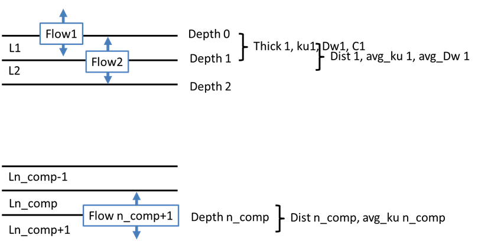
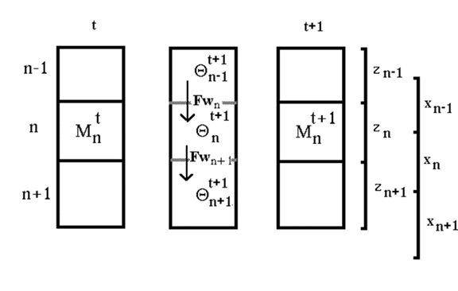

```{r}
#| label: SetupLibraries
#| include: FALSE

knitr::opts_chunk$set(echo = TRUE, warning = FALSE, message = FALSE, fig.align = "center", fig.width = 12, fig.height = 6, fig.pos = "h", fig.cap = TRUE)
rm(list = ls(all.names = TRUE))

library(rmarkdown)
library(bookdown)
library(soilwater)
library(pracma)
library(dplyr)
library(ggplot2)
library(extrafont)
library(gifski)
library(gganimate)
library(transformr)
library(reticulate)
library(tinytex)
library(magick)
library(bibtex)
library(ggsci)
library(knitcitations)
library(kableExtra)
library(Weatherfunctions)
library(xml2)
library(ggpmisc)
library(tidyr)
source("Q:/HUME/HUME/RLib/DokuUtilFunctions.R")

options("citation_format" = "pandoc")

```

```{r}
#| include: false
fn_source <- "Q:/HUME/HUME/Components/Soil/USoilwatermod.pas"
fn_xml_docu <- "Q:/HUME/HUME/XML_Delphi_Docu/USoilwatermod.xml"
```

# Introduction

```{r}
#| echo: false
#| results: "asis"
#| message: false
#| warning: false

# 1. Load the XML file
doc <- xml2::read_xml(fn_xml_docu)


```

```{r}
#| echo: false
#| results: "asis"
#| message: false
#| warning: false

GetClassDevNotes("TSoilWaterMod",fn_xml_docu)
```

## Ancestor classes

The class TSoilWaterModelR has the following ancestor classes shown in Table @tbl-AncestorClasses.

```{r}
#| label: tbl-AncestorClasses
#| echo: false
#| tbl-cap: "Ancestor classes of TSoilWaterMod."

df <- GetAncestorClasses(fn_xml_docu,"TSoilWaterMod")

kable(df)

```

# Scientific Background

The TSoilWaterModelR module simulates the vertical transport of water in the soil profile, which is a key process in agro-ecological systems. The upper boundary is defined by the soil surface, where water can enter the soil profile through precipitation or irrigation, and can leave the soil profile through evaporation. The lower boundary is at the last soil compartment, usually parameterized at a depth of 2m. There capillary rise or drainage can occur, depending on the soil water potential gradient between the last soil compartment and the lower subsoil and different options for its calculation.

## Soil water transport

The module TSoilWaterModelR simulates the vertical transport of water in the soil profile. The water balance at any point in the soil profile can be described by the continuity equation:

$$\frac{d\theta }{dt}=\frac{dFw}{dz}-{{S}_{(z,t)}}$$ {#eq-H2OContinuity}

The water flow F~w~ in the soil follows the potential gradients, whereby only the matrix potential ($\psi_m$) and the gravitational potential ($\psi_z$) have to be taken into account in agricultural soils in temperate climates (no saline soils):

$$Fw(z,t)=-Ku(\theta )\cdot \frac{d{{\psi }_{h}}}{dz}=-\left( Ku(\theta )\frac{d{{\psi }_{m}}}{dz}+Ku(\theta )\frac{d{{\psi }_{z}}}{dz} \right)=-Ku(\theta )\left( \frac{d{{\psi }_{m}}}{dz}+1 \right)$$ {#eq-potentialtransport}

The water transport can also be described using the diffusion equation:

$$Fw(z,t)=-\left( Dw(\theta )\frac{d\theta }{dz}+Ku(\theta ) \right)$$ {#eq-diffusiontransport}

The water diffusivity is defined as the water conductivity multiplied by the reciprocal of the specific water storage capacity, $C(\psi_m)$ or as the water flow per unit of water content gradient:

$$Dw(\theta )=Ku\left( \theta  \right)\frac{d{{\Psi }_{m}}}{d\theta }$$ {#eq-diffusivity}

$$C\left( {{\psi }_{m}} \right)=\frac{d\theta }{d{{\psi }_{m}}}$$ {#eq-specificwaterstorage}

$${{D}_{w}}\left( \theta  \right)\equiv \frac{{{k}_{u}}\left( \theta  \right)}{C\left( \theta  \right)}$$ {#eq-diffusivity2}

The continuity equation can now be represented in different ways. In a combination of water content change on the left and water potential gradients on the right (mixed):

$$\frac{d\theta }{dt}=\frac{dFw}{dz}=\frac{d}{dz}\left( ku\left( \theta  \right)\cdot \left( \frac{d{{\psi }_{m}}}{dz}+1 \right) \right)$$
 {#eq-mixedSoilWater}

The purely tension-based version of the condinuity equation, however, is often used for a numerical solution:

$$C\left( {{\psi }_{m}} \right)\frac{d{{\psi }_{m}}}{dt}=\frac{d}{dz}\left( ku\left( \theta  \right)\cdot \left( \frac{d{{\psi }_{m}}}{dz}+1 \right) \right)$$ {#eq-psisoilwater}

Using a finite difference approach, this equation can be solved iteratively. Because of the comparable large changes of soil water content and even more soil water tension a so called ***implicit*** approaches have to be used in order to solve the equation systems. This is explained in more detail in a later chapter.

Using the water diffusivity leads to an equation in which only water contents are included as a variable on the left and driving force on the right side of the equation. This has advantages in terms of the mass balance during iterative solution of the equation and a higher numerical stability.

The water “mobility” in the flow calculation is thereby represented via the soil water diffusivity:

$$\frac{d\theta }{dt}=\frac{d}{dz}\left( ku\left( \theta  \right)\cdot \frac{d{{\psi }_{h}}}{d\theta }\cdot \frac{d\theta }{dz} \right)=\frac{d}{dz}\left( \frac{ku\left( \theta  \right)}{C\left( \theta  \right)}\cdot \frac{d\theta }{dz}+ku\left( \theta  \right) \right)=\frac{d}{dz}\left( Dw\left( \theta  \right)\cdot \frac{d\theta }{dz}+{{k}_{u}}\left( \theta  \right) \right)$$ {#eq-diffusionSoilWater}

Also a simpler tipping bucket approach is implemented, which is based on the assumption that water flows from one compartment to the next until the water content of the upper compartment reaches field capacity. This approach is numerically stable and fast, but does not consider upward flow of water such as cappilary rise and does not allow for over saturation of soil layers which may an important role in denitrification processes as well as an extra storage of water for later consumption of the crops.

### Spatial discretisation

For the numerical solutions of the water and mass transport equations, the soil profile is divided into a number of layers (See @fig-soil-discretisation). The standard is a resolution in 20 layers S with a layer thickness of 10 cm each. In principle, other resolutions are also possible, provided that the code of all components using this concept correctly. With variable depth resolution, it is important to differentiate between the distance between the center points of the compartments and the thickness. The former determines the transport distances and thus the gradients for the transport of water and nutrients, the latter is part of the buffering, ie the change in water contents / concentrations due to the spatial divergence of the flows.

{#fig-soil-discretisation}

#### Discretisation of transport equations

When converting to a finite difference approach, this results in:

$$\frac{{{\theta }^{t+1}}-{{\theta }^{t}}}{\Delta t}=\frac{F{{w}_{\,in}}-F{{w}_{\,out}}}{\Delta z}-S_{(z,t)}$$ {#eq-H2OContinuityfinDiff}

or

$${{\theta }^{t+1}}\Delta z={{\theta }^{t}}\Delta z+\left( F{{w}_{\,in}}-F{{w}_{\,out}} \right)\cdot \Delta t-{{S}_{(z,t)}}\cdot \Delta t$$ {#eq-H2OContinuityfinDiff2}

Where $\theta \cdot \Delta z$ corresponds to the amount of water M in a compartment.

{#fig-soilcompartimentisation}

The change in the amount of water $M_n^{t+1}$ - $M_{n}^t$ in a compartment in the time period $\Delta t$ is equal to the difference in the flow into and out of this compartment and the change in water content due to other sinks S (water uptake, evaporation):

$$M_{n}^{t+1}=M_{n}^{t}+\left( F{{w}_{n}}-F{{w}_{n+1}} \right)\cdot \Delta t-{{S}_{n}}\cdot \Delta t$$ {#eq-Massbalanceequation}

The flow towards the groundwater has a positive sign by definition. The amount of water at time step t+1 therefore can be written:

$$\theta {{_{n}^{t+1}}^{.}}z_{n}^{{}}=\theta {{_{n}^{t}}^{.}}z_{n}^{{}}+{{({{F}_{w}}_{n}^{t+1}-{{F}_{w}}_{n+1}^{t+1})}^{.}}\Delta t-{{S}_{n}}\cdot \Delta t$$ {#eq-Massbalanceequation2}

## Root water uptake

The root water uptake is considered in the water balance equation as a sink term. The potential transpiration (T~pot~) is calculated using the approach of the Penman-Monteith equation, which considers the atmospheric demand for water and the resistance to water flow from the soil to the atmosphere through the plant. The actual transpiration (T~act~) is then calculated by considering the reduction of water uptake due to low soil water content and root competition.

The details are given in the documentation of the derived class [TSoilWaterModelR](TSoilWaterModelR.qmd).

## Soil evaporation

Actual evaporation \[mm d^-1^\] (E~act~) is calculated by a reduction factor (f~evap~), which corrects E~pot~ by the influence of low soil water content in the top soil layer (@fig-evapredf).

$${{E}_{act}}={{E}_{pot}}\cdot {{red}_{evap}}$$ {#eq-Eact}

Within the module two different options for calculation of evaporation are included. The option called *modified Beese* is the default:

$${{red}_{evap}}=max\left(0, min \left(1,\frac{-1\cdot (\log 10(ps{{i}_{arr[1]}})-4.2)}{4.2-\log 10(ps{{i}_{critevap}})}\right)\right)$$ {#eq-fevap}

the original function according to Beese1978 however is available as well:

$$red_{evap} = max\left(0, min \left(1,-0.5767 * log_{10}(psi_{arr1}) + 1.78\right)\right)$$ {#eq-fevapBeese}

Thereby psi~arr~\[1\] is the soil water tension in the top soil compartment and psi~critevap~ is the soil water tension at which evaporation is reduced. The initiation of soil water potential (psi) is simply done by a parameter psi~ini~. The parameter value of psi~critevap~ has a default value of 500 \[hPa\].

```{r}
#| echo: false
#| message: false
#| warning: false
#| label: fig-evapredf
#| fig-cap: Reduction factor for soil evaporation (fevap) as a function of soil water tension in the top soil layer (psiarr[1]) for a given critical soil water tension for evaporation reduction (psicritevap).


psi_arr_1 <- seq(-16000, -1, by = 1) # Soil water tension in the top soil layer

psicritevap <- -100 # Critical soil water tension for evaporation reduction
fevap <- length(psi_arr_1)
fevap <- pmax(0, pmin(1,(-1 * (log10(-psi_arr_1) - 4.2)) / (4.2 - log10(-psicritevap))))
fevapBeese <- pmax(0, pmin(1, -0.5767 * log10(-psi_arr_1) + 1.78))


illu <- data.frame(psi_arr_1, fevap, fevapBeese)
illu <- pivot_longer(illu, cols = c("fevap", "fevapBeese"), names_to = "Method", values_to = "ReductionFactor")


p <- ggplot(data = illu) +
  geom_line( aes(x = abs(psi_arr_1), y = ReductionFactor, group=Method, color=Method), size = 1) +
  scale_x_log10() +
  scale_color_manual(values = c("blue", "red"), labels = c("Modified Beese", "Original Beese")) +
  labs(x = "Soil water tension in the top soil layer (psi_arr[1]) [kPa]",
       y = "Reduction factor for soil evaporation (fevap)") +
  theme_minimal(base_size = 14)
p

```

## Lower boundary conditions

The lower boundary condition can be defined in different ways. The default is a free drainage, which means that water can freely flow out of the last soil compartment if the soil water potential gradient between the last soil compartment and the groundwater is negative. If the soil water potential gradient is positive, capillary rise can occur, which means that water can flow from the groundwater into the last soil compartment. The capillary rise is calculated based on the soil water retention curve and the hydraulic conductivity of the last soil compartment.

### Free drainage boundary condition

For the free drainage boundary condition, the matrix potential and the soil water content of the compartment n+1 is set to the value of the compartmen n. Therefore the water flow is only driven by the gravitational potential:

$$Fw_{n+1}  = -Ku \left( \theta  \right)\cdot \left( \frac{0}{dz}+1 \right)=-Ku\left( \theta  \right)$$ {#eq-FreeDrainage}

### Fixed water table and no flow boundary condition

There is also an option for a fixed water table, which means that the soil water potential at the lower boundary i.e. in the compartment n+1 is fixed to a certain value. This can be used to simulate situations where the groundwater level is close to the soil surface and can influence the soil water dynamics.

Furthermore a no flow boundary condition is available, which means that water cannot flow out of the last soil compartment. This can be used to simulate situations where the groundwater level is very deep and does not influence the soil water dynamics.

## Options

The class `TSoilWaterModel` implements the following options shown in @tbl-soil-water-base-options.

| Option key | Default | Accepted values | Purpose |
|---|---|---|---|
| `FVGParsFromTexture` | `FromPar` | `FromPar`, `FromTexture` | Uses the horizon parameters `b_sat`, `b_rest`, `alpha`, `n_par`, and `l_par` directly, or derives them from the selected texture class. |
| `FKsFromTexture` | `FromPar` | `FromPar`, `FromTexture` | Uses the horizon `Ks` parameter directly, or derives saturated hydraulic conductivity from texture. With the `RR` texture functions, the numerical bulk-density option `fLD1`--`fLD6` is also used. |
| `act_Evaporation` | `red_f` | `red_f`, `inclExfiltration` | Selects actual-evaporation handling. Both modes apply the evaporation reduction factor; `inclExfiltration` additionally limits evaporation to the calculated exfiltration rate. |
| `evaporation red_f` | `modifiedBeese` | `modifiedBeese`, `Beese1978` | Selects the function used to calculate the evaporation reduction factor from the matric potential in the uppermost soil layer; see [Soil evaporation](#soil-evaporation). |
| `FTextureClass1`--`FTextureClass6` | `Sl3` | `TTextureClass` values | Selects the texture class for each of the six possible soil horizons. These selections affect parameter derivation when `FVGParsFromTexture` or `FKsFromTexture` is `FromTexture`. |
| `FLDClass1`--`FLDClass6` | `LD3` | `LD1`, `LD2`, `LD3`, `LD4`, `LD5` | Selects a KA5 bulk-density class for each horizon. The current base implementation stores these classes through `SetLDPars`; hydraulic parameter derivation instead uses the numerical `fLD` options described below. |
| `fLD1`--`fLD6` | `OldVersion` | `LD13`, `LD142`, `LD15`, `LD164`, `LD17`, `OldVersion` | Selects the numerical bulk-density category for each horizon. It is used when deriving `Ks` with the `RR` texture functions. |
| `Untere_Randb` | `FreeFlow` | `ConstContent`, `NoFlux`, `Groundwater`, `FreeFlow` | Selects the lower boundary condition. `Groundwater` activates the external `Groundwaterdepth` input; `ConstContent` holds the state in the additional lower-boundary compartment constant. |
| `IniMethod` | `Parameter` | `Watercontents`, `Potentials`, `Parameter` | Initializes the profile from layer water contents, layer matric potentials, or the `PsiStart1` parameter and its implemented depth adjustment, respectively. |
| `CompMethod` | `Diffusion` | `Diffusion`, `Richards`, `Mixed`, `MixedHydrus`, `Capacity` | Selects the numerical water-transport solver. The source describes `Diffusion` as fast but approximate for layered soil and identifies `MixedHydrus` as the recommended mixed-form alternative; the remaining methods are retained as experimental or legacy alternatives. |
| `WriteParsFromTexture?` | `false` | `false`, `true` | If enabled, writes the horizon water-retention parameters and `Ks` assigned during initialization back to the parameter INI file. It is intended for retaining parameters derived from texture. |
| `Transfer water contents to next IniFile?` | `false` | `false`, `true` | If enabled, writes final simulated layer water contents to the next state INI file as initial values. |

: Options registered by `TSoilWaterMod.CreateOptions`. {#tbl-soil-water-base-options}

The accepted texture codes are `Ss`, `mS`, `mSgs`, `mSfs`, `fS`, `fSms`, `Sl2`, `Sl3`, `Sl4`, `Slu`, `St2`, `St3`, `Su2`, `Su3`, `Su4`, `Ls2`, `Ls3`, `Ls4`, `Lt2`, `Lt3`, `Lts`, `Lu`, `Uu`, `Uls`, `Us`, `Ut2`, `Ut3`, `Ut4`, `Tt`, `Tl`, `Ts2`, `Ts3`, `Ts4`, `Tu2`, `Tu3`, and `Tu4`. Their parameterization is described in [TSoilTexture](TSoilTexture.qmd).

The pedotransfer-function family is selected by the inherited `Texture_version` option (`KA` by default; alternatively `RR`), which is registered by `TLayeredSoil` rather than by `TSoilWaterMod.CreateOptions`. A commented-out duplicate declaration in `CreateOptions` is therefore not an additional active option.

### Evaporation option interaction {#soil-evaporation-options}

The two evaporation options act at different stages. First, `evaporation red_f` selects either the `modifiedBeese` or `Beese1978` function for calculating `red_evap` from the matric potential of the first soil layer. The result is restricted to the interval from zero to one. Actual evaporation is then calculated as `PotEvap * red_evap`. If `act_Evaporation = inclExfiltration`, the result is additionally capped at the exfiltration rate calculated from the first layer; `red_f` leaves the reduced potential-evaporation value unchanged.


# Details of numerical solutions

## Water-content solution (Diffusion) {#sec-diffusion-solution}

This section documents the water-content formulation implemented by
`Diffwater_solut`. It uses volumetric water content \(\theta\) as the unknown
and expresses matric-potential-driven flow through the soil-water diffusivity
\(D_w(\theta)\). The finite-volume reasoning is analogous to a radial
compartment solution, but the vertical model has a constant horizontal area;
therefore, the cylindrical surface-area and volume factors do not occur.

For compartment \(i\):

- \(D_i\) is the compartment thickness;
- \(d_{i+1/2}\) is the distance between the centres of compartments \(i\) and
  \(i+1\);
- \(\overline D_{w,i+1/2}^{k}\) and \(\overline K_{i+1/2}^{k}\) are the
  interface diffusivity and unsaturated hydraulic conductivity evaluated in
  Picard iteration \(k\); and
- \(S_i\) is the compartment sink rate.

### Flux and water balance

With downward-positive flow, the diffusion-form flux across the lower
interface of compartment \(i\) is

$$
q_{i+1/2}^{t+1,k+1}
=
\overline D_{w,i+1/2}^{k}
\frac{\theta_i^{t+1,k+1}-\theta_{i+1}^{t+1,k+1}}
     {d_{i+1/2}}
+\overline K_{i+1/2}^{k}.
$$ {#eq-diffusion-interface-flow}

The compartment water balance over an internal time step \(\Delta t\) is

$$
\left(\theta_i^{t+1,k+1}-\theta_i^t\right)D_i
=
\left(
q_{i-1/2}^{t+1,k+1}
-q_{i+1/2}^{t+1,k+1}
-S_i
\right)\Delta t.
$$ {#eq-diffusion-water-balance}

The nonlinear hydraulic coefficients are held constant while the linear
system is solved. They are then recalculated from the resulting water
contents for the next Picard iteration [@Remson1971]. Between adjacent soil
compartments, the implementation uses geometric means:

$$
\begin{aligned}
\overline D_{w,i+1/2}^{k}
  &=\sqrt{D_w(\theta_i^k)D_w(\theta_{i+1}^k)},\\
\overline K_{i+1/2}^{k}
  &=\sqrt{K(\theta_i^k)K(\theta_{i+1}^k)}.
\end{aligned}
$$ {#eq-diffusion-interface-means}

For compactness, define the dimensionless diffusion coefficients

$$
A_{i-1/2}^{k}
=\frac{\overline D_{w,i-1/2}^{k}\Delta t}{D_i d_{i-1/2}},
\qquad
A_{i+1/2}^{k}
=\frac{\overline D_{w,i+1/2}^{k}\Delta t}{D_i d_{i+1/2}}.
$$ {#eq-diffusion-coefficients}

### Interior compartments

Substitution of @eq-diffusion-interface-flow into
@eq-diffusion-water-balance gives the tridiagonal equation

$$
\begin{aligned}
&-A_{i-1/2}^{k}\theta_{i-1}^{t+1,k+1}
+\left(1+A_{i-1/2}^{k}+A_{i+1/2}^{k}\right)
 \theta_i^{t+1,k+1}\\
&\qquad
-A_{i+1/2}^{k}\theta_{i+1}^{t+1,k+1}
=
\theta_i^t
+\frac{\Delta t}{D_i}
 \left(
   \overline K_{i-1/2}^{k}
   -\overline K_{i+1/2}^{k}
   -S_i
 \right).
\end{aligned}
$$ {#eq-diffusion-interior-system}

The terms correspond directly to the arrays assembled in `Diffwater_solut`:

| Pascal array | Coefficient or right-hand side for compartment \(i\) |
|---|---|
| `lower` | \(-A_{i-1/2}^{k}\) |
| `diag` | \(1+A_{i-1/2}^{k}+A_{i+1/2}^{k}\) |
| `upper` | \(-A_{i+1/2}^{k}\) |
| `B_vektor` | \(\theta_i^t+\frac{\Delta t}{D_i}(\overline K_{i-1/2}^{k}-\overline K_{i+1/2}^{k}-S_i)\) |

: Coefficients assembled by `Diffwater_solut`. {#tbl-diffusion-coefficients}

The tridiagonal system is solved for all new compartment water contents at
once. This implicit treatment is more stable than calculating each new water
content explicitly from values at the old time level [@Fluhler1990;
@Richter1986]. HUME uses the `trdiag` solver for this system
[@EngelnMullges1987].

### Upper boundary

Under the normal flux boundary, the net surface flow \(q_s\) consists of net
rain minus actual evaporation and any water released from surface storage.
The first matrix row is

$$
\left(1+A_{3/2}^{k}\right)\theta_1^{t+1,k+1}
-A_{3/2}^{k}\theta_2^{t+1,k+1}
=
\theta_1^t
+\frac{\Delta t}{D_1}
 \left(q_s-\overline K_{3/2}^{k}-S_1\right).
$$ {#eq-diffusion-upper-flux}

Before assembling the row, the implementation estimates the maximum
infiltration rate from the surface pressure gradient and surface hydraulic
conductivity. If the available surface flow exceeds that rate, the boundary
is marked as wet. A dry-boundary flag is set when the upper water content
falls below the residual water content while the surface flow is outward.
For either flag, `UpperBoundaryCondition` changes to a prescribed-content row:

$$
\begin{aligned}
&\left(1+A_s^k+A_{3/2}^{k}\right)\theta_1^{t+1,k+1}
-A_{3/2}^{k}\theta_2^{t+1,k+1}\\
&\qquad =
\theta_1^t+A_s^k\theta_{s,1}
+\frac{\Delta t}{D_1}
 \left(\overline K_s^k-\overline K_{3/2}^{k}-S_1\right),
\end{aligned}
$$ {#eq-diffusion-upper-content}

where \(A_s^k=\overline D_{w,s}^k\Delta t/(D_1d_s)\) and
\(\theta_{s,1}\) is the saturated water content of the upper compartment.

### Lower boundary

For `ConstContent`, `Groundwater`, and `FreeFlow`, the water content of the
additional boundary compartment is known. Let \(N\) denote the last active
compartment. The implementation-specific final row is

$$
\begin{aligned}
&-A_N^-\theta_{N-1}^{t+1,k+1}
+\left(1+A_N^-+A_N^+\right)\theta_N^{t+1,k+1}\\
&\qquad =
\theta_N^t+A_N^+\theta_{N+1}
+\Delta t\left(
  \frac{\overline K_{N-1/2}^k-S_N}{D_N}
  -\frac{\overline K_{N+1/2}^k}{D_{N+1}}
 \right),
\end{aligned}
$$ {#eq-diffusion-lower-fixed}

with

$$
A_N^-=
\frac{\overline D_{w,N-1/2}^k\Delta t}{D_Nd_{N-1/2}},
\qquad
A_N^+=
\frac{\overline D_{w,N+1/2}^k\Delta t}{D_{N+1}d_{N+1/2}}.
$$ {#eq-diffusion-lower-coefficients}

The use of \(D_{N+1}\) in the lower-interface terms follows the current
Pascal implementation. It is equivalent to the usual control-volume form
when the last active and boundary compartments have equal thickness.

The boundary alternatives are applied as follows:

- `ConstContent` retains the initialized water content of compartment
  \(N+1\).
- `Groundwater` shortens the actively solved profile according to the
  external `Groundwaterdepth` input and saturates the deeper compartments.
- `FreeFlow` mirrors the last active water content in the boundary
  compartment, giving gravity-driven drainage.
- `NoFlux` supplies zero flow at the lower boundary.

### Temperature correction and Picard iteration

If a soil-temperature model is linked, `CalcTempFactor` multiplies the
diffusivity and conductivity terms by

$$
f_T=
\max\left(0,\min\left(1,\frac{T+1}{2}\right)\right)
\qquad\text{for }T\le 1\,^{\circ}\mathrm C.
$$ {#eq-diffusion-temperature-factor}

Thus, transport is unchanged above \(1\,^{\circ}\mathrm C\), decreases
linearly between \(1\,^{\circ}\mathrm C\) and \(-1\,^{\circ}\mathrm C\),
and is suppressed at and below \(-1\,^{\circ}\mathrm C\).

Each Picard iteration recalculates diffusivities and conductivities, applies
the boundary rows, solves the tridiagonal system, and stores the solution as
the next estimate of \(\theta^{t+1}\). Convergence is reached when the largest
change in water content between successive iterations is below
`Max_IterError`; at least two iterations are performed. If `IterMax` is
exceeded, the old state is restored and the internal time step is reduced.
After an accepted solution, the interface flows are recalculated, excess
water is redistributed toward the surface, and the water-balance diagnostics
and state variables are updated.

## Pressure-head solution (Richards) {#sec-richards-solution}

This section documents the pressure-head formulation implemented by
**Richardswater_solut**. HUME represents matric pressure as a positive
soil-water tension \(h\) in centimetres and defines water flow as positive
downward.

For compartment \(i\):

- \(D_i\) is the compartment thickness;
- \(d_{i+1/2}\) is the distance between the centres of compartments \(i\) and
  \(i+1\);
- \(K_{i+1/2}^{k}\) is the interface hydraulic conductivity evaluated during
  iteration \(k\);
- \(S_i\) is the compartment sink rate; and
- \(C_i^k=\partial\theta_i/\partial h_i\) is the specific water capacity.

Because HUME uses positive tension, water content normally decreases as \(h\)
increases and \(C_i^k\) is therefore negative.

### Discrete water balance

The amount of water in a compartment is \(M_i=\theta_iD_i\). Over an internal
time step \(\Delta t\), its balance is

$$
\left(\theta_i^{t+1}-\theta_i^t\right)D_i
=
\left(q_{i-1/2}^{t+1}-q_{i+1/2}^{t+1}-S_i\right)\Delta t.
$$ {#eq-richards-water-balance}

The downward-positive flow across the lower interface of compartment \(i\) is

$$
q_{i+1/2}^{t+1}
=
K_{i+1/2}^{k}
\left(
  \frac{h_{i+1}^{t+1}-h_i^{t+1}}{d_{i+1/2}}+1
\right).
$$ {#eq-richards-interface-flow}

The pressure-head solver linearizes the storage change as

$$
\theta_i^{t+1}-\theta_i^t
\approx
C_i^k\left(h_i^{t+1}-h_i^t\right).
$$ {#eq-richards-storage-linearisation}

For compactness, define

$$
P_i^k=\frac{\Delta t}{C_i^kD_i},
\qquad
Kf_{i+1/2}^k=\frac{K_{i+1/2}^k}{d_{i+1/2}}.
$$ {#eq-richards-coefficients}

In the Pascal implementation, \(P_i^k\) is set to zero if the calculated
capacity is non-negative. For the Richards method, adjacent compartment
conductivities are combined using the arithmetic mean.

### Interior compartments

Substitution of @eq-richards-interface-flow and
@eq-richards-storage-linearisation into @eq-richards-water-balance gives the
tridiagonal equation

$$
\begin{aligned}
&P_i^kKf_{i-1/2}^k h_{i-1}^{t+1}
+\left[
  1-P_i^k\left(Kf_{i-1/2}^k+Kf_{i+1/2}^k\right)
 \right]h_i^{t+1} \\
&\qquad
+P_i^kKf_{i+1/2}^k h_{i+1}^{t+1}
=
h_i^t
+P_i^k\left(K_{i-1/2}^k-K_{i+1/2}^k-S_i\right).
\end{aligned}
$$ {#eq-richards-interior-system}

The terms are stored as follows:

| Pascal array | Coefficient for compartment \(i\) |
|---|---|
| **lower** | \(P_i^kKf_{i-1/2}^k\) |
| **diag** | \(1-P_i^k(Kf_{i-1/2}^k+Kf_{i+1/2}^k)\) |
| **upper** | \(P_i^kKf_{i+1/2}^k\) |
| **B_vektor** | \(h_i^t+P_i^k(K_{i-1/2}^k-K_{i+1/2}^k-S_i)\) |

: Coefficients assembled by **Richardswater_solut**. {#tbl-richards-coefficients}

### Upper boundary

The ordinary upper boundary is an imposed net surface flux \(q_s\). It
contains net rain minus actual evaporation and may also include water already
ponded at the surface. The first matrix row is

$$
\left(1-P_1^kKf_{3/2}^k\right)h_1^{t+1}
+P_1^kKf_{3/2}^k h_2^{t+1}
=
h_1^t+P_1^k\left(q_s-K_{3/2}^k-S_1\right).
$$ {#eq-richards-upper-flux}

Before assembling this row, the implementation compares the available surface
flux with the attainable infiltration rate. If the infiltration capacity is
exceeded, or if the upper compartment becomes drier than
\(h_\mathrm{air}=20\,000\ \mathrm{cm}\), the solver changes to a prescribed
surface-head boundary. Water that cannot infiltrate is stored as
**PondedWater** up to **PondMax**; additional water contributes to
**CumRunoff**.

### Lower boundary

For **ConstContent**, **Groundwater**, and **FreeFlow**, the pressure head in
the additional boundary compartment \(N+1\) is known. Its contribution is
moved to the right-hand side:

$$
\begin{aligned}
&P_N^kKf_{N-1/2}^k h_{N-1}^{t+1}
+\left[
  1-P_N^k\left(Kf_{N-1/2}^k+Kf_{N+1/2}^k\right)
 \right]h_N^{t+1} \\
&\qquad =
h_N^t
+P_N^k\left(
  K_{N-1/2}^k-K_{N+1/2}^k-S_N
  -Kf_{N+1/2}^k h_{N+1}
\right).
\end{aligned}
$$ {#eq-richards-lower-fixed}

The boundary alternatives have the following meanings:

- **ConstContent** retains the initialized state of compartment \(N+1\).
- **Groundwater** derives the active profile depth from the external
  **Groundwaterdepth** input and treats deeper compartments as saturated.
- **FreeFlow** mirrors the matric pressure of the final calculated compartment
  in compartment \(N+1\), producing a zero matric-pressure gradient and
  gravity-driven drainage.
- **NoFlux** sets the flow through the lower boundary to zero.

### Iteration and time-step control

During each iteration, the solver recalculates hydraulic conductivities and
capacities, assembles the tridiagonal system, solves for the new pressure
heads, and updates water contents using the linearized storage relation.
Pressure heads are restricted to non-negative values.

Convergence is determined from the largest change in water content between
successive iterations. At least two iterations are performed. If the number
of iterations exceeds **IterMax**, the previous state is restored and the
internal time step is reduced. After an accepted solution, overflow is
redistributed upward, interface flows and water-balance diagnostics are
calculated, and the new state variables are stored.

## Mixed-form Picard solutions {#sec-mixed-form-solutions}

In addition to the pressure-head- and water-content-based solutions, `TSoilWaterMod` implements two mixed-form solutions. The mixed form retains the water-content change in the storage term while expressing the fluxes in terms of pressure head. This generally improves mass conservation. Both implementations use Picard iteration and solve a tridiagonal system until the water-balance and convergence criteria are met.

The notation in this section follows the implementation:

- $t$ and $t+1$ denote the old and new time levels;
- $k$ and $k+1$ denote consecutive Picard iterations;
- $D_i$ is the thickness of compartment $i$ and $d_{i+1/2}$ is the distance between the centers of compartments $i$ and $i+1$;
- $K_{i+1/2}^{k}$ is the mean unsaturated hydraulic conductivity at the interface between compartments $i$ and $i+1$;
- $C_i^k=\partial\theta_i/\partial h_i$ is the specific water capacity evaluated at the current iterate; and
- $S_i$ is the sink rate in compartment $i$.

The equations follow HUME's convention of positive soil-water tension and downward-positive water flow.

### Picard correction formulation (`Mixed`) {#sec-mixed-correction}

The change in water content over the time step is linearized around the current Picard iterate:

$$
\frac{\theta_i^{t+1,k+1}-\theta_i^t}{\Delta t}
\approx
C_i^{t+1,k}\frac{h_i^{t+1,k+1}-h_i^{t+1,k}}{\Delta t}
+\frac{\theta_i^{t+1,k}-\theta_i^t}{\Delta t}.
$$ {#eq-mixed-storage-linearisation}

The unknown correction in iteration $k+1$ is

$$
\delta_i^{k+1}=h_i^{t+1,k+1}-h_i^{t+1,k}.
$$ {#eq-mixed-head-correction}

For an interior compartment, the residual of the discretized water-balance equation at the current iterate is

$$
\begin{aligned}
R_i^k={}&
 \frac{K_{i-1/2}^k}{D_i d_{i-1/2}}
 \left(h_i^{t+1,k}-h_{i-1}^{t+1,k}\right)
-\frac{K_{i+1/2}^k}{D_i d_{i+1/2}}
 \left(h_{i+1}^{t+1,k}-h_i^{t+1,k}\right) \\
&+\frac{K_{i-1/2}^k-K_{i+1/2}^k}{D_i}
-\frac{\theta_i^{t+1,k}-\theta_i^t}{\Delta t}
-\frac{S_i}{D_i}.
\end{aligned}
$$ {#eq-mixed-residual}

The correction is obtained from the tridiagonal equation

$$
\begin{aligned}
&-\frac{K_{i-1/2}^k}{D_i d_{i-1/2}}\delta_{i-1}^{k+1}
+\left(
  \frac{C_i^{t+1,k}}{\Delta t}
  +\frac{K_{i-1/2}^k}{D_i d_{i-1/2}}
  +\frac{K_{i+1/2}^k}{D_i d_{i+1/2}}
 \right)\delta_i^{k+1} \\
&\qquad
-\frac{K_{i+1/2}^k}{D_i d_{i+1/2}}\delta_{i+1}^{k+1}
=R_i^k.
\end{aligned}
$$ {#eq-mixed-correction-system}

After solving the system, the implementation updates $h_i^{t+1,k+1}=h_i^{t+1,k}+\delta_i^{k+1}$ and recalculates $\theta_i^{t+1,k+1}$ from the retention function.

#### Upper flux boundary

At the upper boundary, the net surface flux $q_1$ is known from precipitation or irrigation minus evaporation. The first-compartment residual is

$$
\begin{aligned}
R_1^k={}&\frac{q_1}{D_1}
-\frac{K_{3/2}^k}{D_1d_{3/2}}
 \left(h_2^{t+1,k}-h_1^{t+1,k}\right)
-\frac{K_{3/2}^k}{D_1} \\
&-\frac{\theta_1^{t+1,k}-\theta_1^t}{\Delta t}
-\frac{S_1}{D_1},
\end{aligned}
$$ {#eq-mixed-upper-residual}

and the first row of the tridiagonal system becomes

$$
\left(
 \frac{C_1^{t+1,k}}{\Delta t}
 +\frac{K_{3/2}^k}{D_1d_{3/2}}
\right)\delta_1^{k+1}
-\frac{K_{3/2}^k}{D_1d_{3/2}}\delta_2^{k+1}
=R_1^k.
$$ {#eq-mixed-upper-system}

#### Lower boundary

For `ConstContent`, `Groundwater`, and `FreeFlow`, the pressure head in the additional compartment $N+1$ is prescribed. Consequently, its correction is zero and the upper-diagonal coefficient in the final matrix row is set to zero. The residual is still calculated with both interface fluxes by using the known $h_{N+1}$ in @eq-mixed-residual.

For `NoFlux`, the lower-interface flow is omitted. The final residual and matrix row reduce to

$$
\begin{aligned}
R_N^k={}&
 \frac{K_{N-1/2}^k}{D_Nd_{N-1/2}}
 \left(h_N^{t+1,k}-h_{N-1}^{t+1,k}\right)
 +\frac{K_{N-1/2}^k}{D_N} \\
&-\frac{\theta_N^{t+1,k}-\theta_N^t}{\Delta t}
 -\frac{S_N}{D_N}, \\
&-\frac{K_{N-1/2}^k}{D_Nd_{N-1/2}}\delta_{N-1}^{k+1}
 +\left(
   \frac{C_N^{t+1,k}}{\Delta t}
   +\frac{K_{N-1/2}^k}{D_Nd_{N-1/2}}
  \right)\delta_N^{k+1}
 =R_N^k.
\end{aligned}
$$ {#eq-mixed-noflux-system}

### Direct pressure-head formulation (`MixedHydrus`) {#sec-mixed-hydrus}

The `MixedHydrus` implementation uses the same mixed storage approximation but solves directly for $h^{t+1,k+1}$ rather than for a correction. Define

$$
P_i^k=\frac{C_i^{t+1,k}D_i}{\Delta t},
\qquad
Kf_{i+1/2}^k=\frac{K_{i+1/2}^k}{d_{i+1/2}}.
$$ {#eq-mixed-hydrus-coefficients}

For an interior compartment, the resulting tridiagonal equation is

$$
\begin{aligned}
&Kf_{i-1/2}^k h_{i-1}^{t+1,k+1}
+\left(P_i^k-Kf_{i-1/2}^k-Kf_{i+1/2}^k\right)h_i^{t+1,k+1}
+Kf_{i+1/2}^k h_{i+1}^{t+1,k+1} \\
&\qquad={}
P_i^k h_i^{t+1,k}
+K_{i-1/2}^k-K_{i+1/2}^k
-\frac{\left(\theta_i^{t+1,k}-\theta_i^t\right)D_i}{\Delta t}
-S_i.
\end{aligned}
$$ {#eq-mixed-hydrus-interior}

The three coefficients on the left are stored in the Pascal arrays `alpha`, `beta`, and `gamma`; the right-hand side is stored in `Res`. After the tridiagonal solve, `Res` contains the new pressure heads.

#### Upper boundary

With an imposed surface flux $q_1$, the first row is

$$
\begin{aligned}
\left(P_1^k-Kf_{3/2}^k\right)h_1^{t+1,k+1}
+Kf_{3/2}^k h_2^{t+1,k+1}
={}&P_1^k h_1^{t+1,k}+q_1-K_{3/2}^k \\
&-\frac{\left(\theta_1^{t+1,k}-\theta_1^t\right)D_1}{\Delta t}-S_1.
\end{aligned}
$$ {#eq-mixed-hydrus-upper-flux}

`MixedHydrus` also checks the attainable infiltration rate and air-dry pressure head. If the surface becomes saturated or excessively dry, it changes from the imposed-flux case to a prescribed surface head $h_0$. Ponded water contributes to the maximum available surface flux, and excess water is retained as ponded water up to `PondMax` before becoming runoff.

#### Lower boundary

For `ConstContent`, `Groundwater`, and `FreeFlow`, $h_{N+1}$ is known and its contribution is moved to the right-hand side:

$$
\begin{aligned}
&Kf_{N-1/2}^k h_{N-1}^{t+1,k+1}
+\left(P_N^k-Kf_{N-1/2}^k-Kf_{N+1/2}^k\right)h_N^{t+1,k+1} \\
&\qquad={}
P_N^k h_N^{t+1,k}
+K_{N-1/2}^k-K_{N+1/2}^k
-Kf_{N+1/2}^k h_{N+1}^{t+1} \\
&\qquad\quad
-\frac{\left(\theta_N^{t+1,k}-\theta_N^t\right)D_N}{\Delta t}
-S_N.
\end{aligned}
$$ {#eq-mixed-hydrus-lower-fixed}

For `NoFlux`, all lower-interface terms are removed:

$$
\begin{aligned}
Kf_{N-1/2}^k h_{N-1}^{t+1,k+1}
+\left(P_N^k-Kf_{N-1/2}^k\right)h_N^{t+1,k+1}
={}&P_N^k h_N^{t+1,k}+K_{N-1/2}^k \\
&-\frac{\left(\theta_N^{t+1,k}-\theta_N^t\right)D_N}{\Delta t}-S_N.
\end{aligned}
$$ {#eq-mixed-hydrus-lower-noflux}

In both mixed-form methods, conductivities and capacities are recalculated from the current iterate before the matrix is assembled. The iteration continues with an adjusted internal time step until convergence; interface flows and the profile water balance are then calculated from the accepted solution.