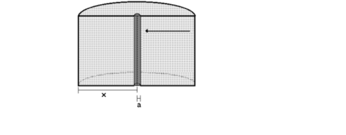
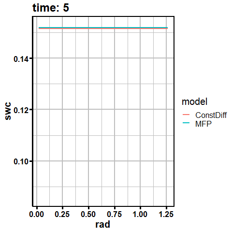

```{r}
#| label: SetupLibraries
#| include: FALSE

knitr::opts_chunk$set(echo = TRUE, warning = FALSE, message = FALSE, fig.align = "center", fig.width = 12, fig.height = 6, fig.pos = "h", fig.cap = TRUE)
rm(list = ls(all.names = TRUE))

library(rmarkdown)
library(bookdown)
library(soilwater)
library(pracma)
library(dplyr)
library(ggplot2)
library(extrafont)
library(gifski)
library(gganimate)
library(transformr)
library(reticulate)
library(tinytex)
library(magick)
library(bibtex)
library(ggsci)
library(knitcitations)
library(kableExtra)
library(Weatherfunctions)
library(xml2)
library(ggpmisc)
library(tidyr)
source("Q:/HUME/HUME/RLib/DokuUtilFunctions.R")
source("Q:/HUME/HUME/RLib/WFlowFunctions.R")
source("Q:/HUME/HUME/RLib/VanGenuchten.r")
source("Q:/HUME/HUME/RLib/RFunctionsSR.R")
source("Components/Soil/Documentation/Redfuncs.R")


options("citation_format" = "pandoc")

```

```{r}
#| include: false
fn_source <- "Q:/HUME/HUME/Components/Soil/URootedSoil.pas"
fn_xml_docu <- "Q:/HUME/HUME/XML_Delphi_Docu/URootedSoil.xml"
```

# Introduction

```{r}
#| echo: false
#| results: "asis"
#| message: false
#| warning: false

# 1. Load the XML file
doc <- xml2::read_xml(fn_xml_docu)
```

```{r}
#| echo: false
#| results: "asis"
#| message: false
#| warning: false

GetClassDevNotes("TSoilWaterModelR",fn_xml_docu)
```

## Ancestor classes

The class TSoilWaterModelR has the following ancestor classes shown in Table @tbl-AncestorClasses.

```{r}
#| label: tbl-AncestorClasses
#| echo: false
#| tbl-cap: "Ancestor classes of TSoilWaterModelR."

df <- GetAncestorClasses(fn_xml_docu,"TSoilWaterModelR")

kable(df)

```

# Scientific Background

The TSoilWaterModelR module simulates add root water uptake to its ancestor component TSoilWaterMod, which simulates the vertical transport of water in the soil profile.

Root water uptake is induced by the process of canopy transpiration in order to compensate plant water loss. But there exist physical limitations of the rate of total water uptake which can be seen by the sum of the maximum transport rates to the segments of the whole root system. These transport rates are governed by the maximum soil water potential difference between the root surface, the unsaturated hydraulic conductivity in the vicinity of the roots and the water uptake rate per unit of root length which can be approximated in a first step by the ratio of transpiration rate to total root length. However, root water uptake and transpiration are usually regulated down before this situation is reached due to stomata opening control in which physical signals like the leaf water potential, environmental signals like the saturation vapor deficit and the irradiation but also hormonal signalling mechanisms by absissic acid (ABA) are involved.

The component TSoilWaterModelR implements some rather simple approaches for describing these complex processes but efforts have been started to include a more mechanistically approach for simulation of root water uptake. The development started with the implementation of a simple reduction factor for root water uptake based on the soil water potential in the different soil layers and the potential transpiration rate. This approach is similar to [@feddes1978] but with a more simple calculation of the reduction factor for root water uptake.

## Implementation

The root water uptake is considered in the water balance equation as a sink term (S). The potential transpiration (T~pot~) is by default calculated based on the Penman-Monteith equation in the component [TPenMonteith](https://agronomykiel.github.io/HUME/Components/Evapotranspiration/Documentation/TPenMonteith.html), which considers the atmospheric demand for water and the resistance to water flow from the soil to the atmosphere through the plant.

The actual transpiration (T~act~) is then calculated by considering the reduction of water uptake due to low soil water content / high water (absolute) tension and/or an estimation of soil water transport restrictions towards the roots.

The component implements a number of different options to calculate the actual transpiration (T~act~) and the sink term for the different soil layers.

Basically there are empirical heuristic approaches and more mechanistic approaches implemented. The latter should allow to more specifically simulate the effects of different root architectures and root distributions on the water uptake by the plant roots. The mechanistic approaches try to estimate the limitation of water uptake due to the transport of water to the root surface, which is a function of root length in the different soil layers, the unsaturated hydraulic conductivity in the vicinity of the roots and the water uptake rate per unit of root length. The mechanistic approaches are still under development.

The empirical heuristic approaches define reduction functions for root water uptake based on the soil water potential in the different soil layers and optional the potential transpiration rate. The reduction functions are based on the work of [@feddes1978] and [@ehlers1991].

## Options and parameters to calculate the potential and actual transpiration (T~act~) and the sink term for the different soil layers

### Options

There are currently the following *options* available to calculate the actual transpiration (T~act~) and the sink term for the different soil layers:

- psicrit: The reduction factor for root water uptake (f~sinkred~) is calculated based on the soil water potential in each soil layer (psi~i~) but independently on the actual transpiration rate.

- nFK~crit~: The reduction factor for root water uptake (f~sinkred~) is calculated based on the soil water content in each soil layer (theta~i~) but independently on the actual transpiration rate.

- psicrit~corr~: The reduction factor for root water uptake (f~sinkred~) is calculated based on an rough estimate of the soil water potential at the root surface derived from a crude estimate of the soil water potential at the root surface. This is a function of the estimated water influx rate and the unsaturated hydraulic conductivity in the vicinity of the roots. This estimate is based on the simple steady state solution of the water transport in radial coordinates [@Gardner1960].

- Feddes: The reduction factor for root water uptake (f~sinkred~) is calculated based on the soil water potential in each soil layer (psi~i~) and the actual transpiration rate (T~act~). The reduction factor for root water uptake (f~sinkred~) is calculated based on a Feddes-like approach [@feddes1978].

- MFP: The reduction factor for root water uptake (f~sinkred~) is calculated based on the soil water potential in each soil layer (psi~i~) and the actual transpiration rate (T~act~). The reduction factor for root water uptake (f~sinkred~) is calculated based on a mechanistic approach which considers the unsaturated hydraulic conductivity in the vicinity of the roots and the estimated water influx rate to the roots according to the matrix flux potential [@vanLier2013][@Metselaar2011].

- MFPvar: Similar to MFP but each layer of the 1D soil profile is divided into 10 different sections with differing root length densities. These are calculated in the Component [TSimpleRootModDM](https://github.com/AgronomyKiel/HUME/blob/mainbranch/Components/Rootgrowth/Documentation/TSimpleRootModDM.html).

- Sqrwl_funct: The option *Sqrwl_funct* is an option to consider the soil water availability in the calculation of the distribution of potential soil water uptake (see @eq-SinkTerm and @eq-SinkTerm2)

- psi_logscale: The option *psi_logscale* is an option to consider the soil water potential in log scale for the calculation of the reduction factor for root water uptake (f~sinkred~) (see @eq-fsinkred1, @eq-fsinkred2 and @eq-psi2Feddes).

### Parameters

- CompFactor: The distribution of the potential water uptake rates can be modified by the parameter *CompFaktor* (CompF) which is a factor for root competition. The lower the value of the competition factor is, the more the potential sink term is distributed to the deeper soil layers with lower root length densities. Analysis of experimental data has, however, indicated that a value of compF lower than 1 may be more realistic for simulating root water uptake [@ehlers1991].

- psi_2: The parameters psi_2 soil water potential and soil water content from which on water uptake decrease.

- nFKcrit: As psi_2 but for the option nFK~crit~. The parameter nFKcrit is the soil water content from which on water uptake decrease.

## Distribution of potential water uptake between soil layers

The potential transpiration (T~pot~) is distributed to the different soil layers according to the root length in the different soil layers.

There are two options available to distribute the potential transpiration (T~pot~) to the different soil layers:

- without considering the soil water availability in a certain layer on the distribution of potential water uptake

- with considering the soil water availability in a certain layer on the distribution of potential water uptake

### Without considering the reduction factor for root water uptake (f~sinkred~)

The default option is to distribute the potential transpiration according to the fraction of root length in a soil layer. The root length in the different soil layers is calculated by the component [TRootGrowth](https://agronomykiel.github.io/HUME/Components/RootGrowth/Documentation/TRootGrowth.html) and is provided as an external value to the component TSoilWaterModelR.

The potential water uptake / potential sink term is calculated from the root length in the layer cm cm^-2^ (RL~i~), an exponential factor for root competition \[-\] (CompF) divided by the sum of root length in all layers \[cm cm^-2^\] (RL~\[j\]~) and CompF (@fig-CompF). The factor 0.1 is the conversion from cm to mm which is used to convert with the units of mm for the evapotranspiration variables and the default unit of the soil processes which is cm.

$$S[i]_{pot}=0.1\cdot {{T}_{pot}}\cdot \frac{RL{{[i]}^{CompF}}}{\sum\limits_{j}{RL{{[i]}^{CompF}}}}\cdot {{f}_{sinkred}}$$ {#eq-SinkTerm}

The lower the value of the competition factor is, the more the potential sink term is distributed to the deeper soil layers with lower root length densities (@fig-CompF). Analysis of experimental data has, however, indicated that a value of compF lower than 1 may be more realistic for simulating root water uptake [@ehlers1991].

It has been argued that this type of distribution of potential water uptake may not be realistic because it does not consider the soil water availability in the different soil layers and drought stress may occur if there is a water shortage in the upper soil layers even if there is still water available in the deeper soil layers.

On the other hand, it is well known from split root experiments that if parts of a root system are exposed to dry soil, absicic acid (ABA) is produced in the roots and transported to the leaves where it induces stomata closure. This reduces the transpiration rate and thus the water uptake from the soil. In this case, it is not possible to compensate for a water shortage in one part of the root system by increasing water uptake from another part of the root system [@holbrook2002].

### Considering the reduction factor for root water uptake (f~sinkred~)

[@jarvis1989] suggested that also the soil water availability would affect distribution of potential soil water uptake. In analogy to his approach we implemented the option to weight potential soil water uptake distribution by the sink reduction factor as well:

$$S[i]_{pot}=0.1\cdot {{T}_{pot}}\cdot \frac{f_{sinkred} \cdot RL{{[i]}^{CompF}}}{\sum\limits_{j}{f_{sinkred} \cdot RL{{[i]}^{CompF}}}}\cdot {{f}_{sinkred}}$$ {#eq-SinkTerm2}

This function is used if the option *Sqrwl_funct* is set to *ReductionFactor*. In practice this distributes the potential soil water uptake more towards soil layers with higher water contents and in total drought stress is reduced for the moment.

```{r}
#| echo: false
#| message: false
#| warning: false
#| label: fig-CompF
#| fig.height: 7
#| fig-cap: Example for an distribution of root length density within the soil profile and the distribution of the potential sink term calculated for different values of the competition factor (CompF).

# library for adding plots
library(patchwork)

depths <- seq(5, 125, by = 5)

RLD0 <- 4
RLDdec <- 0.08

rlds <- RLD0*exp(-RLDdec*depths)

df <- data.frame(depths, rlds)
p1 <- ggplot(df, aes(y = depths, x = rlds)) +
  geom_line(size=1.5) +
  scale_y_reverse() +
  labs(title = "", y = "Depth (cm)", x = "Root Length Density (cm/cm3)") +
  theme_minimal(base_size = 12)

CompF <- c(0.5, 0.75, 1, 1.25)

df_comp <- expand.grid(depths = depths, CompF = CompF)
df_comp$rlds <- RLD0*exp(-RLDdec*df_comp$depths)
df_comp <- df_comp %>% group_by(CompF) %>% mutate(SumRLDComp = sum(rlds^CompF)) %>% ungroup()
df_comp <- df_comp %>% mutate(SinkTerm = 0.1*5*df_comp$rlds^CompF/SumRLDComp) 


p2 <- ggplot(df_comp, aes(y = depths, x = SinkTerm, color = as.factor(CompF))) +
  geom_line(size=1.5) +
  scale_y_reverse() +
  scale_color_manual(values = c("blue", "green", "orange", "red"), labels = c("0.5", "0.75", "1", "1.25")) +
  labs(title = "", y = "Depth (cm)", x = "Pot. sink Term (mm/d)", color = "CompF") +
  theme_minimal(base_size = 18) 


p <- p1 + p2 

p
```

## Reduction of potential water uptake by soil water potential / soil water content

The potential sink term is reduced by the reduction factor for root water uptake (f~sinkred~). The reduction of potential water uptake by soil water potential / soil water content, f~sinkred~, is calculated by the soil water potential in each soil layer psi~i~ \[hPa\], the soil water potential \[hPa\] psi~0~ from which on water uptake is 0 and psi~crit~ \[hPa\], a parameter for the soil water potential from which on water uptake decrease. For historical reasons this parameter psi~crit~ is named psi2 in the code of the component TSoilWaterModelR.

With the option "psi_logscale" = false, the reduction factor for root water uptake (f~sinkred~) based on the untransformed soil water potential in each soil layer (psi~i~), the soil water potential from which on water uptake is 0 (psi0) and a parameter for the soil water potential from which on water uptake decrease (psi~crit~) as shown in Eq. @eq-fsinkred2.

$$f_{sinkred}=max \left( 0, min \left(1, \frac{psi-psi_3}{psi_2-psi_3}\right) \right)$$ {#eq-fsinkred

With the option "psi_logscale" = true the reduction factor is from log-scaled psi values:

$$f_{sinkred}=max \left( 0, min \left(1, \frac{log10(psi)-log10(psi_3)}{log10(psi_2)-log10(psi_3)}\right) \right)$$ {#eq-fsinkred_logscale}

The option "nFK~crit~" calculates the reduction factor for root water uptake (f~sinkred~) based on the soil water content in each soil layer (theta~i~), the soil water content from which on water uptake is 0 (theta0) and a parameter for the soil water content from which on water uptake decrease (theta~crit~) as shown in Eq. @eq-fsinkrednFK.

$$f_{sinkred}=max \left( 0, min \left(1, \frac{nFK-PWP}{nFK_{crit}-PWP}\right) \right)$$ {#eq-fsinkrednFK}

For the option psicrit, the values of psi_2 is a fixed value during a simulation period. Its value is usually set to a value of around 200 hPa.

With the option *Feddes* it is variable, depending on the actual transpiration rate. The value of psi_2 is calculated based on the actual transpiration rate (T~act~) and the potential transpiration rate (T~pot~) as shown in Eq. @eq-psi2Feddes.

The value of psi_2 can vary between two limits $\psi_{2,low}$ at very high potential transpiration rates and $\psi_{2,high}$ at very low potential transpiration rates. These values are calculated from a value of the parameter $psi_2$ also used for the option psi~crit~ and another parameter $psi_{2, diff}$:

$$\psi_{2,high} = max \left(\psi_2-\frac{\psi_{2,diff}}{2}, \psi_{FK} \right)$$ {#eq-psi2Feddes_hightrans}

$$\psi_{2,low} = max\left(\psi_2+\frac{\psi_{2,diff}}{2}, \psi_{PWP}\right)$$ {#eq-psi2Feddes_hightrans}

In between the value of $psi_2^{*}$ is calculated by linear interpolation ({#eq-psi2Feddes}).

$$\psi_2^*=
\begin{cases}
\psi_{2,low} & \text{if } T_{act} \le T_{ref,low},\\
\psi_{2,high} & \text{if } T_{act} > T_{ref,high},\\
\psi_{2,low} + f \cdot (\psi_{2, high}-\psi_{2, low})
& \text{if } T_{ref,low} < T_{act} \le T_{ref,high}
\end{cases}$$ {#eq-psi2Feddes}

with:

$$f= \frac{T_{p} - T_{p,low}} {T_{ref,high} - T_{ref,low}}$$ {#eq-psi2Feddesf}

```{r}
#| label: fig-SinkTerm
#| echo: false
#| message: false
#| warning: false
#| fig.height: 10
#| fig-cap: Example for the calculation potential sink term together with soil water potential and soil water content with depth with or without the inclusion of the reduction factor for distribution of potential sink term.

fn_RR <- "Components/Soil/Documentation/data/GenuchtenPars_roteReihe.csv"
Params_RR <- read.table(fn_RR, header = TRUE, comment.char = "[", sep = ";", dec = ".")
Params_RR$Source <- "RR"
Params_RR$m <- 1-1/Params_RR$n

PotTrans <- 5

psis <- 1/depths^1.2*5e4
df_psis <- data.frame(depths, psis)

psi2 <- 200
psi3 <- 10^4.2


Params <- Params_RR %>% filter(Bodenart == "Sl3") %>% slice(1)
df_psis$swc <- Vectorize(swc) (psi=-df_psis$psis, alpha=Params$alpha,
                  n=Params$n,m=Params$m,theta_sat=Params$theta_s,
                  theta_res=Params$theta_r, lambda = Params$m * Params$n, type_swc = "VanGenuchten")

FK <- swc (psi=-10^1.8, alpha=Params$alpha,
                  n=Params$n,m=Params$m,theta_sat=Params$theta_s,
                  theta_res=Params$theta_r, lambda = Params$m * Params$n, type_swc = "VanGenuchten")
PWP <- swc (psi=-10^4.2, alpha=Params$alpha,
                  n=Params$n,m=Params$m,theta_sat=Params$theta_s,
                  theta_res=Params$theta_r, lambda = Params$m * Params$n, type_swc = "VanGenuchten")

nFK <- FK-PWP

# root competition factor
CompF <- 0.5
# thickness of layer
dz <- 10

df1 <- df_psis
df1$rlds <- RLD0*exp(-RLDdec*df1$depths)
df1$RL <- df1$rlds*dz


# sum of root length in all layers considering the competition factor CompF
SumRLComp <- sum(df1$rlds^CompF)

# normalized root length  i.e. the fraction of root length in the layer i to the total root length in all layers considering the competition factor CompF
df1 <- df1 %>% mutate(NRLD = (df1$rlds^CompF)/SumRLComp) %>% ungroup()

# potential sink term for layer i without considering the reduction factor for root water uptake (f~sinkred~)
df1 <- df1 %>% mutate(pSink = 0.1*PotTrans*NRLD) 

#sum(df1$pSink)

# reduction factor for root water uptake (f~sinkred~) 
df1$sinkredf <- pmax(0,pmin(1, (df1$psis-psi3)/(psi2-psi3)))
#summary(df1$sinkredf)


# potential sink term distributed without reduction factor (NoReductionFactor option)
df1$SinkTerm <- df1$pSink*df1$sinkredf

# Jarvis correction factor omega
omega <-  sum(df1$sinkredf*df1$NRLD)


# actual sink term: potential sink reduced once by sinkredf
df1$Sact <- df1$SinkTerm*df1$sinkredf
Tact <- sum(df1$Sact)


Tact_Tpot <- Tact/(PotTrans*0.1)

omega_c <- 0.6

df1 <- df1 %>% mutate(Sact_Jarvis = sinkredf*NRLD*0.1*PotTrans*1/max(omega, omega_c)) %>% ungroup()
Tact_jarvis <- sum(df1$Sact_Jarvis)

Tact_jarvis/(PotTrans*0.1)


df1$option <- "No reduction"


df2 <- df_psis
df2$rlds <- RLD0*exp(-RLDdec*df2$depths)
df2$sinkredf <- pmax(0,pmin(1, (df2$psis-psi3)/(psi2-psi3)))

df2 <- df2 %>% mutate(SumRLDComp = sum(sinkredf*rlds^CompF)) %>% ungroup()
df2 <- df2 %>% mutate(SinkTerm = 0.1*PotTrans*sinkredf*df2$rlds^CompF/SumRLDComp) 
df2$Sact <- df2$SinkTerm*df2$sinkredf
Tact_Tpot2 <- sum(df2$Sact)/(PotTrans*0.1)


df2$option <- "Reduction by soil water potential"

selcols <-  c("depths", "psis", "swc", "rlds", "sinkredf","SinkTerm",   "Sact", "option")
df <- rbind(df1[,selcols], df2[,selcols])

df.sum <- df |> group_by(option) |> 
  summarise(Tact = sum(Sact)*10, Tpot = PotTrans, Tact_Tpot = sum(Sact)*10/(PotTrans)) |> ungroup()


p3 <- ggplot(df_psis, aes(x = depths, y = psis)) +
  geom_line(size=1.5) +
  geom_abline(xintercept = -10^1.8, linetype = "dashed", color = "blue") +
  coord_flip() +
  scale_x_reverse() +
  scale_y_log10() +
  labs(title = "", x = "Depth (cm)", y = "Soil water potential (hPa)") +
  theme_minimal(base_size = 16)
#p3


p4 <- ggplot(df_psis, aes(x = depths, y = swc)) +
  geom_line(size=1.5) +
  scale_x_reverse() +
  coord_flip() +
  geom_hline(yintercept = FK, linetype = "dashed", color = "blue", size=1) +
  geom_hline(yintercept = PWP, linetype = "dashed", color = "red", size=1) +
  labs(title = "", x = "Depth (cm)", y = "Soil water content (cm3/cm3)") +
  theme_minimal(base_size = 16)
#p4

df <- df %>% arrange(option, depths)
p5 <- ggplot(df, aes(x = depths, y = SinkTerm, color = option)) +
  geom_line(aes(group=option),size=1.5) +
  coord_flip() +
  scale_x_reverse() +
  scale_color_manual(values = c("blue", "red"), labels = c("No reduction", "Reduction by soil water potential")) +
  labs(title = "", x = "Depth (cm)", y = "Pot. sink Term (mm/d)", color = "Option") +
  theme_minimal(base_size = 16)
#p5

df <- df %>% arrange(option, depths)
p6 <- ggplot(df, aes(x = depths, y = Sact, color = option)) +
  geom_line(aes(group=option),size=1.5) +
  coord_flip() +
  scale_x_reverse() +
  scale_color_manual(values = c("blue", "red"), labels = c("No reduction", "Reduction by soil water potential")) +
  labs(title = "", x = "Depth (cm)", y = "Actual sink Term (cm/d)", color = "Option") +
  theme_minimal(base_size = 16)
#p6
p <- (p3 + p4 )/ (p5 + p6) + plot_layout( guides = "collect") & theme(legend.position = "bottom", axis_titles="collect")

p
```

For the scenario shown in @fig-SinkTerm, the actual transpiration rate (T~act~) is reduced by 24% if the reduction factor for root water uptake (f~sinkred~) is not considered in the distribution of the potential sink term. If the reduction factor for root water uptake (f~sinkred~) is considered in the distribution of the potential sink term, the actual transpiration rate (T~act~) is only reduced by 11% compared to the potential transpiration rate (T~pot~) (@tbl-RelTransRedFactor).

```{r}
#| echo: false
#| message: false
#| warning: false
#| label: tbl-RelTransRedFactor
#| tbl-cap: "Relative transpiration and reduction factor for root water uptake (f~sinkred~) for the two options to distribute the potential sink term."

kable(df.sum, digits = 2)

```

```{r}
#| label: fig-FeddesReduction
#| echo: false
#| message: false
#| warning: false
#| fig-cap: Example for the calculation of the reduction factor for root water uptake (f~sinkred~) based on the soil water potential in each soil layer (psi~i~) and the actual transpiration rate (T~act~) based on a Feddes-like approach [@feddes1978]. The parameters psi2_hightrans = 200, psi2_lowtrans = 2000, Trefhigh = 6, Treflow = 1.


logpsi <- seq(from=1, to = 4.3, by=0.05)
psi_ <- 10^logpsi

PotTrans <- seq(1, 6, by = 1)

psi2_hightrans <- 200
psi2_lowtrans <- 2000
Trefhigh <- 6
Treflow <- 1

df.redf <- expand.grid(PotTrans = PotTrans, psi = psi_)

#test <- Feddes_redf(psi= 800, PotTrans=5, psi2_lowtrans, psi2_hightrans, Trefhigh, Treflow, logscale=TRUE)
#test

df.redf$fred <- Vectorize(Feddes_redf)(df.redf$psi, df.redf$PotTrans, psi2_lowtrans=2000, psi2_hightrans=200,
                                       Trefhigh=6, Treflow=1, logscale=TRUE)

p <- ggplot(df.redf, aes(x = psi, y = fred, color = as.factor(PotTrans))) +
  geom_line(size=1.5) +
  scale_x_log10() +
  scale_color_manual(values = c("blue", "green", "orange", "red", "purple", "brown"), labels = c("1", "2", "3", "4", "5", "6")) +
  labs(title = "", x = "Soil water potential (hPa)", y = "Reduction factor for root water uptake", color = "Potential transpiration (mm/d)") +
  theme_minimal(base_size = 18)
p

```

Within the component TSoilWaterModelR different options are available to calculate a *Feddes-like* reduction factor. The most simple approach is to neglect the effect of the actual transpiration rate on the reduction of root water uptake and to calculate the reduction factor for root water uptake (f~sinkred~) only based on the soil water potential in each soil layer (psi~i~), the soil water potential from which on water uptake is 0 (psi0) and a parameter for the soil water potential from which on water uptake decrease (psi~crit~) as shown in Eq. @eq-fsinkred1.

$$f_{sinkred}[i]=\left\{ \begin{align}
  & 1\quad \quad \quad \quad \quad \quad  |psi_i\le psi_2 \\ 
 & \frac{ psi_i-psi_3}{psi_2-psi_3} \quad \quad |psi_i > psi_2 \\ 
\end{align} \right.$$ {#eq-fsinkred1}

$${{f}_{\sin kred}}[i]=\left\{ \begin{align}
  & 1\quad \quad \quad \quad \quad \quad \quad \quad \quad |ps{{i}_{i}}\ge ps{{i}_{crit}} \\ 
 & \frac{\log (ps{{i}_{i}})-\log (ps{{i}_{0}})}{\log (ps{{i}_{crit}})-\log (ps{{i}_{0}})}\quad |ps{{i}_{i}}\ge ps{{i}_{crit}} \\ 
\end{align} \right.$$ {#eq-fsinkred2}

The sum of the sink terms of the different soil layers is the actual transpiration \[mm d^-1^\] (T~act~).

$${{T}_{act}}=\sum\limits_{j}{S[j]}$$ {#eq-SumSinkTerm}

The reduction factor for root water uptake (f~sinkred~) is calculated based on the soil water potential in each soil layer (psi~i~), the soil water potential from which on water uptake is 0 (psi0) and a parameter for the soil water potential from which on water uptake decrease (psi~crit~). There are different options available to calculate the reduction factor for root water uptake (f~sinkred~) as shown in @eq-fsinkred2, i.e. the version with logarithms of soil water tension as the independent variable.

## More mechanistic approaches to calculate the reduction factor for root water uptake (f~sinkred~)

The above shown appproaches do not take into account the physical limitations of the rate of total water uptake which can be seen by the sum of the maximum transport rates to the segments of the whole root system.

## Calculation of water transport towards roots

The continuity equation for soil water ($\theta$) in radial coordinates is:

$$\frac{\partial \theta }{\partial t}=-\frac{\partial q }{\partial r} $$ {#eq-ContinuityEquation}

where q is the flux density $[cm^3 \cdot cm^{-2} \cdot d^{-1}]$ of water towards the root surface and r is the distance from the root surface. The combination of the continuity equation with the Richards equation for radial coordinates yields:

$$\frac{\partial \theta }{\partial t}=\frac{1}{r}\frac{\partial }{\partial r}\left( {{r}\cdot}{{k}_{u}}(\theta )\cdot\frac{\partial \psi }{\partial r} \right)  $$ {#eq-RichardsEquationradial}

Using the identity $\frac{d\theta }{d\theta }$ this can be written as:

$$\frac{\partial \theta }{\partial t}=\frac{1}{r}\frac{\partial }{\partial r}\left( r\cdot {{k}_{u}}\left( \theta  \right)\cdot \frac{\partial \psi }{\partial \theta }\cdot \frac{\partial \theta }{\partial r} \right)$$ {#eq-RichardsEquationradial2}

The specific soil water capacity is defined as:

$${{C}{(\psi }}{)}=\frac{d\theta }{d\psi } $$ {#eq-SpecCapacity} Combined with the unsaturated soil hydraulic conductivity this with gives the definition of soil water diffusivity:

$${{D}_{w}}(\theta )={{k}_{u}}(\theta )\cdot \frac{1}{{{C}_{(\psi )}}} $$ {#eq-Diffusivity}

which can be used to rewrite eq. @eq-RichardsEquationradial2 as:

$$\frac{\partial \theta }{\partial t}=\frac{1}{r}\cdot \frac{\partial }{\partial r}\left( r\cdot {{D}_{w}}\left( \theta  \right)\cdot \frac{\partial \theta }{\partial r} \right)$$ {#eq-DiffusionSingleRoot}

For this partial differential equation analytic solutions exists, but only for special cases of the boundary conditions and for specific forms of the soil specific relationship for $D_w(\theta)$.

## Analytical solutions of the radial water transport problem

@Gardner1960 and @Philip1957 first gave analytic solutions for boundary conditions given by (a) a constant rate ($I_w$) of water uptake per unit root length $[cm^3cm^{-1}d^{-1}]$ where the inner boundary condition is given by:

$$I_w = -2\pi aK \frac{d\psi}{dr} $$ {#eq-Iw} This can also be written in terms of soil water diffusivity and with a flux density $[d^{-1}]$ on the left hand side as the term $2\pi a$ is the root surface area per unit root length $[cm^2]$:

$$\frac{I_w}{2\pi a}  = -D_w \frac{d\theta}{dr}=q $$ {#eq-Iw2pia}

at r = a, and with the assumption of an infinite soil volume available for the sink, the solution is @Philip1957, @Carslaw1946):

$$\overline{\psi_s}-\psi_a=\frac{I_w}{4\pi K_u}\left[ln\left(\frac{4D_wt}{a^2}\right)-0.5772\right]$$ {#eq-CarslawJaeger} where $\overline{\psi_s}$ and $\psi_a$ are respectively the water potentials at the root surface and in the bulk soil, and a is the root radius. The value 0.5772 is the so called Euler-Mascheroni constant.

A similar formulation based on diffusivity and for water content differences is given by @vanLier2006: $$\overline{\theta_s}-\theta_a=\frac{x^2T_p}{4z D_w}\left[ln\left(\frac{4D_wt}{a^2}\right)-0.5772\right]$$ {#eq-QuirindeJong2006}

The first terms on the right hand side of the equations \@ref(eq:CarslawJaeger) and \@ref(eq:QuirindeJong2006) contain different formulations of the dimensionless change of water content per day, which are, however, equivalent and can be transformed into terms which have the units of $d^{-1}$.

$$\frac{{{I}_{w}}}{\pi }=\frac{{{x}^{2}}{{T}_{p}}}{z} \\ 
\frac{{{I}_{w}}}{\pi {{x}^{2}}}=\frac{{{T}_{p}}}{z} \\ $$

The solution of the equation @eq-QuirindeJong2006 needs values for the soil water diffusivity and the unsaturated hydraulic conductivity as a function of volumetric soil water content or matrix potential, respectively.

## Steady state and steady rate solutions for finite soil volumes

The above equation assumes that each root absorbs water from an infinite amount of soil, and that there is always more soil, at a steadily increasing distance, which can be drawn upon. In real root-soil systems this is not correct, since roots compete, and each root can be assumed to have a limited amount of soil for its sole exploitation. The root surface water potential will therefore fall faster than predicted above, and the mean water content and potential of the soil volume will decrease steadily. The simplest way of dealing with this situation is to assign an equal 'equivalent cylinder' @fig-SingleRootCylinder1 of soil to each root, and to assume that all water entering the root originates in this cylinder. This is nearly equivalent to saying that roots are organized in equally spaced parallel array. There are no analytical solutions of the diffusion equation sufficiently simple to be of general use for this case (see @Youngs1963), and numerical solutions or approximations have to be employed. The latter are most useful for discussing the general features of the system. @Passioura1968 have discussed the two usual methods, the 'steady state' and 'steady rate' approximations.

{#fig-SingleRootCylinder1}

### Steady state solution:

For a steady state, it is assumed that all the water is injected into the system at the periphery of the equivalent cylinder, and the appropriate equation is for the steady state flow in a cylinder:

$$\psi_x-\psi_a=\frac{I_w}{2\pi K}ln\left( \frac{x}{a}\right) $$ {#eq-SRSteadyState}

or with water content differences and diffusivity:

$$\theta_x-\theta_a=\frac{I_w}{2\pi D_w}ln\left( \frac{x}{a}\right) $$ {#eq-SRSteadyStateDw}

where x is the radius of the equivalent cylinder. Water is in fact being removed from the equivalent cylinder all the time, and this is allowed for by calculating the water loss after some convenient time interval at

$$\frac{\Delta \theta}{\Delta t}=\frac{I_w}{\pi (x^2-a^2)}\approx \frac{I_w}{\pi x^2} $$ {#eq-Thetadt}

and recalculating with the new values of $\psi_b$ $K_u$ or $D_w$ to allow for the change in $\theta$.

The steady rate approximation (@Cowan1965) is rather more realistic, since it embodies the assumption that water is being supplied uniformly from within the soil cylinder to maintain the constant flow (figure 1). The equation for this system is

$${2\pi r{D}_{w}}\left( \theta  \right)\frac{\partial \theta }{\partial r}=\overline I_w \frac{\left(x^2-r^2\right)}{\left(x^2-a^2\right)}$$ {#eq-MassBalanceradial}

this yields:

$$\theta_b-\theta_a=\frac{I_w}{2\pi D_w}\left[ \frac{x^2}{x^2-a^2}ln\left(ln\frac{x}{a} \right)-\frac{1}{2}\right] $$ {#eq-ThetaDiff}

The solutions are therefore closely similar, but (for constant $\theta_b$) but the steady rate equation predicts a value of $\theta_a$ (for constant $\theta_b$) which is identical to that of e with the steady state equation at r = 1.65a. The equations are most useful in the relation to the mean water content $\overline\theta$, rather than $\theta_b$ and then give (@Passioura1968) a steady state and with approximation for for x \>\> a, which is valid for most cases:

$$\overline{\theta}=\theta_a+\frac{I_w}{2\pi D_w}\left(\frac{x^2}{x^2-a^2}ln\frac{x}{a}-ln\frac{1}{2} \right) \approx \theta_a+\frac{I_w}{2\pi D_w}ln\frac{x}{1.65a}$$ {#eq-SteadyStatetheta}

A similar equation can be defined by using unsaturated soil hydraulic conductivity and soil matriax potential:

$$\overline{\psi}=\psi_a+\frac{I_w}{2\pi k_u}\left(\frac{x^2}{x^2-a^2}ln\frac{x}{a}-ln\frac{1}{2} \right) \approx \psi_a+\frac{I_w}{2\pi k_u}ln\frac{x}{1.65a}$$ {#eq-SteadyStatepsi}

Rearranging for Iw gives:

$$I_w=2\pi k_u \cdot \frac{\psi_a-\overline{\psi}}{ln\frac{x}{1.65a}}$$ {#eq-SteadyStatepsi2}

### Steady rate solution

The steady rate approximation (Cowan 1965) is rather more realistic, since it embodies the assumption that water is being supplied uniformly from within the soil cylinder to maintain the constant flow. The Steady rate solution and its approximation for for x \>\> a is @Tinker1976:

$$\overline{\theta}=\theta_a+\frac{I_w}{2\pi D_w\left( x^2-a^2\right)}\left[ \left(\frac{x^4}{x^2-a^2}ln\frac{x}{a}\right)-\left(\frac{3x^2-a^2}{4}\right) \right] \approx \theta_a+\frac{I_w}{2\pi D_w}ln\frac{x}{2.1a}$$ {#eq-SteadyRate}

If one rearranges equation @eq-SteadyRate for $I_w$ and assumes that $\theta_a$ is equal to $\theta_{PWP}$ (water content at the permanent wilting point) one gets the maximum possible water uptake rate under the given conditions $Iw_{max}$:

$$Iw_{max}=2\pi {{D}_{w}}\cdot \frac{{{\left( \overline{\theta }-{{\theta }_{PWP}} \right)}}}{ln\left( \frac{x}{2.1a} \right)}$$ {#eq-SteadyRateIwmax}

## Water content distribution around roots

The water content $\theta_r$ in any distance r from the root center then is given by:

$$\theta_{r}=\theta_a\left( 1+{\frac{I_w}{2\pi Dw}}ln\left( \frac{r}{a} \right) \right) $$ {#eq-thetar}

```{r}
#| message: false
#| warning: false
#| include: false


z1 <- 60
z2<- 80
Lrv0 <- 4 # cm.cm-3
kr <- 0.03
Lrv_av <- (Lrv0*(exp(-kr*z1)-exp(-kr*z2)))/(kr*(z2-z1))
#cat("This gives an average root length density (Lrv) of ", format(Lrv_av, digits = 2), "cm/cm3, ")
#cat("and root length for water uptake (Lr) of ", format(Lr, digits = 2), "cm/cm2.")

z <- seq(0, 150, 5)
Lrv <- Lrv0*exp(-kr*z)
#plot(Lrv, -z )
Lr <- Lrv0/kr*(1-exp(-kr*max(z)))
time <- seq(0, 10, 10/(24*2))
Tp <- 4

# root radius [cm]
a<- 0.02

SimTime <- 10 # days
dt_hour <- 0.5 # time step in hours

df.sim<- expand.grid(day = seq(from=0, to=SimTime, by = 1),
                     hour = seq(from=0, to=23.5, by=dt_hour))
dt <- dt_hour/24
df.sim <- df.sim %>% arrange(day, hour)
df.sim$time <- df.sim$day+df.sim$hour/24
df.sim$Tp <- Tp*sinusf( Stunde = df.sim$hour)

#plot(df.sim$time, df.sim$Tp, type = "l")

minor_breaks <- rep(1:9, 21)*(10^rep(-10:10, each=9))
MyBreaks <- c(1, 10, 100, 1000, 10000)
```

```{r}
#| message: false
#| warning: false
#| include: false
soils <- c("gS", "Sl3", "Ut2")
#sl3.soil <- list(v=0.5, ksat=89.9, alpha=0.047598, n=1.22044, theta_sat=0.363891, theta_res=0, theta_fk=0, theta_pwp=0)
#fSms.soil <- list(v=-0.328, ksat=507.5, alpha=0.15041, n=1.33576, theta_sat=0.4095, theta_res=0, theta_fk=0, #theta_pwp=0)
#ut2.soil <- list(v=0.5, ksat=29.3, alpha=0.008499, n=1.225240, theta_sat=0.399765, theta_res=0, theta_fk=0, theta_pwp=0)
a.soil <- list(v=0.5, ksat=89.9, alpha=0.047598, n=1.22044, theta_sat=0.363891, theta_res=0, theta_fk=0, theta_pwp=0)
Params <- read.table("Components/Soil/Documentation/data/GenuchtenPars_roteReihe.csv", header = TRUE, comment.char = "[", sep = ";", dec = ".")
Params <- Params %>% dplyr::rename(Texture = Bodenart, theta_res=theta_r, theta_sat=theta_s)
#Params

Params$m <- 1-1/Params$n
Params$FK <- swc (psi=-10^1.8, alpha=Params$alpha,
                  n=Params$n,m=Params$m,theta_sat=Params$theta_s,
                  theta_res=Params$theta_res, psi_s = -1/alpha, lambda = m * n, type_swc = "VanGenuchten")
Params$PWP <- swc (psi=-10^4.2, alpha=Params$alpha,
                  n=Params$n,m=Params$m,theta_sat=Params$theta_s,
                  theta_res=Params$theta_res, psi_s = -1/alpha, lambda = m * n, type_swc = "VanGenuchten")
Params$nFK <- Params$FK-Params$PWP

df.soil.par <- Params[Params$Texture %in% soils,]

fromval <- log10(15000)
toval <- log10(0.1)
steps <- 100
interval <- (fromval-toval)/steps 
logpsivals <- seq(from=fromval, to = toval, by=-interval)
df.soil <- expand.grid(logpsi=logpsivals, soil=soils)
df.soil$psivals <- -10^logpsivals
diffs <- diff(df.soil$psivals)

df.soil <- merge(x = df.soil, y = df.soil.par, by.x="soil", by.y = "Texture" )


df.soil <- df.soil %>% group_by(soil) %>% mutate(swc =  swc(psi = psivals, alpha = alpha, n = n, m = 1-1/n,theta_sat = theta_sat, theta_res = theta_res, type_swc = "VanGenuchten"),
                           kuvals = khy(psi=psivals, v = l, ksat = Ks, alpha = alpha, n=n,
              m=1-1/n, theta_sat = theta_sat, theta_res = theta_res),
              Dw = diffusivity(psi=psivals , v = l, ksat = Ks, alpha = alpha, n=n,
              m=1-1/n, theta_sat = theta_sat, theta_res = theta_res)
              )


```

```{r}
#| message: false
#| warning: false
#| include: false


Trans <- 0.5*max(df.sim$Tp)
Iw_max <- Trans/(Lrv_av*20)*0.1
psi <- -c(200,500, 2000)
xl <- abstand_func(Lrv_av)
rads <- f_rad_arr(zylinderradius = xl, wurzelradius = a,  n = 20)
df.swcr <- expand.grid(r=rads, psi=psi, Texture=soils)
df.swcr <- merge(df.swcr, df.soil.par, "Texture")
df.swcr <- df.swcr %>% group_by(Texture) %>% mutate(theta = swc(psi=psi, alpha=alpha, n=n,m=m, 
                                                      theta_sat = theta_sat, theta_res = theta_res))
#summary(df.swcr$theta)
df.swcr <- df.swcr %>% group_by(Texture) %>% mutate(Dw=diffusivity(psi=psi, v = l, ksat = Ks, alpha = alpha, n=n, m = m, theta_sat = theta_sat, theta_res = theta_res))
df.swcr$Iw <- Iw_max
#theta <- c(0.15, 0.175,0.2)
xl <- 1/sqrt(pi*Lrv_av)
df.swcr$theta_a <- pmax(df.swcr$PWP, baf(b=df.swcr$theta, Iw = Iw_max, Dw = df.swcr$Dw, xl = xl, a = a))
df.swcr$psi_a <- Vectorize(psi_b_f)(b = df.swcr$theta_a, b_rest = df.swcr$theta_res, b_sat = df.swcr$theta_sat, n_par = df.swcr$n, alpha = df.swcr$alpha, m_par = df.swcr$m)
df.swcr$Iw <- ifelse(df.swcr$theta_a<=df.swcr$PWP, iwmax(b = df.swcr$theta, bmin = df.swcr$PWP, Dw = df.swcr$Dw, xl = xl, a = a), Iw_max)
df.swcr$theta_r <- bnf(ba = df.swcr$theta_a, Iw = df.swcr$Iw, Dw = df.swcr$Dw, Radius = df.swcr$r, a = a)
df.swcr$psi <- as.factor(df.swcr$psi)
```

```{r}
#| label: WcontProfilesQ
#| echo: FALSE
#| fig.align: 'center'
#| fig.height: 4
#| fig.width: 6
#| warning: FALSE
#| message: FALSE
#| fig.cap: "Water content distribution around roots at different soil water potentials and for three different soil textures calculated with the steady rate model. Upper dotted line: field apacity, lower dotted line: permanent wilting point" 

p <- ggplot(data = df.swcr)
p <- p + theme_bw(base_size = 20)
p <- p + geom_line(aes(x=r, y=theta_r, color=psi), size=1)
p <- p + geom_abline(data = df.swcr, aes(slope = 0, intercept = PWP), lty=2)
p <- p + geom_abline(data=df.swcr, aes(slope = 0, intercept = FK), lty=2)
p <- p + facet_wrap(facets = vars(Texture))
p <- p + scale_y_continuous(limits = c(0, 0.4))
p <- p + theme(legend.position = "top")
p <- p + xlab("Distance to root center [cm]") + ylab("Vol. Water [cm³/cm³]")
p <- p + scale_color_aaas()
p <- p + theme(strip.background = element_blank())
p

```

The accuracy of the above shown approaches is, however, limited, as the assumption of a constant soil water diffusivity with respect to the radial distance to the root surface is obviously not correct. As the soil water content decreases near the root surface, the soil water diffusivity decreases as well, leading to a self reinforcing effect.

### Boundary conditions

For t \> 0 and at the root surface, i.e. the inner boundary condition, the water influx rate per unis root length $I_w$ is derived from the daily crop transpiration rate $\overline{T_w}$ $[cm^.d^{-1}]$ and the total root length $L_r$ $[cm^.cm^{-2}]$. The most simple assumption is that the water uptake rate is equal for the whole root system:

$$t>0, \; r=a, \; 2\pi rD_w \left( \theta  \right) \frac{\partial \theta }{\partial r} = \overline{I_w} \frac{\left( x^2-r^2 \right)}{\left( x^2-a^2 \right)} = \frac{\overline{Tr}}{2\pi a L_r} = -\frac{\overline{I_w}}{2\pi a} $$ {#eq-BoundarySR}

A bit more realistic is the assumption of a diurnal variation of transpiration rate and water influx rate following the radiation intensity:

$$I_w\left( t \right)=\frac{Tr\left( t \right)}{L_r}=\frac{{{\overline{{{T}_{r}}}}\cdot}{{\frac{5}{3}}\cdot}\left[ 0.5+sin\left( {{\pi }^{.}}\frac{t}{12}+1.5 \right) \right]}{{{L}_{r}}} $$ {#eq-Iwt}

It was further assumed that the water potential at the root surface can not be lower than the permanent wilting point, defined as a water potential of 1.5 MPa.

#### outer boundary condition

It was assumed that there is a watershed between two neighboring roots. At this line the flow rate is zero:

$$t>0, \; r=x \;\;\;2\cdot{\pi }\cdot x \cdot D_w \cdot \frac{\partial\theta }{\partial r}=0 $$ {#eq-OuterBoundary}

### Definition of matric flux potential

@vanLier2006 with correction by @Schroder2007 derived an expression to describe M as a function of the radial distance from the root surface r \[cm\] at the onset of the falling rate phase, based on the continuity equation for one‐dimensional axisymmetric flow Matric flux potential $(M) \left[ {cm^{2} d^{−1}} \right]$ is defined as the integral of unsaturated hydraulic conductivity, $K(h) [cm^.d^{−1}]$, over pressure head, or equivalently, as the integral of diffusivity, $D(θ) \left[cm^2d^{−1}\right]$, over volumetric water content $(\theta) \left[cm^{3}cm^{−3}\right]$. For convenience, the permanent wilting point in terms of pressure head $(h_w) \left[cm\right]$ or water content $\theta{_w} \left[cm^{3}cm^{−3}\right]$ is chosen as the lower bound of the integral:

$$M=\int_{-h_w}^{h}K(h)dh=\int_{\theta{_w}}^{\theta}D(\theta)d(\theta)$$ {#eq-MFPdef}

The Matric flux potential can be calculated numerically by integrating $k_u$ or $D_w$ from the permanent wilting point. Figure @fig-MFluxPotCurves) gives the curves for the matrix flux potential for the choosen soil textures.

```{r}
#| warning: FALSE
#| include: FALSE

# calculation of summed ku values for the whole range of 
df.soil$sumku <- NA

for (soil in soils) {
#  soil <- soils[2]
  temp <- df.soil[as.character(df.soil$soil)==soil,]
  temp$sumku[1] <- temp$kuvals[1]
# integration with trapez-approach
  for (i in 2:length(temp$psivals)){
    temp$sumku[i] <- temp$sumku[i-1]+(temp$kuvals[i-1]+temp$kuvals[i])/2*diffs[i-1]   }

  df.soil[df.soil$soil==soil,"sumku"] <- temp$sumku
}
```

```{r}
#| label: fig-MFluxPotCurves
#| echo: FALSE
#| fig.align: 'center'
#| fig.cap: "Matrix flux potential vs. soil water tension for three different soil texture types"
#| message: FALSE
#| warning: FALSE
#| fig.height: 4
#| fig.width: 6


minor_breaks <- rep(1:9, 21)*(10^rep(-10:10, each=9))
MyBreaks <- c(1e-7, 0.000001,0.00001,0.0001,0.001, 0.01, 0.1, 1, 10, 100, 1000, 10000)
m <- NULL
m <-ggplot()
m <- m + geom_line(data=df.soil, aes(x=-psivals, y=sumku, colour=soil),lwd=2)
m <- m + annotation_logticks(sides = "trbl")
m <- m + scale_x_log10(limits=c(1, 15000),breaks = MyBreaks, minor_breaks=minor_breaks)
m <- m + scale_y_log10(limits=c(1e-4, 1e3),breaks = MyBreaks, minor_breaks=minor_breaks)
m <- m + guides(colour=guide_legend(title="Texture"))
#m <- m + geom_rect(data=nFKframe, aes(xmin=logpsiFK, xmax=logpsiPWP, ymin=PWP, ymax=FK, colour=texturetype, fill=texturetype),alpha=0.1)
m <- m + theme(panel.border = element_blank(), panel.grid.minor.x = element_blank())
m <- m + ylab("Matrix flux potential [cm2.d-1]") + xlab("Tension [hPa]")
m <- m + scale_colour_brewer(palette="Set1")
m <- m + scale_fill_brewer(palette="Set1")
#m <- set_theme(m,20)
m <- m + theme_bw(base_size = 18)
#ggsave(filename = "pF_curves.png", plot=m, units="cm", dpi = 300, height=15, width=22, bg = "transparent")
m

```

## Single root model with matrix flux potential

A solutions of eq. \@ref(eq:DiffusionSingleRoot) using the matrix flux potential approach have been derived by @de_Willigen1987 and were more recently used to derive sink term formulation of macroscopic soil water transport models by @vanLier2006, @Schroder2007 and @vanLier2008.

From mass conservation, and ignoring the root volume it follows that:

$$\frac{\partial\overline{\theta}}{\partial t}=-\frac{T_p}{z} $$ {#eq-Tpz1}

where $\overline{\theta}$ is the average water content in the entire rhizospere and z \[cm\] is the rooting depth.Assuming that $\frac{d\theta}{dt}$ is independent of r Eq. can be generalized:

$$\frac{\partial\theta}{\partial t}=-\frac{T_p}{z}$$ {#eq-Tpz2}

The right and left hand hand side can be expressed in dimensions of $[d^{-1}]$ and it should be noted that $T_p$ is given from the water influx rate times the root length per unit area. Assume a transpiration rate of 4 $[mm^.d^{-1}]$ or 0.4 $[cm^.d^{-1}]$, a root length density of average 0.5 $[cm^.cm^{-2}]$ and the a rooting depth of 100 \[cm\],

```{r include=FALSE}
depth   <- 100.0 # cm
Lrv <- 0.5  #Lrv_av # cm/cm3
Wl <- Lrv*depth # Wurzellänge in [cm.cm-2]
L <- Wl*1e8           # Wurzellänge in cm/ha
Avg_Transpi <- 4 # average transpiration rate in [mm/d] or [l/m2]
Tp <- 0.1*Avg_Transpi # average transpiration rate in [cm.d-1]
Tp_z <- Tp/depth #[d-1]
#Tp_z
Iw <- Tp/Wl #[cm.d-1.cm.cm-2] -> [d-1]
Iw_L_z <- Iw*Wl/depth
Iw_L_z <- Iw*Lrv

```

the total root length then is 'r format(Wl, digits=1)' $[cm.cm^{-2}]$ and the water influx rate is 'r format(Iw, digits=1)' $[cm\cdot d^{-1} \cdot cm \cdot cm^{-2}]$ which can be shortened to units $[d^{-1}].$

According to @vanLier2006 eq. 38 a second order differential equation follows:

$$-\frac{T_p}{z}=\frac{I_wL}{z}=-\frac{-q}{r}-\frac{\partial q}{\partial r}=\frac{\partial M}{r\partial r}+\frac{{{\partial }^{2}}M}{\partial {{r}^{2}}} $$ {#eq-Tpz3} For this equation the following solution is found (@vanLier2006 eq. 39):

$$M=\frac{-T_p}{4z}r^2+C_1ln(r)+C_2 $$ {#eq-MbaseIntegral}

where $C_1$ and $C_2$ are integration constants. This solution is known as the steady-rate solution. We assume the continuum approach required to apply We assume the continuum approach required to apply Darcy's equation to hold for the geometry and the scales considered. @vanLier2006 and @Schroder2007 used the boundary condition

$$M=0;\;\;\;\;r=a$$ {#eq-MFPinnerboundary1}

where a (cm) is the root radius, to express the conditions at the onset of the falling rate phase, i.e. when transport of water towards the roots is limiting water uptake rate.

To be representative for the entire constant rate phase, here we use:

$$M=M_0;\;\;\;\;\;\;r=a $$ {#eq-MFPinnerboundary2}

where $M_0\;[cm^2d^{−1}]$ is the matric flux potential at the root surface. The second inner boundary condition remains:

$$\frac{dM}{dr}=T_p\frac{x^2}{2za};\;\;\;\;\;r=a $$ {#eq-dMdr} where x (cm) is the rhizosphere radius, which is equal to the half mean distance between roots and is related to the root length density $L_{rv}\;[cm\;cm^{−3}]$ by Eq.x.

Applying these boundary conditions (Eq. \[11\] and \[12\]) yields (@Schroder2007, @vanLier2008):

$$C_1=\frac{T_p}{2z}(x^2+a^2) $$ {(#eq-C1)}

and @vanLier2008:

$$C_2=\frac{T_p}{2z}\left[\frac{a^2}{2}-(x^2+a^2)\:ln(a)\right]+M_0 $$ {#eq-C2} which combines to (@vanLier2008)

$$M-M_0=\frac{T_p}{2z}\left[\frac{a^2-r^2}{2}+\left(x^2-a^2\right)\:ln\left(\frac{r}{a}\right)\right] $$ {#eq-MM0)}

@Metselaar2007 showed by numerical analysis that M(r) under limiting hydraulic conditions has the same shape as under non-limiting conditions and may be described with an expression equivalent to Eq. ??, with $T_p$ replaced by the actual transpiration rate $T_a$ and $M_0$ equal to the matric flux potential at the permanent wilting point ($M_w$), which by definition is equal to zero under limiting soil water conditions (Eq. \[4\]). Therefore, in the falling rate phase,

$$M=\frac{T_a}{2z}\left[\frac{a_z^2-r^2}{2}+\left(x_z^2+a_z^2\right)\:ln\left(\frac{r}{a}\right)\right] $$ {#eq-MTz}

replacing $T_p/z$ with $I_w/(\pi x^2)$ gives an equation for the distribution of matric flux potential around the roots based on influx per unit root length:

$$M=\frac{I_w}{2\pi x^2}\left[\frac{a_z^2-r^2}{2}+\left(x_z^2+a_z^2\right)\:ln\left(\frac{r}{a}\right)\right] $$ {#eq-MIw}

To calculate water uptake per layer, @vanLier2008 substituted the $T_p/z$ term by the root water uptake per unit of thickness for layer z, $S_z$ $(cm^3 cm^{−3} d^{−1})$:

$$M_z-M_{0,z}=\frac{S_z}{2}\left[\frac{a_z^2-r^2}{2}+\left(x_z^2-a_z^2\right)\:ln\left(\frac{r}{a_z}\right)\right]$$ {#eq-M0Sz}

in which the index z refers to layer‐dependent parameter.

At a radial distance from the root surface $\overline{r}$ (cm), the water content is equal to the mean (bulk) soil water content in the rhizosphere, and $\overline{M}$ $[m^2\:d^{−1}]$ is the corresponding matric flux potential. A coefficient $d_z$ can be defined as

$$d_z=\frac{\overline{r_z}}{x_z}$$ {#eq-dz}

Using analytical methods, the value of d was shown to be $e^{−1/2}$ (≈0.607) assuming a constant diffusivity by @vanLier2006 For soils with van Genuchten hydraulic functions, these authors showed with numerical simulations that the value of d is slightly lower (0.56 ± 0.06, with a median value of 0.53). Substituting $\overline{M}$ and $\overline{r}$ into Eq. \[18\] and incorporating Eq. \[19\] yields

$$\overline{M_z}-M_{0,z}=\frac{S_z}{2}\left[\frac{a_z^2-d_z^2x_z}{2}+\left(x_z^2+a_z^2\right)\:ln\left(\frac{d_zx_z}{a_z}\right)\right] $$ {#eq-MzM0z}

It should be noted that $\overline{M_z}$ is the matric flux potential calculated from the average soil water tension or the average volumetric soil water content of each layer, which can be straightforward calculated by (numerical) integration of $K_u(\psi)$ or $D_w(\theta)$ for each soil layer.

The above equation again could be formulated to use the water influx per unit root length and setting $M_{0,z}$ to zero for limiting soil water conditions. This then estimates the maximum water uptake per unit root length for the given soil conditions:

$$I_{wmax}=\frac{4\overline{M_z} \pi x^2}{a_z^2-d_z^2x_z+2\left(x_z^2+a_z^2\right)\:ln\left(\frac{d_zx_z}{a_z}\right)} $$ {#eq-IwmaxMFP} the value of $d_z$ estimated to be 0.56.

According to this approach also the matric flux potential an the root surface can be calculated from the specific soil water influx and the average matric flux potential within the root cylinder:

$$M_{0}=\overline{M_z}-\frac{I_w}{2\pi x^2}\left[\frac{a_z^2-(d_zx_z)^2}{2}+\left(x_z^2+a_z^2\right)\:ln\left(\frac{d_zx_z}{a_z}\right)\right]$$ {#eq-M0M} Thereby the water influx is the minimum of the transpirational demand divided by the total root length or the maximum transport limited influx rate $I_{wmax}$.

The profile of the matric flux potential then is given by:

$$M\left( r \right) = M_0 + \frac{I_w}{(2 \cdot pi \cdot x^2)}\cdot\frac{a^2-r^2}{2}+(x^2+a^2)\cdot ln\left(\frac {r}{a}\right) $$ {#eq-Mr}

```{r include=FALSE}

df.swcr$M0 <- NA
df.swcr$MFP_ <- NA
df.swcr$MFP_r <- NA
df.swcr$psi_r <- NA
#df.swcr$psi_a <- NA
#df.swcr$theta0 <- NA
df.swcr$psi <- as.numeric(as.character(df.swcr$psi))

df.MFP <- df.swcr
df.MFP$model <- "MFP"
df.swcr$model <- "Steady rate"


for (soil in soils){
#  soil<- "Sl3"
  tmp.swcr <- df.MFP[df.MFP$Texture==soil, ]
  tmp.soil <- df.soil[as.character(df.soil$soil)==soil,]
  tmp.swcr$MFP_ <- MFP_f(psi = tmp.swcr$psi, df = tmp.soil)
  

#  tmp.swcr$Iw <- pmin(Iw_max,
#                        MFP_Iwmax_f (MFP_ = tmp.swcr$MFP_,xl =  xl, r_root = a))
  tmp.swcr$Iw <- pmin(Iw_max,
                        MFP_Iwmax_f (MFP_ = tmp.swcr$MFP_, xl =  xl, r_root = a))

  tmp.swcr$M0 <- pmax(0, MFP0_f(MFP_ =  tmp.swcr$MFP_, xl = xl, r_root=a, tmp.swcr$Iw))#Iw = tmp.swcr$Iw)
  tmp.swcr$psi_a <- psi_f(tmp.swcr$M0, df = tmp.soil)
  tmp.swcr$theta_a <- b_psi_f(psi = -tmp.swcr$psi_a, b_rest = tmp.swcr$theta_res, b_sat = tmp.swcr$theta_sat,
                             n_par = tmp.swcr$n, alpha = tmp.swcr$alpha)
  tmp.swcr$MFP_r <- MFP_r_f(MFP0 = tmp.swcr$M0, Iw = tmp.swcr$Iw, r_root = a, xl = xl, r = tmp.swcr$r)
  tmp.swcr$psi_r <- psi_f(MFP = tmp.swcr$MFP_r, df = tmp.soil)
  tmp.swcr$theta_r <- b_psi_f(psi=tmp.swcr$psi_r, b_rest = tmp.swcr$theta_res, b_sat = tmp.swcr$theta_sat, n_par =    tmp.swcr$n, alpha = tmp.swcr$alpha)

  df.MFP[df.MFP$Texture==soil,] <- tmp.swcr
}

df.swcr.all <- rbind(df.swcr, df.MFP)
df.swcr.all$psi <- as.factor(df.swcr.all$psi)


```

```{r}
#|label: WcontProfilesMFP
#|echo: FALSE
#|message: FALSE
#|fig.align: 'center'
#|fig.cap: "Water content distribution around roots at different soil water potentials and for three different soil textures calculated with the matrix flux potential model. Upper dotted line: field apacity, fig.height=4, fig.width=6, warning=FALSE, lower dotted line: permanent wilting point"

p <- ggplot(data = df.swcr.all)
p <- p + theme_bw(base_size = 16)
p <- p + geom_line(aes(x=r, y=theta_r, color=psi, lty=model), size=1)
p <- p + geom_abline(data = df.MFP, aes(slope = 0, intercept = PWP), lty=2)
p <- p + geom_abline(data=df.MFP, aes(slope = 0, intercept = FK), lty=2)
p <- p + facet_wrap(facets = vars(Texture))
p <- p + scale_y_continuous(limits = c(0, 0.4))
#p <- p + scale_y_log10()
p <- p + theme(legend.position = "top",legend.box="vertical", legend.margin=margin())
p <- p + xlab("Distance to root center [cm]") + ylab("Vol. Water [cm³/cm³]")
p <- p + scale_color_aaas()
p <- p + theme(strip.background = element_blank())
p

```

From which the water uptake rate per soil layer then is:

$$S_{z}=\frac{4\left(\overline{M_z}-M_{0,z}\right)}{a_z^2-0.56^2x_z^2+2(x_z^2-a_z^2)\;ln\frac{0.56\:x_z}{a_z}} $$ {#eq-Szfrac}

Because $\overline{M_{0,z}}$ is zero for limiting soil water conditions, i.e. the falling phase of root water uptake in a layer at the maximum water uptake rate per soil layer is:

$$S_{z,max}=\frac{4\overline{M_z}}{a_z^2-0.56^2x_z^2+2(x_z^2-a_z^2)\;ln\frac{0.56\;x_z}{a_z}} $$ {#eq-Szmax}

{#fig-SingleRootSimulation1}

## Approach for non-uniformely distributed roots

The log normal distribution has density

$$f(x) = \frac{1}{\sqrt{2\pi}\sigma x} e^{-(\log(x) - \mu)^2/2 \sigma^2}$$ {#eq-lognormal}

where $\mu$ and $\sigma$ are the mean and standard deviation of the logarithm. The mean is $E(X) = exp(\mu + 1/2 \sigma^2)$ , the median is $med(X) = exp(\mu)$, and the variance $Var(X) = exp(2\mu + \sigma^2)(exp(\sigma^2) - 1)$ and hence the coefficient of variation is $\sqrt{exp(\sigma^2) - 1}$ which is approximately $\sigma$ when that is small (e.g., $\sigma < 1/2$\$\\sigma \< 1/2\$).
