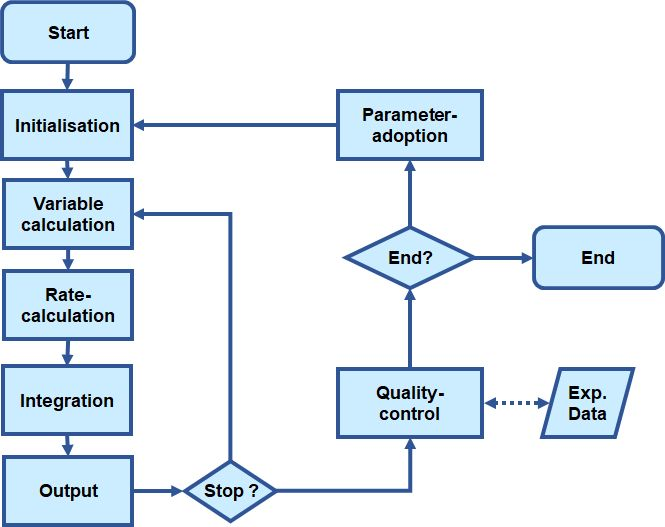
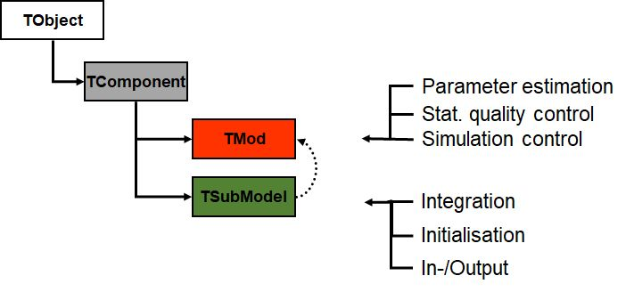
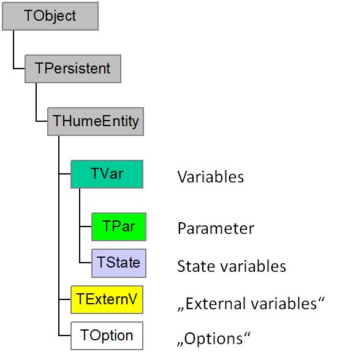

# Background

The development of the Hume component library started in the mid nineteens and was motivated by the senior authors wish to combine the re-use existing code implemented in Pascal into a new object-oriented programming environment making the code more reusable and modular. The concepts of graphical simulation environments like ModelMaker(r) and Stella (r), both based on the Forrester approach for simulation of dynamic systems were used as a basis for the design of the library, although it was never intended to develop a graphical simulation environment.

The decision not to used established agro-ecological models was based on the desire to develop a more flexible approach which may be better suited to use dynamic simulation models as heuristic tools, i.e. to test different scientific hypotheses by implementing them into different model components or process formulations and to test them against experimental data.

## Data structure and execution sequence

Agroecological models have common features in terms of their data structure and execution sequence. With respect to the data structure we can distinguish by following Forrester (1961):

-   State variables
-   Variables (Derived values)
-   Parameters
-   Constants
-   ‘External Variables’ / Driving forces

Thereby state variables represent the memory of the system and are updated during the simulation. Variables are derived from state variables and parameters, and are calculated during the simulation. Parameters are constant values that can be changed by the user, while constants are fixed values that do not change. External variables are inputs to the model, such as weather data or from the view of a nested part of the simulation mode - a submodel - values which are calculated in another submodel.

With respect to the execution sequence we can distinguish the steps initalisation, variable calculation, rate calculation, integration and output. The initialisation step sets the initial values of the state variables and parameters, while the variable calculation step calculates the values of the variables based on the current state of the system. The rate calculation step calculates the rates of change for each state variable, which are then integrated over time to update the state variables in the integration step. In each time step the output step generates the results of the simulation (@fig-SimulationSequence).

{#fig-SimulationSequence}

## Modularity

The modularity of agroecological models is a key feature that allows for the development of complex models by combining simpler sub-models. Each sub-model can represent a specific process or component of the system, such as plant growth, soil water dynamics, or nutrient cycling. The modular approach allows for flexibility in model design, enabling researchers to focus on specific aspects of the system while maintaining the overall structure and functionality of the model.

## Object-oriented programming

Object-oriented programming (OOP) is a programming paradigm that uses objects to represent data and methods to manipulate that data. In the context of agroecological models, OOP allows for the encapsulation of data and behavior within classes, promoting code reuse and modularity. This approach facilitates the development of complex models by allowing researchers to create reusable components that can be easily integrated into larger systems. The concept of inheritence in OOP enables the creation of specialized classes that extend the functionality of base classes, allowing for the development of more complex models without duplicating code.

## Hume Component Library

The Hume Component library is an object oriented class library is described which implements a state variable and modular based approach of modelling agro-ecological systems within the Delphi®/C++Builder®/ Borland Developer Studio programming environment. The class library takes advantage of main programming paradigms of that environment like the concept of components. The main objective of the library is to support the use of dynamic system models as heuristic tools within the scientific process. It assists the development of new model modules or submodules by implementing the basic functionality for simulating dynamic system within parent classes and adds tools for evaluating and calibration of models against experimental data. Additionally, a translation tool for models implemented within the graphical commercial simulation software ModelMaker supports rapid model development.

Any model based on this library consists of one main model module, implemented in a class called ‘TMod’ and a number of sub-models (@fig-TModTSubmod).

{#fig-TModTSubmod}

The main model is responsible for the control of the simulation, single or multiple runs, and also implements methods like calculating basic statistics and parameter estimation based on the Levenberg-Marquardt method. All sub-models have to be derived from the base class TsubMod’ which contains dynamic lists of state variables, variables, parameters and ‘external values’, i.e. values needed from outside the sub-model.

{#fig-TStateTVar}

The information exchange between the sub-models through ‘external values’ is flexible, since it is simply based on string identities between the information needed and information located in any other or input file. This technique allows exchange of sub-models through ‘drag and drop’ without any changes in source code even for a changing number and order of parameters, as long as the necessary input parameters to the sub-model can be found anywhere else in the model. A graphical user interface based on the general data structure supports control of parameter values, initial values and allows input of measured data. Based on these fundamental classes a component hierarchy has been and is still further developed, including several components for dry matter production, plant development, dry matter partitioning, root growth of plants as well as modules for soil water and soil nitrogen budget.
